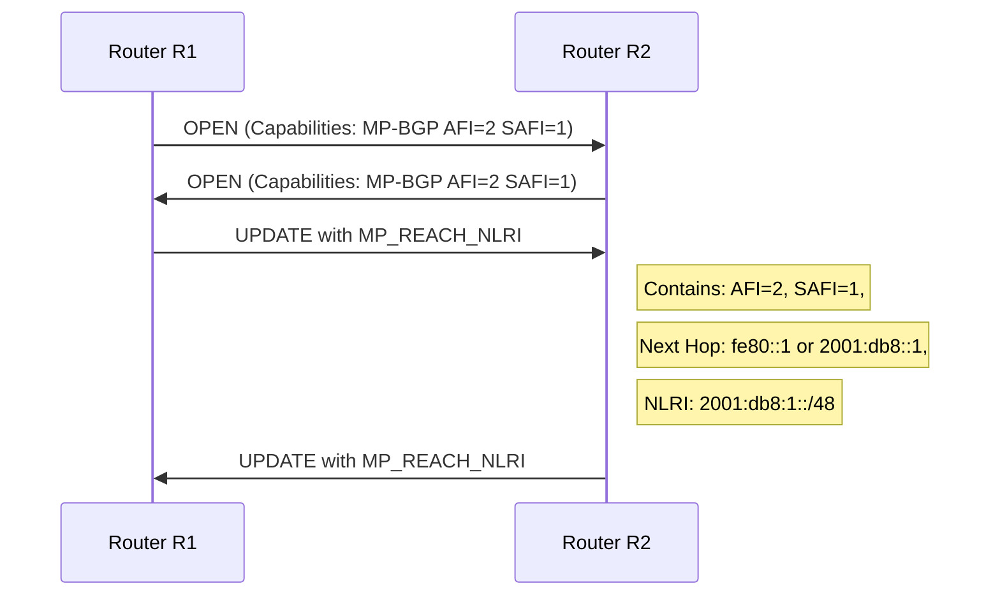

# How to Understand Multiprotocol BGP for IPv6

Author: [nawazdhandala](https://www.github.com/nawazdhandala)

Tags: BGP, IPv6, MP-BGP, Routing, RFC 4760

Description: Understand Multiprotocol BGP (MP-BGP) and how it extends BGP-4 to carry IPv6 routing information using address families.

## Overview

BGP-4 was originally designed only for IPv4. **Multiprotocol BGP (MP-BGP)**, defined in RFC 4760, extends BGP to carry routing information for multiple network layer protocols - including IPv6, VPN, and multicast - using the concept of **Address Families**.

## What MP-BGP Adds

MP-BGP adds two new optional, non-transitive BGP path attributes:
1. **MP_REACH_NLRI** - carries reachable next-hop and prefix information for non-IPv4 protocols
2. **MP_UNREACH_NLRI** - carries withdrawn (unreachable) prefixes for non-IPv4 protocols

These attributes allow a single BGP session to carry prefixes from multiple address families simultaneously.

## Address Family Identifiers (AFI/SAFI)

| AFI | SAFI | Address Family |
|-----|------|----------------|
| 1 | 1 | IPv4 Unicast |
| 2 | 1 | **IPv6 Unicast** |
| 1 | 128 | VPNv4 |
| 2 | 128 | VPNv6 |
| 1 | 2 | IPv4 Multicast |

For IPv6 routing: AFI=2, SAFI=1 (IPv6 Unicast).

## How IPv6 MP-BGP Works



## Next Hop in IPv6 BGP

IPv6 BGP next hops can be either:
- A **global unicast address** (2001:db8::1) for eBGP peering
- A **link-local address** (fe80::1) for peers on the same link

When using link-local addresses, the next hop must include both the link-local address and the interface identifier.

## Capability Negotiation

Before IPv6 prefixes can be exchanged, both BGP peers must negotiate support for the IPv6 address family during the OPEN message exchange. If either side does not support IPv6 AF, only IPv4 prefixes will be exchanged.

```bash
# FRRouting - verify negotiated capabilities

vtysh -c "show bgp neighbors <neighbor-ip>"
# Look for:
# Neighbor capabilities:
#   Address family IPv6 Unicast: advertised and received
```

## Running Dual-Stack BGP

In dual-stack deployments, a single BGP session can carry both IPv4 and IPv6 routes:

```text
# FRRouting configuration for dual-stack BGP
router bgp 65001
 neighbor 2001:db8::peer remote-as 65002

 address-family ipv4 unicast
  neighbor 2001:db8::peer activate
 exit-address-family

 address-family ipv6 unicast
  neighbor 2001:db8::peer activate
  neighbor 2001:db8::peer route-map FILTER-IN in
 exit-address-family
```

## IPv6 BGP Session Types

| Session Type | Description |
|-------------|-------------|
| eBGP over IPv6 global | Standard inter-AS peering over global addresses |
| eBGP over link-local | Direct peering on shared link (IXP or direct cable) |
| iBGP over IPv6 | Internal BGP using IPv6 loopback addresses |
| BGP-4+ | Older RFC 2858 term; now superseded by RFC 4760 |

## Summary

MP-BGP (RFC 4760) extends BGP-4 with address family support, enabling IPv6 routing information to be carried alongside IPv4, VPN, and other protocols. IPv6 BGP uses AFI=2, SAFI=1 and adds the MP_REACH_NLRI and MP_UNREACH_NLRI attributes. Both peers must negotiate IPv6 capability in their OPEN messages before IPv6 prefixes are exchanged.
