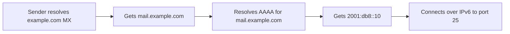

# How to Configure MX Records for IPv6 Mail Servers

Author: [nawazdhandala](https://www.github.com/nawazdhandala)

Tags: DNS, MX Records, IPv6, Email, AAAA Records, Mail Server

Description: Configure MX and AAAA DNS records so that IPv6-capable senders can deliver email directly to your mail server over IPv6.

## Introduction

MX records point to mail server hostnames, not IP addresses. For IPv6 mail delivery to work, the hostnames pointed to by your MX records must have AAAA records. Without AAAA records on MX hosts, senders with IPv6-only connectivity cannot reach your mail server.

## How IPv6 MX Resolution Works

When a sending server looks up where to deliver mail:



## Adding an AAAA Record for Your MX Hostname

In your DNS zone file or DNS provider's control panel:

```dns
; MX record pointing to mail.example.com
example.com.      300  IN  MX  10  mail.example.com.

; A record for IPv4
mail.example.com.  300  IN  A     203.0.113.10

; AAAA record for IPv6 (required for IPv6 delivery)
mail.example.com.  300  IN  AAAA  2001:db8::10
```

## Multiple MX Records with Priority

For redundancy, configure multiple MX records with different priorities:

```dns
; Primary MX (lowest number = highest priority)
example.com.  300  IN  MX  10  mail1.example.com.
example.com.  300  IN  MX  20  mail2.example.com.

; AAAA records for both MX hosts
mail1.example.com.  300  IN  AAAA  2001:db8::10
mail2.example.com.  300  IN  AAAA  2001:db8::11

; A records for dual-stack support
mail1.example.com.  300  IN  A  203.0.113.10
mail2.example.com.  300  IN  A  203.0.113.11
```

## Verifying MX and AAAA Records

```bash
# Look up MX records
dig MX example.com +short
# 10 mail.example.com.

# Verify AAAA record for the MX hostname
dig AAAA mail.example.com +short
# 2001:db8::10

# Full lookup chain in one command
DOMAIN="example.com"
echo "=== MX Records ==="
dig MX $DOMAIN +short

echo "=== AAAA Records for MX Hosts ==="
for mx in $(dig MX $DOMAIN +short | awk '{print $2}'); do
    echo "$mx: $(dig AAAA $mx +short)"
done
```

## Testing IPv6 Mail Reception

```bash
# Confirm your server accepts SMTP on IPv6
nc -6 -v -w 5 mail.example.com 25

# Use swaks to deliver a test message
swaks --from test@otherdomain.com \
      --to recipient@example.com \
      --server [2001:db8::10]:25

# Check Postfix is listening on IPv6
ss -tlnp | grep ':25'
```

## Important: MX Records Cannot Be IPv6 Addresses

A common mistake is trying to put an IPv6 address directly in an MX record. This is invalid:

```dns
; WRONG - MX must point to a hostname, never an IP address
example.com.  IN  MX  10  2001:db8::10.  ; INVALID

; CORRECT - MX points to hostname, hostname has AAAA
example.com.  IN  MX  10  mail.example.com.
mail.example.com.  IN  AAAA  2001:db8::10  ; CORRECT
```

## Propagation and Testing Timeline

After adding AAAA records:

```bash
# Monitor propagation with dig using different resolvers
dig AAAA mail.example.com @8.8.8.8 +short    # Google
dig AAAA mail.example.com @1.1.1.1 +short    # Cloudflare
dig AAAA mail.example.com @208.67.222.222 +short  # OpenDNS

# Check from MX Toolbox
curl -s "https://mxtoolbox.com/api/v1/lookup/mx/example.com" 2>/dev/null | python3 -m json.tool
```

## Conclusion

Enabling IPv6 mail reception is as simple as adding AAAA records to the hostnames referenced by your MX records. Ensure your mail server is listening on IPv6 (using `inet_protocols = all` in Postfix), the firewall allows port 25/TCP on IPv6, and both MX hostnames have valid AAAA records for full dual-stack mail delivery.
