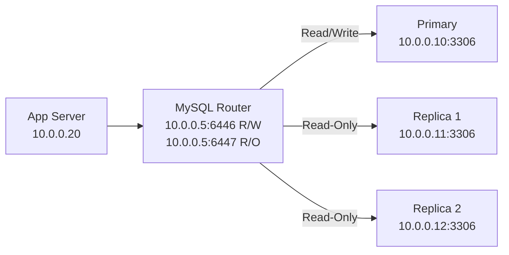

# How to Configure MySQL Router bind_address for IPv4 Connection Routing

Author: [nawazdhandala](https://www.github.com/nawazdhandala)

Tags: MySQL Router, IPv4, Routing, MySQL, InnoDB Cluster, Connection Pooling, Configuration

Description: Learn how to configure MySQL Router's bind_address directive to control which IPv4 address it listens on for routing connections to MySQL InnoDB Cluster.

---

MySQL Router is a lightweight middleware that routes client connections to MySQL servers in an InnoDB Cluster. Configuring `bind_address` controls which IPv4 address Router listens on, enabling you to expose specific routing ports on specific network interfaces.

## How MySQL Router Works



## Initial Bootstrap

```bash
# Bootstrap MySQL Router against the InnoDB Cluster primary
mysqlrouter --bootstrap root@10.0.0.10:3306 \
  --user mysqlrouter \
  --conf-use-sockets \
  --directory /etc/mysqlrouter

# Answer prompts for MySQL root password
# Router will generate mysqlrouter.conf automatically
```

## Configuring bind_address

```ini
# /etc/mysqlrouter/mysqlrouter.conf

[DEFAULT]
# Global bind address for all routing sections
# 0.0.0.0 = all IPv4 interfaces
# 10.0.0.5 = specific IPv4 interface only
bind_address = 10.0.0.5

[routing:primary]
# Read/Write routing — forward to primary
bind_port = 6446
destinations = metadata-cache://mycluster/?role=PRIMARY
routing_strategy = first-available
protocol = classic

[routing:secondary]
# Read-Only routing — forward to replicas
bind_port = 6447
destinations = metadata-cache://mycluster/?role=SECONDARY
routing_strategy = round-robin-with-fallback
protocol = classic

[routing:primary_x]
# X Protocol (MySQL Shell)
bind_port = 6448
destinations = metadata-cache://mycluster/?role=PRIMARY
routing_strategy = first-available
protocol = x

[metadata_cache:mycluster]
cluster_type = gr
router_id = 1
user = mysqlrouter
metadata_cluster = mycluster
ttl = 0.5
auth_cache_ttl = -1
auth_cache_refresh_interval = 2
```

## Per-Route bind_address Override

Override the global bind address for a specific routing rule:

```ini
[routing:internal_only]
# This route listens on the internal interface only
bind_address = 192.168.1.5
bind_port = 6446
destinations = metadata-cache://mycluster/?role=PRIMARY
routing_strategy = first-available
protocol = classic
```

## Starting and Verifying MySQL Router

```bash
# Start MySQL Router
systemctl enable --now mysqlrouter

# Verify it's listening on the configured IPv4 addresses and ports
ss -tlnp | grep mysqlrouter

# Test connection through Router (R/W port)
mysql -h 10.0.0.5 -P 6446 -u appuser -p mydb

# Test connection through Router (R/O port)
mysql -h 10.0.0.5 -P 6447 -u appuser -p mydb -e "SELECT @@hostname;"
```

## Key Takeaways

- `bind_address` in `[DEFAULT]` applies to all routing sections; override per-section as needed.
- Port `6446` is the standard read/write port; `6447` is read-only — these are conventions but configurable.
- Run `mysqlrouter --bootstrap` to automatically generate the configuration from the cluster's metadata.
- After changing `mysqlrouter.conf`, restart the service with `systemctl restart mysqlrouter`.
