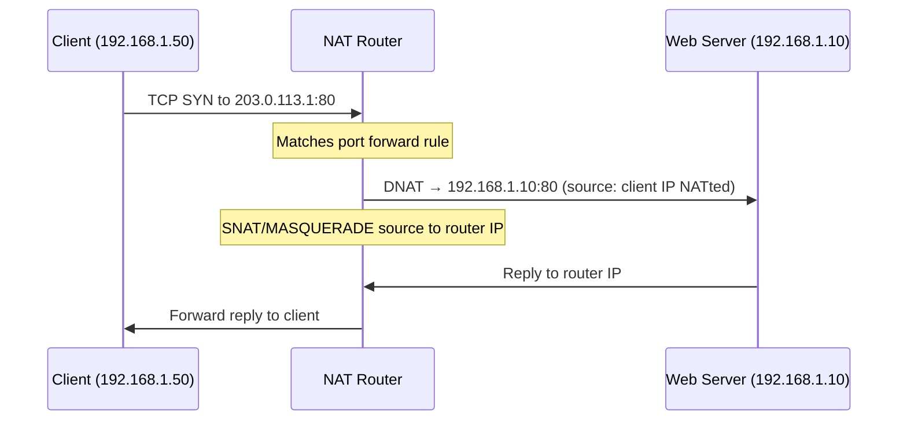

# How to Understand NAT Hairpinning and Loopback

Author: [nawazdhandala](https://www.github.com/nawazdhandala)

Tags: Networking, NAT, Hairpin, IPv4, Architecture

Description: Learn what NAT hairpinning (loopback) is, when you need it, and how it differs from standard port forwarding.

## What Is NAT Hairpinning?

NAT hairpinning (also called NAT loopback or NAT reflection) occurs when a host **inside** the network accesses a server that is also **inside** the network, but does so using the **public/external IP address** of the NAT router.

```
Without hairpinning (fails):
Client (192.168.1.50) → DNS → 203.0.113.1 (public IP)
Client sends to 203.0.113.1 → ISP router → drops (not public)

With hairpinning (works):
Client (192.168.1.50) → 203.0.113.1 → NAT router hairpins → 192.168.1.10 (web server)
```

## Why Is Hairpinning Needed?

Common scenario:
- You own `example.com` → DNS points to your public IP `203.0.113.1`
- Your web server is inside your network at `192.168.1.10`
- Internal users browse `http://example.com` → DNS returns `203.0.113.1`
- Without hairpin NAT, internal users cannot reach the server via domain name

## How Hairpinning Works



The critical element: the NAT router must MASQUERADE the client's source IP when forwarding to the server. Otherwise, the server sends replies directly to the client, bypassing the router, causing asymmetric routing.

## Hairpinning vs Standard Port Forward

| Scenario | Traffic Path |
|----------|-------------|
| External client | Internet → WAN → NAT → LAN server |
| Internal client (hairpin) | LAN client → router → LAN server (via DNAT + SNAT) |
| Without hairpin | LAN client → router → router drops/ISP |

## Implementations

### Linux iptables

```bash
# Port forward (external access)
iptables -t nat -A PREROUTING -i eth1 -p tcp --dport 80 \
    -j DNAT --to-destination 192.168.1.10:80

# Hairpin: internal access via public IP
iptables -t nat -A PREROUTING -i eth0 -p tcp -d 203.0.113.1 --dport 80 \
    -j DNAT --to-destination 192.168.1.10:80

# Critical: SNAT for hairpin so return traffic goes through router
iptables -t nat -A POSTROUTING -s 192.168.1.0/24 -d 192.168.1.10 -p tcp --dport 80 \
    -j MASQUERADE
```

### pfSense

Enable **NAT Reflection**:
- **System → Advanced → Firewall & NAT**
- NAT Reflection mode: `Enable (Pure NAT)`
- Check "Enable automatic outbound NAT for Reflection"

### Cisco IOS

Cisco IOS typically handles hairpin NAT automatically when `ip nat inside` is configured on the LAN interface and the NAT translation table has the mapping.

## Testing Hairpin NAT

```bash
# From internal client, access server via public IP
curl -v http://203.0.113.1
# Should reach 192.168.1.10

# Traceroute should show the router
traceroute 203.0.113.1
# 1. 192.168.1.1 (router)
# 2. 192.168.1.10 (server) [within same subnet]
```

## Common Hairpin Issues

| Problem | Cause | Fix |
|---------|-------|-----|
| Connection timeout | Missing PREROUTING rule for eth0 | Add hairpin DNAT on LAN interface |
| One-way connection | Missing MASQUERADE for hairpin | Add POSTROUTING MASQUERADE for internal|
| Works externally only | Hairpin not configured | Enable NAT reflection/hairpin |

## Key Takeaways

- Hairpin NAT allows internal clients to reach internal servers using the external public IP.
- Requires both DNAT (for the port forward) and SNAT/MASQUERADE (for the return path).
- On pfSense, enable "NAT Reflection" under System → Advanced.
- The MASQUERADE in POSTROUTING is the key difference between standard port forwarding and hairpin NAT.

**Related Reading:**

- [How to Configure Hairpin NAT for Internal Access to Public Services](https://oneuptime.com/blog/post/2026-03-20-hairpin-nat-internal-access/view)
- [How to Set Up Port Forwarding with NAT](https://oneuptime.com/blog/post/2026-03-20-port-forwarding-nat/view)
- [How to Set Up NAT with pfSense](https://oneuptime.com/blog/post/2026-03-20-nat-pfsense-setup/view)
