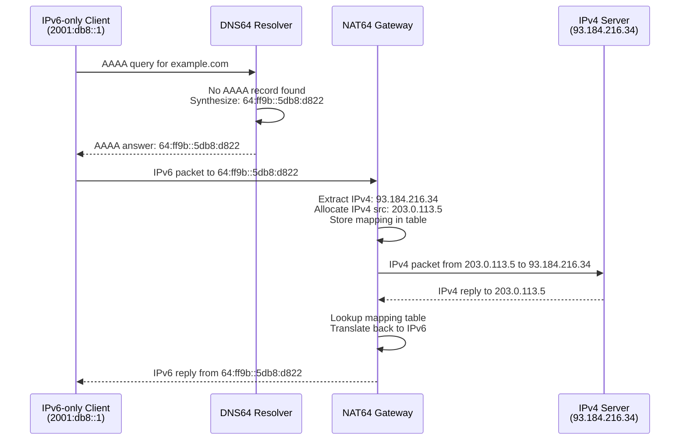

# How to Understand NAT64 Translation Mechanism

Author: [nawazdhandala](https://www.github.com/nawazdhandala)

Tags: IPv6, NAT64, IPv6 Transition, Networking, Protocol Translation

Description: An in-depth explanation of how NAT64 translates between IPv6 and IPv4 address spaces, enabling IPv6-only clients to communicate with IPv4-only servers.

## What Is NAT64?

NAT64 is a network address translation mechanism defined in RFC 6146 that allows IPv6-only clients to communicate with IPv4-only servers. It works by maintaining a translation table that maps IPv6 connections to IPv4 addresses, similar to how NAT44 maps private IPv4 addresses to public ones.

NAT64 is often paired with DNS64, which synthesizes AAAA records for IPv4-only destinations so IPv6-only clients can look them up.

## NAT64 Address Architecture

NAT64 uses a special IPv6 prefix (the "NAT64 prefix") that embeds IPv4 addresses. The well-known NAT64 prefix is `64:ff9b::/96`. An IPv4 address is mapped to an IPv6 address by appending the 32-bit IPv4 address to this prefix:

| IPv4 Address | NAT64 IPv6 Representation |
|---|---|
| 93.184.216.34 | 64:ff9b::93.184.216.34 = 64:ff9b::5db8:d822 |
| 8.8.8.8 | 64:ff9b::808:808 |
| 1.1.1.1 | 64:ff9b::101:101 |

## How a NAT64 Translation Works

The following diagram shows the full flow of a connection from an IPv6-only client to an IPv4 server through a NAT64 gateway:



## NAT64 Translation Table

The NAT64 gateway maintains a stateful binding table with entries like:

```
Protocol  IPv6 Src            IPv6 Dst               IPv4 Src      IPv4 Dst       Timeout
TCP       2001:db8::1:5000    64:ff9b::5db8:d822:80  203.0.113.5   93.184.216.34  7200s
UDP       2001:db8::2:1234    64:ff9b::808:808:53    203.0.113.5   8.8.8.8        300s
```

## Header Translation Details

When translating from IPv6 to IPv4, the NAT64 gateway performs these transformations:

- **IPv6 source address** → allocated IPv4 address from the NAT64 pool
- **IPv6 destination address** → extract last 32 bits (the embedded IPv4 address)
- **IPv6 Next Header** → IPv4 Protocol field (same values: TCP=6, UDP=17, ICMP=1/58)
- **IPv6 Hop Limit** → IPv4 TTL
- **ICMPv6** ↔ **ICMPv4** translation per RFC 7915

## Custom NAT64 Prefixes

Organizations can use their own prefix instead of `64:ff9b::/96`. RFC 6052 defines the allowed prefix lengths: /32, /40, /48, /56, /64, and /96. The IPv4 address occupies bits 96–127 in all cases.

Example with a custom /48 prefix:

```
NAT64 prefix: 2001:db8:cafe::/48
IPv4: 192.0.2.1 → 2001:db8:cafe::c000:0201
```

## Limitations of NAT64

- **ALG requirements**: Protocols that embed IP addresses in payloads (FTP, SIP, H.323) need Application Layer Gateways.
- **IPv4-initiated connections**: NAT64 is stateful and only supports IPv6-initiated connections. Connections from IPv4 to IPv6 require static mappings.
- **Performance**: Stateful translation adds overhead and requires maintaining large binding tables at scale.
- **IPsec**: Certain IPsec configurations are incompatible with NAT64 translation.

## Summary

NAT64 is a critical IPv6 transition technology that enables IPv6-only networks to reach the legacy IPv4 internet. Understanding the address embedding scheme, translation table mechanics, and header conversion process is essential for deploying and troubleshooting NAT64 in production environments.
