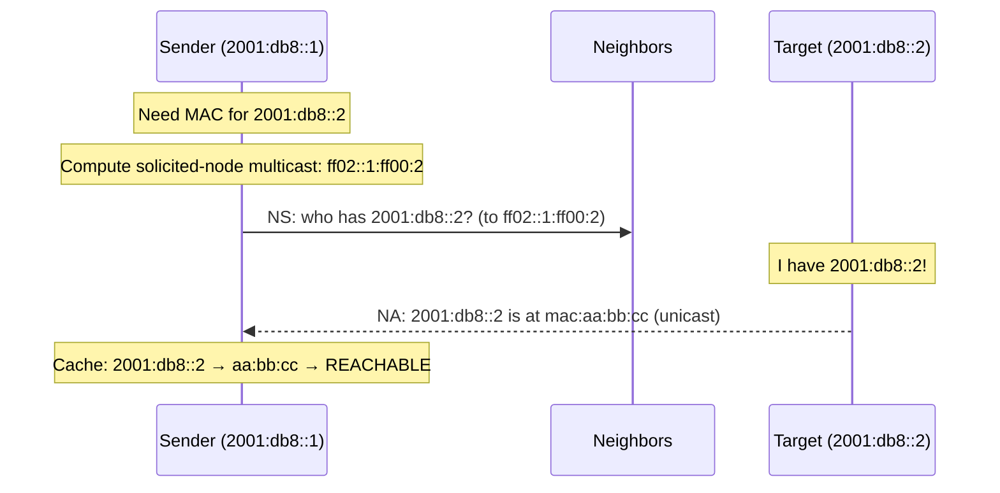

# How to Understand NDP Address Resolution (Replacing ARP)

Author: [nawazdhandala](https://www.github.com/nawazdhandala)

Tags: NDP, ARP, Address Resolution, IPv6, Neighbor Cache

Description: Understand how NDP Neighbor Solicitation and Advertisement replace IPv4 ARP for address resolution, the key improvements NDP provides, and how to debug resolution issues.

## Introduction

IPv4 uses ARP (Address Resolution Protocol) to map IP addresses to MAC addresses. IPv6 replaces ARP with NDP's Neighbor Solicitation/Advertisement mechanism. NDP address resolution is more efficient (uses multicast instead of broadcast), more secure (Hop Limit 255 prevents remote attacks), and integrated into ICMPv6 rather than being a separate protocol. Understanding the differences explains why some ARP-centric tools and thinking don't apply to IPv6.

## ARP vs NDP Address Resolution

```
IPv4 ARP:
  Protocol:    ARP EtherType 0x0806 (separate from IP)
  Request to:  Ethernet BROADCAST (ff:ff:ff:ff:ff:ff)
               → Everyone on the segment receives and processes it
  Request from: Sender's IP and MAC
  Reply to:    Unicast to requester
  No authentication: Any host can reply to any ARP request
  Cache:       ARP cache; entries expire (default ~20 min Linux)

IPv6 NDP:
  Protocol:    ICMPv6 (inside IPv6)
  NS (request) to:  Solicited-node MULTICAST
               → Only nodes with matching last 24 bits receive it
               → ~1/16,777,216 of nodes on a large network (much less traffic)
  NS from:     Sender's link-local address + Source Link-Layer Address option
  NA (reply) to: Unicast to requester
  Verification: Hop Limit MUST be 255 (ensures message is from local node)
  Cache:       Neighbor cache; entries go through state machine
```

## Address Resolution Process



## Solicited-Node Multicast Efficiency

```python
import socket

def explain_solicited_node_efficiency(network_size: int = 10000) -> dict:
    """
    Demonstrate why solicited-node multicast is more efficient than broadcast.
    """
    # IPv4 ARP broadcast: ALL hosts process every ARP request
    arp_nodes_processing = network_size

    # IPv6 NS multicast: only nodes sharing the last 24 bits
    # Probability: 1 / 2^24 = 1 / 16,777,216
    # For typical networks (< 16M nodes), usually 0-1 collision
    # On average: 1 node processes each NS
    ns_nodes_processing = max(1, network_size // (2**24 // network_size + 1))

    return {
        "network_size": network_size,
        "arp_broadcast_recipients": arp_nodes_processing,
        "ns_multicast_recipients": ns_nodes_processing,
        "reduction_factor": arp_nodes_processing / ns_nodes_processing,
    }

for size in [100, 1000, 10000]:
    r = explain_solicited_node_efficiency(size)
    print(f"Network size {size}: ARP={r['arp_broadcast_recipients']} recipients, "
          f"NS multicast≈{r['ns_multicast_recipients']} → "
          f"{r['reduction_factor']:.0f}x reduction")
```

## Viewing the Neighbor Cache

```bash
# Linux: show neighbor cache (equivalent to 'arp -n' for IPv4)
ip -6 neigh show

# Example output:
# 2001:db8::1 dev eth0 lladdr 00:11:22:33:44:55 REACHABLE
# fe80::1     dev eth0 lladdr 00:11:22:33:44:55 STALE
# 2001:db8::2 dev eth0                          FAILED

# Show neighbor cache with more detail
ip -6 neigh show dev eth0

# Show only REACHABLE entries
ip -6 neigh show | grep REACHABLE

# Delete a specific neighbor entry (force re-resolution)
sudo ip -6 neigh del 2001:db8::1 dev eth0

# Flush entire neighbor cache for an interface
sudo ip -6 neigh flush dev eth0
```

## Debugging Address Resolution

```bash
# Watch NS/NA exchange for address resolution
sudo tcpdump -i eth0 -v \
    "icmp6 and (ip6[40] == 135 or ip6[40] == 136)"

# Trigger address resolution and watch it
ping6 -c 1 2001:db8::1 &
sudo tcpdump -i eth0 -v \
    "icmp6 and (ip6[40] == 135 or ip6[40] == 136)" -c 4

# If NS appears but no NA: target is down or NDP blocked
# Check if target's NS/NA is blocked by its firewall:
# sudo ip6tables -L INPUT | grep "icmpv6"

# Check neighbor cache state after resolution attempt
ip -6 neigh show | grep 2001:db8::1
# REACHABLE: recently confirmed (NUD confirms fresh)
# STALE:     cache entry exists but unconfirmed
# FAILED:    resolution failed (target unreachable)
# INCOMPLETE: resolution in progress (NS sent, awaiting NA)
```

## Conclusion

NDP's replacement of ARP is one of IPv6's cleaner architectural improvements. Solicited-node multicast reduces unnecessary traffic processing compared to ARP broadcast. The Hop Limit 255 requirement prevents remote exploitation. The NS/NA pair provides the same address resolution function as ARP Request/Reply, but with better efficiency, security, and integration with the NUD state machine. The neighbor cache (`ip -6 neigh show`) is the operational equivalent of the ARP cache for IPv6 diagnostics.
