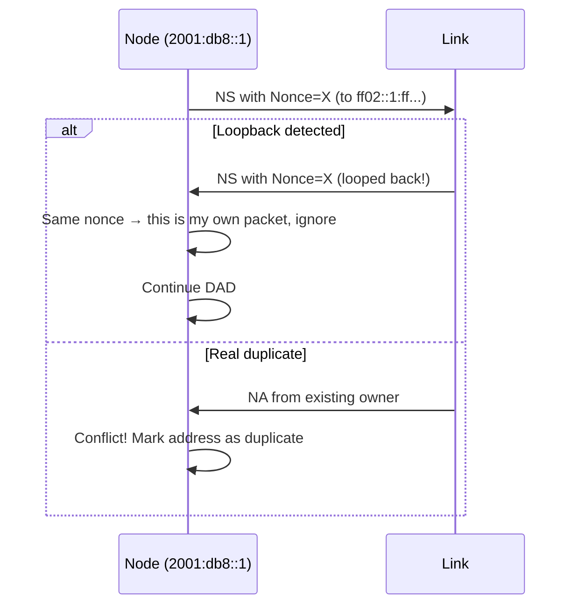

# How to Use Enhanced DAD for IPv6

Author: [nawazdhandala](https://www.github.com/nawazdhandala)

Tags: IPv6, NDP, DAD, Enhanced DAD, RFC 7527, Networking

Description: Implement Enhanced Duplicate Address Detection (Enhanced DAD, RFC 7527) to detect looped interfaces and prevent address conflicts during network recovery.

## What is Enhanced DAD?

Standard DAD sends Neighbor Solicitation messages to detect if an address is already in use. A limitation: if the NS is looped back (e.g., due to a network misconfiguration or bridge loop), the node thinks there's a duplicate when there isn't.

Enhanced DAD (RFC 7527) adds a **nonce** to the NS message. If the NS is received back by the sender and contains the same nonce, it's a loopback (not a real duplicate). The node can ignore loopbacks and complete DAD successfully.

## Enhanced DAD Behavior



## Enabling Enhanced DAD on Linux

```bash
# Enhanced DAD is controlled by the ndisc_notify setting
# Linux kernel 4.10+ supports Enhanced DAD via RFC 7527

# Check current DAD settings
sysctl net.ipv6.conf.eth0.dad_transmits
sysctl net.ipv6.conf.eth0.accept_dad

# Enhanced DAD is enabled when dad_transmits >= 1
# The kernel automatically includes a nonce option in NS messages

# Verify kernel supports Enhanced DAD
uname -r  # Need 4.10+

# DAD on a specific interface
ip -6 addr add 2001:db8::1/64 dev eth0

# Watch for Enhanced DAD nonce in packet capture
tcpdump -i eth0 -n -v 'icmp6 and (ip6[40] == 135)'
# Look for: nonce option in NS messages
```

## Detecting Loop with Enhanced DAD

```bash
# Create a bridge loop scenario to test Enhanced DAD
# (Do this in a test environment only!)

# Create loopback bridge
ip link add br0 type bridge
ip link add veth0 type veth peer name veth1
ip link set veth0 master br0
ip link set veth1 master br0
ip link set br0 up
ip link set veth0 up
ip link set veth1 up

# Try to assign IPv6 address to bridge interface
ip -6 addr add 2001:db8::1/64 dev br0

# Observe DAD behavior — with Enhanced DAD, should detect loop
dmesg | grep -E "DAD|duplicate"

# Clean up
ip link del veth0
ip link del br0
```

## DAD Statistics Monitoring

```bash
# Monitor DAD-related kernel events
ip monitor all dev eth0

# Check for DAD failures in kernel logs
journalctl -k -f | grep -i "duplicate\|DAD"

# Watch address state transitions
watch -n 0.5 "ip -6 addr show dev eth0 | grep -E 'inet6|tentative|preferred'"

# Count DAD events with nstat
nstat -z | grep -i "dad\|Nd6\|Icmp6"
```

## Enhanced DAD in Network Equipment

```
! Cisco IOS-XE — Enhanced DAD is on by default
! Verify DAD behavior
show ipv6 interface GigabitEthernet0/0 | include DAD
! "DAD enabled, 1 DAD attempts, max interval 1000 ms"

! Disable DAD (not recommended for production)
interface GigabitEthernet0/0
 no ipv6 nd dad attempts

! Juniper — Enhanced DAD supported in Junos 17.3+
show ipv6 neighbors detail | match "DAD"
```

## Testing Enhanced DAD

```python
from scapy.all import *
from scapy.layers.inet6 import *

def send_nd_with_nonce(iface, target_addr, nonce_value):
    """Send NS with nonce option (Enhanced DAD test)"""
    # Build NS with nonce
    ns = (IPv6(src="::", dst="ff02::1:ff00:1") /
          ICMPv6ND_NS(tgt=target_addr) /
          ICMPv6NDOptNonce(nonce=nonce_value))

    sendp(Ether(dst="33:33:ff:00:00:01") / ns, iface=iface, verbose=False)
    print(f"Sent NS with nonce {nonce_value.hex()} for {target_addr}")

# Test: simulate loop by sending NS with known nonce
# import os
# nonce = os.urandom(6)
# send_nd_with_nonce("eth0", "2001:db8::1", nonce)
```

## Conclusion

Enhanced DAD adds nonce values to Neighbor Solicitation messages to distinguish loopbacks from genuine address conflicts. It's supported in Linux kernels 4.10+ and most modern network equipment. When a node receives its own NS (same nonce), it identifies a loop and continues DAD rather than treating it as a duplicate. This prevents false address conflicts in bridged environments. Enhanced DAD is enabled by default when `dad_transmits` is set — no additional configuration needed on modern Linux systems.
