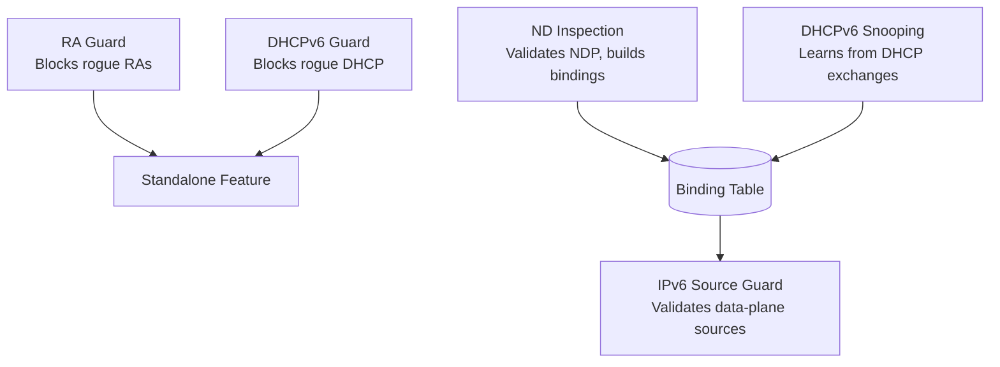

# How to Understand IPv6 First Hop Security Features

Author: [nawazdhandala](https://www.github.com/nawazdhandala)

Tags: First Hop Security, IPv6 Security, RA Guard, DHCPv6 Guard, ND Inspection, IPv6 Source Guard

Description: Understand the four components of IPv6 First Hop Security - RA Guard, DHCPv6 Guard, ND Inspection, and IPv6 Source Guard - and how they work together to protect IPv6 networks.

## Introduction

IPv6 First Hop Security (FHS) is a suite of switch-level features that protect IPv6 networks from link-local attacks. The four core components are RA Guard (blocks rogue Router Advertisements), DHCPv6 Guard (blocks rogue DHCPv6 servers), ND Inspection (validates NDP messages and builds a binding table), and IPv6 Source Guard (uses the binding table to prevent source address spoofing). Together they address the most common IPv6 first-hop attack vectors without requiring changes to hosts or routers.

## The Four FHS Components

```text
IPv6 First Hop Security Components:

1. RA Guard
   Protects against: Rogue Router Advertisements
   Mechanism: Block ICMPv6 Type 134 on host ports
   OSI Layer: L2 (switch inspection)
   Required for: All networks

2. DHCPv6 Guard
   Protects against: Rogue DHCPv6 servers
   Mechanism: Block DHCPv6 ADVERTISE/REPLY/RECONFIGURE on client ports
   OSI Layer: L2/L4 (switch + UDP port inspection)
   Required for: Networks using DHCPv6

3. ND Inspection (IPv6 Snooping)
   Protects against: NDP spoofing, NA flooding
   Mechanism: Inspect NDP messages, build binding table
   OSI Layer: L2/L3 (switch inspection + state tracking)
   Required for: All networks (prerequisite for Source Guard)

4. IPv6 Source Guard
   Protects against: Source address spoofing in data traffic
   Mechanism: Drop data packets with source not in binding table
   OSI Layer: L2/L3 (hardware-assisted forwarding check)
   Required for: High-security environments
```

## Attack Vectors Addressed

```text
Attack vs FHS Component:

Rogue Router Advertisement:
  Attack: Host sends RA, becoming default gateway
  Defense: RA Guard drops RA on host ports
  Impact if unprotected: All hosts route through attacker (MITM)

Rogue DHCPv6 Server:
  Attack: Host runs DHCPv6 server, assigns attacker's DNS
  Defense: DHCPv6 Guard drops server replies on client ports
  Impact if unprotected: Hosts use attacker's DNS/gateway

Neighbor Advertisement Spoofing:
  Attack: Host sends NA for another host's address (cache poisoning)
  Defense: ND Inspection validates NA source against binding table
  Impact if unprotected: Neighbor cache poisoned, traffic hijacked

Source Address Spoofing:
  Attack: Host sends packets with spoofed source IPv6 address
  Defense: IPv6 Source Guard validates source against binding table
  Impact if unprotected: Spoofed traffic bypasses ACLs, enables DDoS

DAD Attack (NDP Exhaustion):
  Attack: Host floods DAD NS messages to fill binding table
  Defense: ND Inspection address-count limits per port
  Impact if unprotected: Legitimate addresses evicted, DoS
```

## FHS Architecture and Dependencies



## Deployment Checklist

Follow this order when deploying FHS features.

```text
FHS Deployment Order:

Step 1: Deploy RA Guard (immediate protection, no side effects)
  - Create HOST policy (device-role host)
  - Create ROUTER policy (device-role router, trusted-port)
  - Apply HOST to all access ports
  - Apply ROUTER to uplinks
  - Verify: show ipv6 nd raguard statistics

Step 2: Deploy DHCPv6 Guard (if using DHCPv6)
  - Create CLIENT policy (device-role client)
  - Create SERVER policy (device-role server)
  - Apply CLIENT to access ports
  - Apply SERVER to uplinks/DHCP server ports
  - Verify: show ipv6 dhcp guard statistics

Step 3: Deploy ND Inspection (builds binding table)
  - Create snooping policy with security-level guard
  - Apply to access VLANs
  - Mark uplink ports as trusted
  - Wait for binding table to populate
  - Verify: show ipv6 neighbor binding
  - Caution: inspect mode first, then guard mode

Step 4: Deploy IPv6 Source Guard (requires binding table)
  - Only after binding table is fully populated
  - Create source-guard policy
  - Apply to access ports
  - Monitor dropped traffic closely
  - Verify: show ipv6 source-guard statistics
```

## Caution: Deployment Order Matters

Deploying in the wrong order can cause outages.

```text
Wrong Order (causes outage):

1. Enable Source Guard FIRST (before binding table exists)
   → All traffic dropped immediately
   → Binding table is empty, no hosts can communicate

2. Enable ND Inspection in 'guard' mode on trunk ports
   → Snooping inspects all NDP, including router NDP
   → Router NDP may fail inspection, losing connectivity
   → Always use 'trusted-port' on trunk/router ports

3. Apply DHCPv6 Guard to server port
   → DHCPv6 server's replies are dropped
   → All clients lose DHCPv6 connectivity

Correct Order:
  RA Guard → DHCPv6 Guard → ND Inspection (inspect mode, then guard)
  → Verify binding table → Source Guard
```

## Complete Cisco FHS Configuration

```text
! Complete IPv6 First Hop Security deployment

! RA Guard
ipv6 nd raguard policy HOST_RA
 device-role host
ipv6 nd raguard policy ROUTER_RA
 device-role router
 trusted-port

! DHCPv6 Guard
ipv6 dhcp guard policy HOST_DHCP
 device-role client
ipv6 dhcp guard policy SERVER_DHCP
 device-role server

! ND Inspection (Snooping)
ipv6 snooping policy ND_SNOOP
 security-level guard
 tracking enable
 limit address-count 10

! IPv6 Source Guard
ipv6 source-guard policy SRC_GUARD

! Apply to access ports
interface range GigabitEthernet1/0/1 - 23
 ipv6 nd raguard attach-policy HOST_RA
 ipv6 dhcp guard attach-policy HOST_DHCP
 ipv6 snooping attach-policy ND_SNOOP
 ipv6 source-guard attach-policy SRC_GUARD

! Apply to uplink/router port
interface GigabitEthernet1/0/24
 ipv6 nd raguard attach-policy ROUTER_RA
 ipv6 dhcp guard attach-policy SERVER_DHCP
 ipv6 snooping trust
```

## Conclusion

IPv6 First Hop Security provides defense-in-depth for IPv6 networks at the switch level. RA Guard stops rogue router advertisements, DHCPv6 Guard stops rogue DHCP servers, ND Inspection validates NDP messages and tracks bindings, and IPv6 Source Guard enforces those bindings in the data plane. Deploy in order - RA Guard and DHCPv6 Guard first, then ND Inspection, then Source Guard - to avoid connectivity disruptions. This suite is the practical alternative to SEND for enterprise and campus networks.
