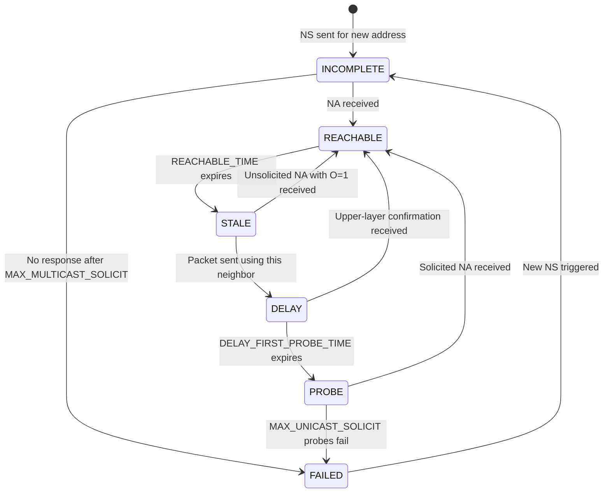

# How to Understand Neighbor Unreachability Detection (NUD)

Author: [nawazdhandala](https://www.github.com/nawazdhandala)

Tags: NDP, NUD, Neighbor Unreachability Detection, IPv6, RFC 4861

Description: Understand the IPv6 Neighbor Unreachability Detection mechanism, how it verifies ongoing neighbor reachability, and how it enables faster failure detection than IPv4's passive ARP cache aging.

## Introduction

Neighbor Unreachability Detection (NUD) is an NDP mechanism that actively verifies the reachability of IPv6 neighbors rather than passively waiting for cache entries to expire. IPv4's ARP cache simply ages out entries after a timeout, with no active reachability verification. IPv6's NUD uses a state machine with multiple states and active probing to quickly detect when a neighbor is no longer reachable, enabling faster failover and more reliable connectivity.

## NUD State Machine

```
NUD States for a neighbor cache entry:

INCOMPLETE:
  → NS sent, waiting for NA reply
  → No MAC address known yet
  → Packets to this address are queued or dropped

REACHABLE:
  → Neighbor confirmed reachable within REACHABLE_TIME (30s default)
  → NA received in response to NS, or upper-layer protocol confirmed it
  → Packets forwarded directly

STALE:
  → REACHABLE_TIME expired; no recent confirmation
  → MAC address still known; packets are forwarded
  → But next transmission triggers NUD probe

DELAY:
  → First packet after STALE state was sent
  → Waiting DELAY_FIRST_PROBE_TIME (5s) for upper-layer reachability confirmation
  → If confirmed: back to REACHABLE; if not: move to PROBE

PROBE:
  → Sending unicast NS to confirm reachability
  → Up to MAX_UNICAST_SOLICIT (3) probes at RETRANS_TIMER intervals
  → If NA received: REACHABLE; if no reply: FAILED

FAILED:
  → All probes failed; neighbor unreachable
  → Traffic to this neighbor dropped
  → ICMPv6 Destination Unreachable Code 3 sent to upper layers
```

## State Transitions



## NUD Timing Parameters

```bash
# View NUD timing parameters on Linux
cat /proc/sys/net/ipv6/neigh/eth0/base_reachable_time_ms
# Default: 30000 ms (30 seconds) — how long REACHABLE state lasts
# Actual REACHABLE_TIME is randomized: 0.5x to 1.5x base_reachable_time

cat /proc/sys/net/ipv6/neigh/eth0/delay_first_probe_time
# Default: 5 (seconds) — DELAY state duration before moving to PROBE

cat /proc/sys/net/ipv6/neigh/eth0/retrans_time_ms
# Default: 1000 ms — interval between NUD probe NS messages

cat /proc/sys/net/ipv6/neigh/eth0/ucast_solicit
# Default: 3 — maximum unicast NS probes before FAILED

# For faster failure detection (e.g., 3-second detection):
sudo sysctl -w net.ipv6.neigh.eth0.base_reachable_time_ms=3000
sudo sysctl -w net.ipv6.neigh.eth0.delay_first_probe_time=1
sudo sysctl -w net.ipv6.neigh.eth0.retrans_time_ms=500
sudo sysctl -w net.ipv6.neigh.eth0.ucast_solicit=2
# Total FAILED detection: ~4 seconds (1s DELAY + 2×0.5s probes)
```

## Monitoring NUD in Action

```bash
# Watch neighbor cache state changes
watch -n 1 'ip -6 neigh show dev eth0'

# Trigger NUD by sending traffic to a STALE neighbor
# The first packet moves state from STALE to DELAY
ping6 -c 1 2001:db8::1

# Capture NUD probe NS messages (unicast NS to neighbor)
# NUD probes go to unicast destination (not multicast)
sudo tcpdump -i eth0 -v \
    "icmp6 and ip6[40] == 135 and not dst ff02::/16"
# These are the NUD unicast probe NSs

# Also capture the expected NA responses
sudo tcpdump -i eth0 -v \
    "icmp6 and (ip6[40] == 135 or ip6[40] == 136)" | \
    grep -E "solicitation|advertisement"
```

## Upper-Layer Confirmation

```
NUD can be confirmed without sending NS probes:
Upper-layer protocols (TCP, TLS) can confirm reachability:

TCP acknowledgement received from neighbor:
  → This is "upper-layer confirmation"
  → NUD moves or stays in REACHABLE state
  → No NS probe needed

On Linux:
  TCP ACK from a neighbor updates the REACHABLE timer
  This is why active TCP connections don't trigger NUD probes

Check kernel parameter:
  cat /proc/sys/net/ipv6/neigh/eth0/locktime
  # Minimum time between NUD updates (anti-flap protection)
```

## Conclusion

NUD provides active reachability monitoring for IPv6 neighbors through a well-defined state machine. The REACHABLE state confirms recent connectivity, STALE indicates aging, and PROBE sends active unicast NS messages to confirm before declaring FAILED. This is significantly better than IPv4's passive ARP aging because it detects failures within seconds rather than minutes. The NUD timing parameters can be tuned for faster failover in high-availability environments, at the cost of increased NDP traffic.
