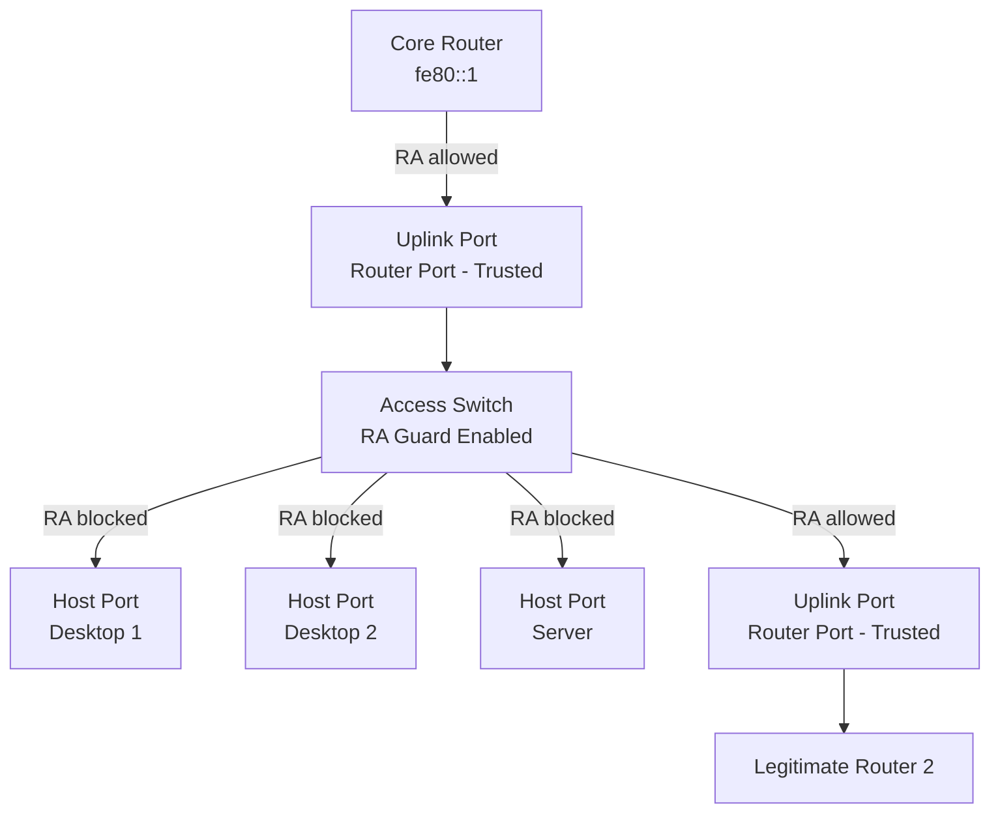

# How to Understand RA Guard for Rogue Router Advertisement Prevention

Author: [nawazdhandala](https://www.github.com/nawazdhandala)

Tags: RA Guard, NDP Security, IPv6 Security, Router Advertisement, First Hop Security

Description: Understand how RA Guard works to prevent rogue Router Advertisement attacks on IPv6 networks, how it compares to SEND, and when to deploy it.

## Introduction

RA Guard is a switch-level security feature that blocks unauthorized Router Advertisement (RA) messages on host-facing ports. Any host on an IPv6 link can send a forged RA and redirect traffic through itself or cause hosts to lose their default gateway. RA Guard prevents this by enforcing a simple policy: only designated router ports may forward RA messages. It is the most widely deployed NDP security mechanism because it requires no changes to hosts or routers.

## The Rogue RA Problem

Without RA Guard, any host on a subnet can send an RA and become the default router for all other hosts on that segment.

```text
Rogue RA Attack:

[Legitimate Router]          [Attacker Host]
  fe80::1 → sends RA          fe80::bad → sends forged RA
  RouterLifetime=1800          RouterLifetime=1800
  Prefix: 2001:db8::/64        Prefix: 2001:db8::/64
  Gateway: fe80::1             Gateway: fe80::bad ← traffic redirected here

Hosts receive both RAs and may:
  - Use attacker as default gateway (man-in-the-middle)
  - Lose connectivity if attacker sends RouterLifetime=0 (invalidation)
  - Get incorrect prefix information (denial of service)

Only requires link-local access: any compromised host can do this.
```

## How RA Guard Works

RA Guard operates on managed switches and classifies each port as either a router port or a host port.

```text
RA Guard Port Classification:

Switch Port Policy:
  Router Port (trusted):
    - Allows RA messages through
    - Connected to actual routers or uplinks
    - Example: uplink to distribution switch

  Host Port (untrusted):
    - Drops any RA message received on this port
    - Connected to end hosts, servers, or access points
    - Example: desktop ports, server ports

Traffic Flow:
  RA from Router → Router Port → ALLOWED → forwarded to hosts
  RA from Host   → Host Port   → DROPPED  → never reaches other hosts

The switch inspects ICMPv6 Type 134 (Router Advertisement) and
drops it if received on a port configured as a host port.
```

## RA Guard Inspection Capabilities

Basic RA Guard only checks the port role. Enhanced RA Guard can also inspect RA content.

```text
RA Guard Inspection Levels:

Level 1 (Basic):
  - Drop RA on host ports regardless of content
  - Simple and effective
  - Supported on most managed switches

Level 2 (Enhanced):
  - Verify RA source is a known router (prefix match)
  - Verify advertised prefix matches expected subnet
  - Check hop limit in RA (must be 255 for valid NDP)
  - Verify RA does not set M/O flags unexpectedly
  - Inspect Router Lifetime range

Enhanced RA Guard prevents:
  - Routers advertising wrong prefixes
  - Hijacked router ports
  - Misconfigured router policy
```

## RA Guard vs SEND Comparison

```text
Feature Comparison: RA Guard vs SEND

RA Guard:
  Implementation: Switch firmware (L2)
  Host changes required: None
  Router changes required: None
  PKI infrastructure: Not required
  Computational overhead: Minimal
  Vendor support: Wide (Cisco, Juniper, Aruba, etc.)
  Deployment complexity: Low
  Protection scope: On the local switched segment only

SEND (RFC 3971):
  Implementation: Host OS + Router OS
  Host changes required: Yes (CGA, RSA keys)
  Router changes required: Yes (certificates)
  PKI infrastructure: Required for router authorization
  Computational overhead: High (RSA per NDP message)
  Vendor support: Very limited
  Deployment complexity: High
  Protection scope: Cryptographic end-to-end

Recommendation:
  Use RA Guard for all managed switch deployments.
  SEND only for specialized environments with full PKI.
```

## Deployment Architecture

A typical enterprise deployment places RA Guard on all access layer switches.



## Verifying RA Guard Behavior

Use tcpdump or Wireshark to verify RAs are being dropped on host ports.

```bash
# On a host connected to a protected port:

# Run this and connect a rogue RA source on the same segment

# Capture RA messages on the host
sudo tcpdump -i eth0 -v "icmp6 and ip6[40] == 134"
# Type 134 = Router Advertisement
# If RA Guard is working, you should NOT see rogue RAs here

# Send a test RA from another host (requires radvd or ndisc6 tools)
# sudo radvd --configtest    ← test radvd config
# If RA Guard blocks it: no output on the listening host

# Check if RA Guard is active (Cisco switch CLI):
# show ipv6 nd raguard policy
# show ipv6 nd raguard interface GigabitEthernet0/1
```

## Limitations of RA Guard

```text
RA Guard Limitations:

1. IPv6 Extension Headers (CVE-2011-2176 class):
   Attackers can wrap RA in fragmented packets or
   use routing headers to bypass some RA Guard implementations.
   Fix: Use updated switch firmware; some vendors added deep
   inspection to handle extension headers.

2. Router ports can still be compromised:
   If an attacker gains access to a trunk/router port,
   RA Guard cannot help.
   Mitigation: Physical port security + 802.1X on all ports.

3. Wireless environments:
   Wi-Fi APs in bridging mode may not enforce RA Guard.
   Mitigation: Configure RA Guard on the switch port connected to AP.

4. Does not authenticate RA content:
   RA Guard only enforces port role; it cannot verify
   that an RA from a router port is legitimate.
   For content authentication: use SEND (if available).
```

## Conclusion

RA Guard is the practical first line of defense against rogue Router Advertisement attacks. By restricting RA messages to designated router ports, it prevents any compromised host from injecting false routing information. Deploy RA Guard on all access layer switches with host-facing ports marked as untrusted. For enhanced protection, combine RA Guard with DHCPv6 Guard and IPv6 Source Guard to cover all first-hop attack vectors.
