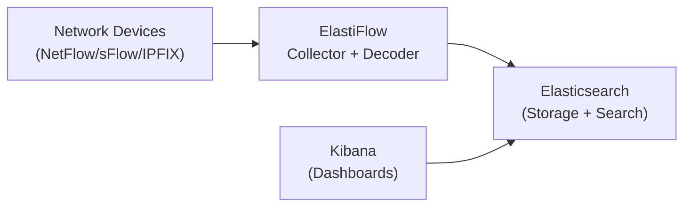

# How to Set Up NetFlow Collection with ElastiFlow and Elasticsearch

Author: [nawazdhandala](https://www.github.com/nawazdhandala)

Tags: NetFlow, ElastiFlow, Elasticsearch, Kibana, Traffic Analysis, ELK Stack

Description: Learn how to deploy ElastiFlow with Elasticsearch and Kibana to collect, index, and visualize NetFlow, sFlow, and IPFIX data for network traffic analytics.

## What Is ElastiFlow?

ElastiFlow is a network flow collection and analytics platform built on the Elastic Stack (Elasticsearch, Kibana). It receives NetFlow v5/v9, IPFIX, and sFlow data, normalizes the fields into a unified schema, and indexes records into Elasticsearch for fast querying and Kibana dashboards.

## Architecture



## Step 1: Install Elasticsearch and Kibana

```bash
# Add Elastic repository

curl -fsSL https://artifacts.elastic.co/GPG-KEY-elasticsearch | \
  sudo gpg --dearmor -o /usr/share/keyrings/elastic-keyring.gpg

echo "deb [signed-by=/usr/share/keyrings/elastic-keyring.gpg] \
  https://artifacts.elastic.co/packages/8.x/apt stable main" | \
  sudo tee /etc/apt/sources.list.d/elastic-8.x.list

sudo apt-get update
sudo apt-get install -y elasticsearch kibana

# Configure Elasticsearch (single-node for lab)
echo "node.name: node-1
network.host: 0.0.0.0
discovery.type: single-node
xpack.security.enabled: false" | sudo tee -a /etc/elasticsearch/elasticsearch.yml

sudo systemctl enable elasticsearch kibana
sudo systemctl start elasticsearch kibana
```

## Step 2: Install ElastiFlow Unified Flow Collector

```bash
# Download ElastiFlow (community edition)
# Check latest version at: https://github.com/elastiflow/elastiflow_for_elasticsearch

wget https://github.com/elastiflow/elastiflow_for_elasticsearch/releases/download/v7.3.0/elastiflow_unified_collector_7.3.0_linux_amd64.deb
sudo dpkg -i elastiflow_unified_collector_7.3.0_linux_amd64.deb
```

## Step 3: Configure ElastiFlow

Edit the ElastiFlow configuration:

```yaml
# /etc/elastiflow/elastiflow.yml

# Input: where to receive flows
flow:
  input:
    netflow:
      enabled: true
      host: "0.0.0.0"
      port: 2055
    sflow:
      enabled: true
      host: "0.0.0.0"
      port: 6343
    ipfix:
      enabled: true
      host: "0.0.0.0"
      port: 4739

# Output: send to Elasticsearch
output:
  elasticsearch:
    hosts:
      - "http://localhost:9200"
    index: "elastiflow-flow-codex-*"
    compress: true
```

```bash
sudo systemctl enable elastiflow
sudo systemctl start elastiflow
```

## Step 4: Configure Network Devices to Send Flows

Send NetFlow from your Cisco router to ElastiFlow:

```bash
! NetFlow v9 to ElastiFlow
Router(config)# ip flow-export destination 192.168.1.200 2055
Router(config)# ip flow-export version 9
Router(config)# ip flow-export source Loopback0

Router(config)# interface GigabitEthernet0/0
Router(config-if)# ip flow ingress
Router(config-if)# ip flow egress
```

## Step 5: Install ElastiFlow Kibana Dashboards

ElastiFlow provides pre-built Kibana dashboards:

```bash
# Import dashboards via Kibana API
# Download the dashboard package from ElastiFlow's GitHub releases

curl -X POST "http://localhost:5601/api/saved_objects/_import?overwrite=true" \
  -H "kbn-xsrf: true" \
  --form file=@elastiflow-kibana-dashboards.ndjson
```

Access Kibana at `http://server-ip:5601` and navigate to Dashboard > ElastiFlow dashboards.

## Step 6: Verify Data Is Flowing

```bash
# Check ElastiFlow is receiving data
sudo journalctl -u elastiflow -f

# Verify Elasticsearch is receiving documents
curl "http://localhost:9200/elastiflow-flow-*/_count?pretty"

# Expected output:
# {
#   "count" : 25000,
#   "_shards" : {...}
# }

# Query top source IPs
curl -X POST "http://localhost:9200/elastiflow-flow-*/_search?pretty" \
  -H "Content-Type: application/json" \
  -d '{
    "size": 0,
    "aggs": {
      "top_sources": {
        "terms": {"field": "source.ip", "size": 10}
      }
    }
  }'
```

## Step 7: Create a Custom Kibana Visualization

In Kibana Visualize, create a data table showing top talkers:
- Index pattern: `elastiflow-flow-*`
- Metric: Sum of `network.bytes`
- Split rows: Terms on `source.ip` (Top 10)

## Conclusion

ElastiFlow with Elasticsearch and Kibana provides enterprise-grade NetFlow analytics on open-source infrastructure. The unified collector handles NetFlow v5/v9, IPFIX, and sFlow normalization, Elasticsearch provides fast storage and querying, and Kibana's pre-built dashboards deliver immediate traffic visibility. This stack is well-suited for security analysis, capacity planning, and troubleshooting.
