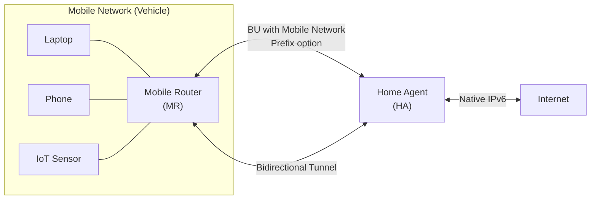

# How to Understand Network Mobility (NEMO) Basic Support

Author: [nawazdhandala](https://www.github.com/nawazdhandala)

Tags: NEMO, Network Mobility, Mobile IPv6, RFC 3963, Mobile Router, Networking

Description: Understand the Network Mobility (NEMO) Basic Support protocol that enables entire networks (like vehicle networks) to move between access points while maintaining connectivity.

## Introduction

Network Mobility Basic Support (NEMO BS), defined in RFC 3963, extends Mobile IPv6 to support the mobility of entire networks rather than individual hosts. A Mobile Router (MR) connects the mobile network to the internet and handles mobility signaling on behalf of all devices in the mobile network.

## NEMO vs MIPv6

| Aspect | MIPv6 | NEMO BS |
|---|---|---|
| Who moves | Individual host | Entire network |
| Mobility agent | Mobile Node | Mobile Router (MR) |
| Protected devices | One device | All devices behind MR |
| MN requirements | MIPv6 stack | Standard IPv6 (behind MR) |
| Typical use | Smartphones | Vehicles, trains, ships, aircraft |

## NEMO Architecture



All devices in the mobile network get addresses from the **Mobile Network Prefix (MNP)** - a stable prefix anchored at the Home Agent.

## Key NEMO Concepts

### Mobile Network Prefix (MNP)

```text
Home Network Prefix:   2001:db8:home::/48
Mobile Network Prefix: 2001:db8:home:1::/64  (delegated to MR)
Mobile Router HoA:     2001:db8:home::MR

Devices behind MR get addresses like:
  Laptop: 2001:db8:home:1::laptop
  Phone:  2001:db8:home:1::phone
```

### Mobile Router Binding Update

NEMO uses the same BU format as MIPv6 but adds a **Mobile Network Prefix option** to register the MNP.

```text
Binding Update (from MR to HA):
  H flag: 1 (home registration)
  R flag: 1 (NEMO-specific: mobile router flag)
  Lifetime: 3600
  Options:
    Mobile Network Prefix option:
      Prefix: 2001:db8:home:1::/64
      MNP length: 64
```

## Setting Up a NEMO Mobile Router

```bash
# /etc/mip6d.conf - Mobile Router configuration (UMIP)

NodeConfig MR;  # Mobile Router role

# Interface facing the home network
HomeInterface "eth1" {
    UseExternal enabled;
}

# Interface facing the mobile network (backward iface)
Interface "eth0" {
    MrIfPreference 1;
}

# Mobile Router Home Address
HomeAgent 2001:db8:home::1;
Home 2001:db8:home::MR/64;

# Mobile Network Prefix delegated to this router
MobileNetworkPrefix 2001:db8:home:1::/64;

# Enable prefix delegation to devices in mobile network
MNPPrefixDelegation enabled;
```

```bash
# On the HA - configure to accept MR registrations
# /etc/mip6d.conf (HA role)
NodeConfig HA;

Interface "eth0" {
    HaRestartAfterReboot enabled;
}

# Allow NEMO Mobile Router registrations
AcceptMobileRouters enabled;
```

## Nested Mobility (NEMO within NEMO)

NEMO supports nested mobile networks (e.g., a laptop that is itself a router for another mobile network).

```text
Train Network (MR1):
  MNP1: 2001:db8:train::/48

Passenger's Car (MR2, connected to train network):
  MNP2: 2001:db8:train:car1::/64

Both register with the same HA or a hierarchy of HAs.
```

## Verification

```bash
# Check Mobile Router bindings on HA
sudo mip6d -n | grep -A5 "Mobile Router"

# Check that MNP route exists on HA
ip -6 route show | grep "2001:db8:home:1::"

# Test connectivity from a device behind the MR
# (from laptop at 2001:db8:home:1::laptop)
ping6 2001:4860:4860::8888

# Trace the path through the NEMO tunnel
traceroute6 2001:4860:4860::8888
# Should show HA as first hop before internet
```

## Conclusion

NEMO Basic Support extends MIPv6 to entire mobile networks, requiring only the Mobile Router to run mobility software. Devices behind the MR use standard IPv6 without any mobility-awareness. Monitor MR binding health and MNP reachability with OneUptime to ensure vehicle/mobile-network connectivity.
