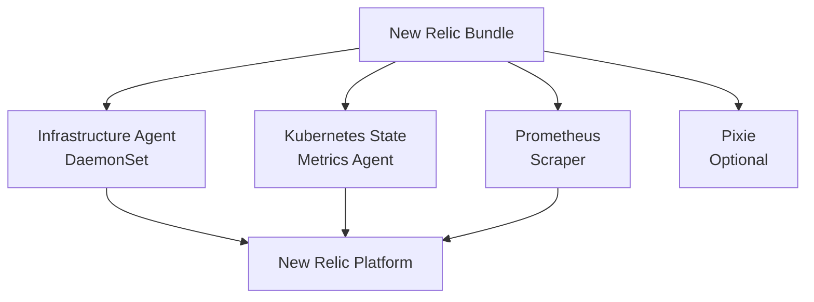

# How to Deploy New Relic Infrastructure with OpenTofu

Author: [nawazdhandala](https://www.github.com/nawazdhandala)

Tags: OpenTofu, New Relic, Monitoring, Kubernetes, Helm, APM, Infrastructure as Code

Description: Learn how to deploy New Relic infrastructure monitoring and APM on Kubernetes using OpenTofu with the New Relic Helm bundle, including the New Relic provider for alert configuration.

---

New Relic provides full-stack observability — infrastructure metrics, APM traces, logs, and browser monitoring. The New Relic Kubernetes bundle deploys all agents in a single Helm release. OpenTofu manages both the agent deployment and New Relic alert policies.

## New Relic Agent Architecture



## License Key Secret

```hcl
resource "kubernetes_secret" "newrelic" {
  metadata {
    name      = "newrelic-bundle-newrelic-infrastructure"
    namespace = "newrelic"
  }

  data = {
    licenseKey = var.newrelic_license_key
  }
}
```

## New Relic Kubernetes Bundle

```hcl
resource "helm_release" "newrelic_bundle" {
  name             = "newrelic-bundle"
  repository       = "https://helm-charts.newrelic.com"
  chart            = "nri-bundle"
  version          = "5.0.33"
  namespace        = "newrelic"
  create_namespace = true

  values = [
    yamlencode({
      global = {
        licenseKey = var.newrelic_license_key
        cluster    = var.cluster_name
        lowDataMode = var.environment != "production"  # Reduce data in non-prod
      }

      # Infrastructure agent
      newrelic-infrastructure = {
        enabled = true
        kubelet = {
          config = {
            timeout = 30
          }
        }
      }

      # Kubernetes events
      nri-kube-events = {
        enabled = true
      }

      # Prometheus metrics scraping
      nri-prometheus = {
        enabled = true
        config = {
          cluster_name         = var.cluster_name
          audit                = false
          insecure_skip_verify = false
          require_scrape_enabled_label_for_nodes = true
        }
      }

      # Kubernetes state metrics
      kube-state-metrics = {
        enabled = true
      }

      # Log forwarding
      newrelic-logging = {
        enabled = true
        fluentBit = {
          # Forward all container logs
          config = {
            parsers      = "[PARSER]\n    Name docker\n    Format json"
            inputPlugins = "[INPUT]\n    Name tail\n    Path /var/log/containers/*.log"
          }
        }
      }
    })
  ]
}
```

## New Relic Alert Policy via Provider

```hcl
# newrelic_alerts.tf
terraform {
  required_providers {
    newrelic = {
      source  = "newrelic/newrelic"
      version = "~> 3.0"
    }
  }
}

provider "newrelic" {
  account_id = var.newrelic_account_id
  api_key    = var.newrelic_api_key
  region     = "US"
}

resource "newrelic_alert_policy" "app" {
  name                = "${var.environment}-application-alerts"
  incident_preference = "PER_CONDITION_AND_TARGET"
}

resource "newrelic_nrql_alert_condition" "high_error_rate" {
  policy_id   = newrelic_alert_policy.app.id
  name        = "High Error Rate"
  description = "Error rate exceeds 5%"
  enabled     = true

  nrql {
    query = <<-EOT
      SELECT percentage(count(*), WHERE error IS true)
      FROM Transaction
      WHERE appName = '${var.app_name}'
      AND environment = '${var.environment}'
    EOT
  }

  critical {
    operator              = "above"
    threshold             = 5
    threshold_duration    = 300
    threshold_occurrences = "ALL"
  }

  warning {
    operator              = "above"
    threshold             = 2
    threshold_duration    = 300
    threshold_occurrences = "ALL"
  }
}

resource "newrelic_notification_channel" "slack" {
  name       = "slack-${var.environment}"
  type       = "SLACK"
  account_id = var.newrelic_account_id

  destination_id = newrelic_notification_destination.slack.id

  product = "IINT"

  property {
    key   = "channelId"
    value = var.slack_channel_id
  }
}
```

## Best Practices

- Enable `lowDataMode = true` for non-production environments to reduce New Relic ingest costs by ~50%.
- Use the `newrelic` Terraform provider to manage alert policies and dashboards alongside the agent deployment.
- Store the New Relic license key in a Kubernetes Secret — don't put it in Helm values files that are committed to git.
- Configure `nri-prometheus` with `require_scrape_enabled_label_for_nodes = true` to avoid collecting metrics from system pods you don't care about.
- Use New Relic's `lowDataMode` in development and staging to save on data ingest costs while keeping full fidelity in production.
