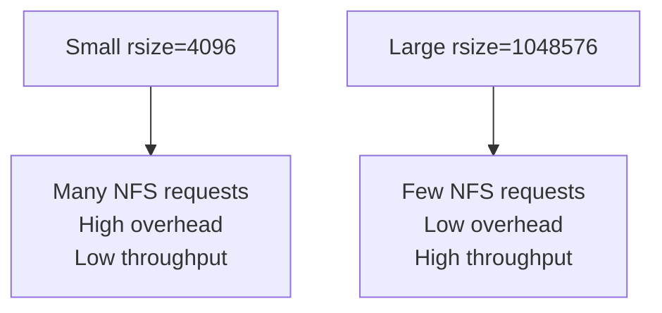

# How to Configure NFS Read/Write Buffer Sizes (rsize/wsize) for IPv4 Performance

Author: [nawazdhandala](https://www.github.com/nawazdhandala)

Tags: NFS, IPv4, Performance, rsize, wsize, Tuning, Linux, Networking

Description: Learn how to tune NFS rsize and wsize mount options for optimal throughput over IPv4 networks, including how to determine the right values for your environment.

---

`rsize` (read size) and `wsize` (write size) control the maximum number of bytes transferred in a single NFS read or write operation. Choosing appropriate values for your network's MTU and available bandwidth significantly impacts NFS throughput.

## How rsize/wsize Affects Performance

Small buffers (e.g., 4KB) generate many round trips, wasting bandwidth on overhead. Large buffers reduce round trips but increase memory usage per connection. The optimal value depends on network latency and MTU.



## Default Values

Linux NFS client defaults depend on the kernel version:
- NFS v3: typically 32KB (32768)
- NFS v4: typically 1MB (1048576) on modern kernels

Check current values:

```bash
# View current NFS mount options including negotiated rsize/wsize
mount | grep nfs

# Or
cat /proc/mounts | grep nfs
nfs-server:/ /mnt/nfs nfs4 rsize=1048576,wsize=1048576,...
```

## Recommended Values by Network Type

| Network | Recommended rsize/wsize |
|---------|------------------------|
| 1 Gbps LAN | 1048576 (1MB) |
| 10 Gbps LAN | 1048576 (1MB, max) |
| WAN (high latency) | 65536 (64KB) |
| Slow/lossy link | 32768 (32KB) |

## Mounting with Custom Buffer Sizes

```bash
# Mount NFS with explicit 1MB read/write buffers
mount -t nfs4 \
  -o rsize=1048576,wsize=1048576,timeo=14,retrans=3 \
  192.168.1.10:/data \
  /mnt/nfs

# For NFSv3
mount -t nfs \
  -o vers=3,rsize=1048576,wsize=1048576 \
  192.168.1.10:/data \
  /mnt/nfs
```

## Persistent Mount in /etc/fstab

```bash
# /etc/fstab
192.168.1.10:/data  /mnt/nfs  nfs4  rw,sync,rsize=1048576,wsize=1048576,timeo=14,retrans=3  0 0
```

## Testing Performance

```bash
# Write performance test (no caching: direct I/O)
dd if=/dev/zero of=/mnt/nfs/testfile bs=1M count=1024 oflag=dsync
# Look for: MB/s throughput

# Read performance test
dd if=/mnt/nfs/testfile of=/dev/null bs=1M
```

## NFS Server-Side Buffer Tuning

```bash
# Increase the NFS server's read-ahead and request buffers
echo "1048576" > /sys/module/nfsd/parameters/max_block_size

# Or set via sysctl
echo "net.core.rmem_max = 134217728" >> /etc/sysctl.conf
echo "net.core.wmem_max = 134217728" >> /etc/sysctl.conf
sysctl -p
```

## Key Takeaways

- `rsize` and `wsize` up to 1MB (`1048576`) are supported on modern Linux kernels with NFSv4.
- The kernel negotiates down to the server's maximum if you specify a larger value.
- Use `dd oflag=dsync` for write benchmarks to bypass client-side caching and get accurate NFS write speeds.
- For WAN or high-latency links, reduce `rsize`/`wsize` and increase `timeo` (timeout) to reduce timeouts.
