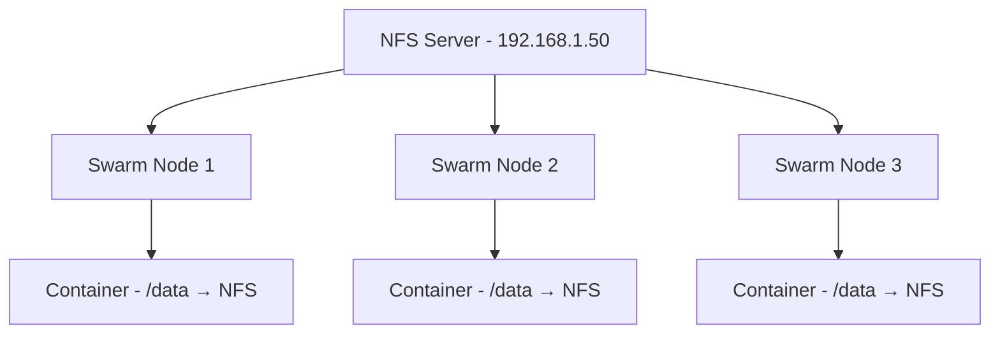

# How to Set Up NFS Shared Storage for Portainer Swarm

Author: [nawazdhandala](https://www.github.com/nawazdhandala)

Tags: Portainer, NFS, Docker Swarm, Shared Storage, Docker, DevOps

Description: Learn how to configure NFS shared storage so all nodes in a Portainer-managed Docker Swarm can access the same persistent volumes.

---

Docker Swarm services can run on any node in the cluster. Without shared storage, a container restarted on a different node loses access to its data. NFS (Network File System) solves this by providing a network-accessible directory that all nodes can mount — giving containers persistent storage that follows them across the cluster.

---

## Architecture



---

## Step 1: Set Up the NFS Server

Install and configure NFS on a dedicated storage server or on your Swarm manager node.

```bash
# Install NFS server (Ubuntu/Debian)
sudo apt update && sudo apt install -y nfs-kernel-server

# Create the directory to export
sudo mkdir -p /exports/portainer-data
sudo chown nobody:nogroup /exports/portainer-data
sudo chmod 777 /exports/portainer-data

# Export the directory — allow your Swarm nodes to access it
# /etc/exports
echo "/exports/portainer-data 192.168.1.0/24(rw,sync,no_subtree_check,no_root_squash)" | sudo tee -a /etc/exports

# Apply the export configuration
sudo exportfs -arv

# Confirm exports are active
showmount -e localhost
```

---

## Step 2: Install NFS Client on All Swarm Nodes

```bash
# Run on every Swarm node (manager and workers)
sudo apt update && sudo apt install -y nfs-common

# Test the connection from a node
showmount -e 192.168.1.50

# Test mount manually
sudo mkdir -p /mnt/test-nfs
sudo mount -t nfs 192.168.1.50:/exports/portainer-data /mnt/test-nfs
ls /mnt/test-nfs
sudo umount /mnt/test-nfs
```

---

## Step 3: Create NFS-Backed Docker Volumes on All Nodes

For Swarm, each node needs a Docker volume pointing to the NFS share.

```bash
# Run this on ALL Swarm nodes to create the shared volume
docker volume create \
  --driver local \
  --opt type=nfs \
  --opt o=addr=192.168.1.50,rw,nfsvers=4 \
  --opt device=:/exports/portainer-data \
  portainer-shared-data

# Verify the volume was created
docker volume inspect portainer-shared-data
```

---

## Step 4: Deploy a Swarm Stack Using NFS Volume in Portainer

In Portainer, deploy a stack that uses the shared NFS volume.

```yaml
# nfs-app-stack.yml — Swarm stack with shared NFS storage
version: "3.8"

services:
  webapp:
    image: myapp:latest
    restart: unless-stopped
    volumes:
      # Use the NFS-backed Docker volume
      - portainer-shared-data:/app/data
    deploy:
      replicas: 3
      update_config:
        parallelism: 1
        delay: 10s
      restart_policy:
        condition: on-failure

volumes:
  portainer-shared-data:
    external: true  # must exist on each node before deployment
```

---

## Step 5: Automate Volume Creation via Cloud-Init or Ansible

For new nodes joining the Swarm, automate the NFS volume creation.

```bash
# cloud-init user-data snippet or Ansible task
# Add to node setup playbook to ensure NFS volume exists on every node

docker volume inspect portainer-shared-data > /dev/null 2>&1 || \
docker volume create \
  --driver local \
  --opt type=nfs \
  --opt o=addr=192.168.1.50,rw,nfsvers=4 \
  --opt device=:/exports/portainer-data \
  portainer-shared-data

echo "NFS volume ready"
```

---

## Monitoring NFS Performance

```bash
# Check NFS mount stats
nfsstat -m

# Monitor NFS I/O
iostat -x 1 5

# Check active NFS connections on the server
sudo netstat -an | grep :2049
```

---

## Summary

NFS shared storage for Portainer Swarm requires three things: an NFS server with an exported directory, NFS client and volume creation on all Swarm nodes, and Docker Compose stacks that reference the shared volume as `external: true`. Once set up, containers can reschedule to any node without losing their data.
