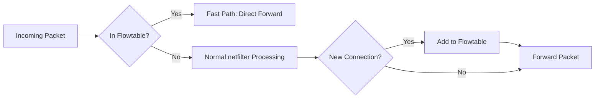

# How to Use nftables Flowtables for Performance Optimization

Author: [nawazdhandala](https://www.github.com/nawazdhandala)

Tags: nftables, Linux, Firewall, Flowtable, Performance, Fast Path, Networking

Description: Accelerate nftables packet forwarding using flowtables to offload established TCP and UDP flows to a kernel fast path, bypassing the full netfilter stack.

## Introduction

nftables flowtables enable software-based flow offloading. Once a connection is established and added to a flowtable, subsequent packets in that flow bypass the full netfilter hook chain and are processed directly in the network stack. This significantly reduces CPU overhead and increases throughput for high-bandwidth forwarding scenarios.

## Prerequisites

- Linux kernel 4.16+
- nftables 0.9.1+
- A routing/forwarding setup (flowtables are for forwarded traffic, not local)
- Root access

## How Flowtables Work



## Create a Flowtable

A flowtable is declared in a table and references the physical interfaces that participate in fast-path forwarding.

```bash
# Create a flowtable for interfaces eth0 and eth1
nft add flowtable inet filter my_flowtable { hook ingress priority 0 \; devices = { eth0, eth1 } \; }
```

## Add a Rule to Offload TCP/UDP Flows

After establishing a connection, add it to the flowtable for fast-path processing:

```bash
# Offload established TCP and UDP connections to the flowtable
nft add rule inet filter forward ct state established,related flow add @my_flowtable
```

## Full Configuration

```bash
#!/usr/sbin/nft -f

flush ruleset

table inet filter {
    # Declare the flowtable: specifies which interfaces participate
    flowtable my_flowtable {
        hook ingress priority 0
        devices = { eth0, eth1 }
    }

    chain input {
        type filter hook input priority 0; policy drop;

        iif lo accept
        ct state established,related accept
        ct state invalid drop

        tcp dport 22 accept
    }

    chain forward {
        type filter hook forward priority 0; policy drop;

        # Add established flows to the flowtable for fast-path forwarding
        ct state established,related flow add @my_flowtable

        # Allow new connections from LAN to WAN
        iif "eth1" oif "eth0" ct state new accept

        # Allow established return traffic
        ct state established,related accept
    }

    chain output {
        type filter hook output priority 0; policy accept;
    }
}
```

## Verify Flowtable Activity

```bash
# List all flowtables
nft list flowtables

# List a specific flowtable
nft list flowtable inet filter my_flowtable
```

## Hardware Offloading (Optional)

On supported NICs, you can push flow offloading to hardware:

```bash
# Add hardware offloading flag (requires driver support)
nft add flowtable inet filter hw_flowtable { \
    hook ingress priority 0 \; \
    devices = { eth0, eth1 } \; \
    flags offload \; \
}
```

## Performance Considerations

- Flowtables work on **forwarded** traffic only, not locally-terminated connections
- They are most beneficial on high-bandwidth routers (multi-Gbps)
- The first packet of each flow still traverses the full netfilter chain
- UDP flows require connection tracking to be established (requires `ct state` tracking)

## Conclusion

nftables flowtables provide a straightforward way to accelerate packet forwarding by offloading established flows to a kernel fast path. For routers and gateways handling high-bandwidth traffic, this can dramatically reduce CPU utilization. The setup requires only a `flowtable` declaration and a single `flow add` rule in the forward chain.
