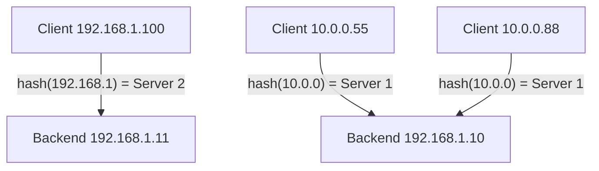

# How to Configure ip_hash Load Balancing in Nginx for IPv4 Clients

Author: [nawazdhandala](https://www.github.com/nawazdhandala)

Tags: Nginx, IPv4, Ip_hash, Session Persistence, Load Balancing, Sticky Sessions

Description: Use Nginx ip_hash to implement session persistence by routing each IPv4 client consistently to the same upstream backend server.

## Introduction

The `ip_hash` directive enables sticky sessions by hashing the client's IPv4 address to select a consistent backend server. This ensures a client always reaches the same server-useful for applications that store session state locally rather than in a shared cache.

## How ip_hash Works

Nginx uses the first three octets of the IPv4 address as the hash key. All clients in the same /24 subnet are hashed the same way:



## Basic ip_hash Configuration

```nginx
# /etc/nginx/conf.d/ip-hash-lb.conf

upstream sticky_backends {
    # Enable IP-based sticky sessions
    ip_hash;

    server 192.168.1.10:8080;
    server 192.168.1.11:8080;
    server 192.168.1.12:8080;
}

server {
    listen 80;
    server_name app.example.com;

    location / {
        proxy_pass http://sticky_backends;
        proxy_set_header Host $host;
        proxy_set_header X-Real-IP $remote_addr;
        proxy_set_header X-Forwarded-For $proxy_add_x_forwarded_for;
        proxy_http_version 1.1;
        proxy_set_header Connection "";
    }
}
```

## Temporarily Removing a Server Without Breaking Sessions

When taking a server offline for maintenance, use `down` instead of removing it. This preserves the hash table so remaining clients aren't remapped:

```nginx
upstream sticky_backends {
    ip_hash;

    server 192.168.1.10:8080;
    server 192.168.1.11:8080;
    # Mark as down: Nginx skips it but keeps hash slots intact
    server 192.168.1.12:8080 down;
}
```

Removing a server entirely forces all clients to be rehashed across the remaining servers, disrupting sessions.

## ip_hash with Weights

You can combine `ip_hash` with weights, though the interaction is less predictable:

```nginx
upstream sticky_backends {
    ip_hash;

    server 192.168.1.10:8080 weight=2;
    server 192.168.1.11:8080 weight=1;
}
```

## Limitations of ip_hash

**Problem: clients behind shared NAT** - Many users sharing one public IPv4 (e.g., corporate NAT) all hash to the same backend, creating uneven load.

**Problem: first three octets only** - Clients in the same /24 always go to the same server even if they have different final octets.

For better session persistence, consider cookie-based stickiness (available in Nginx Plus) or move session state to Redis/Memcached so any backend can serve any client.

## Verifying Persistence

Test that the same client IP always reaches the same backend:

```bash
# Repeat 5 times-should always return the same backend identifier

for i in $(seq 1 5); do
    curl -s http://app.example.com/server-id
done

# Expected: same server ID each time
# server-2
# server-2
# server-2
# server-2
# server-2
```

## Conclusion

`ip_hash` is a quick way to add session persistence to Nginx load balancing without application changes. It works well for small deployments where clients have distinct IPv4 addresses. For larger, NAT-heavy environments, complement it with application-level session sharing to avoid hot spots on a single backend.
