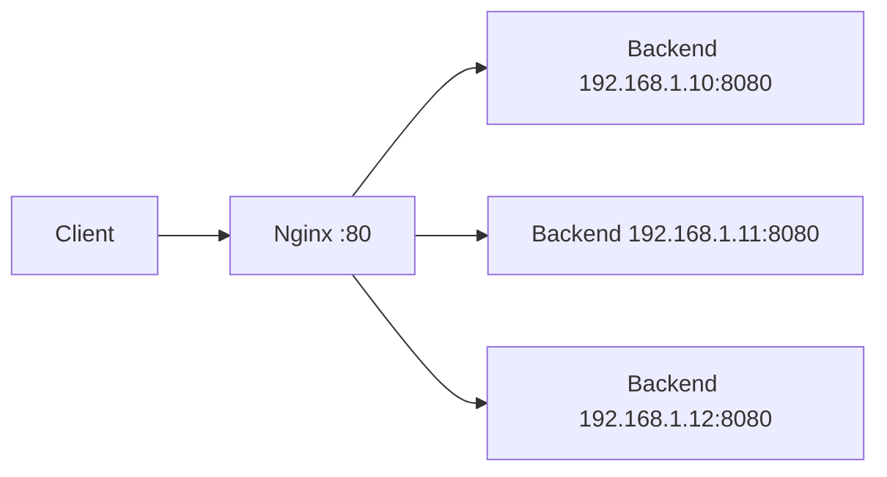

# How to Configure Nginx Load Balancing Across IPv4 Servers

Author: [nawazdhandala](https://www.github.com/nawazdhandala)

Tags: Nginx, Load Balancing, IPv4, Upstream, High Availability, Networking

Description: Set up Nginx as a load balancer distributing HTTP traffic across multiple IPv4 backend servers using round-robin, least connections, and other balancing algorithms.

## Introduction

Nginx's `upstream` module provides built-in load balancing for HTTP, TCP, and UDP traffic. Distributing requests across multiple IPv4 backends increases availability and throughput with minimal configuration.

## Architecture Overview



## Prerequisites

- Nginx installed (open-source or Plus)
- Two or more IPv4 backend servers
- Port 80 or 443 open on the Nginx host

## Round-Robin Load Balancing (Default)

The default algorithm cycles through backends sequentially:

```nginx
# /etc/nginx/conf.d/load-balancer.conf

upstream app_servers {
    # Round-robin: requests distributed 1-2-3-1-2-3...
    server 192.168.1.10:8080;
    server 192.168.1.11:8080;
    server 192.168.1.12:8080;
}

server {
    listen 80;
    server_name example.com;

    location / {
        proxy_pass http://app_servers;

        # Pass client IPv4 address to backends
        proxy_set_header X-Real-IP $remote_addr;
        proxy_set_header X-Forwarded-For $proxy_add_x_forwarded_for;
        proxy_set_header Host $host;

        # Use HTTP/1.1 for connection reuse
        proxy_http_version 1.1;
        proxy_set_header Connection "";

        # Timeouts
        proxy_connect_timeout 5s;
        proxy_send_timeout 60s;
        proxy_read_timeout 60s;
    }
}
```

## Least Connections Algorithm

Routes each new request to the backend with the fewest active connections—best for backends with variable response times:

```nginx
upstream app_servers {
    least_conn;  # Enable least connections balancing

    server 192.168.1.10:8080;
    server 192.168.1.11:8080;
    server 192.168.1.12:8080;
}
```

## Configuring Backup and Down Servers

Mark servers as backup (used only when primary servers fail) or permanently down:

```nginx
upstream app_servers {
    server 192.168.1.10:8080;
    server 192.168.1.11:8080;

    # Only used when 10 and 11 are unavailable
    server 192.168.1.12:8080 backup;

    # Temporarily removed from rotation
    server 192.168.1.13:8080 down;
}
```

## Passive Health Checking

Nginx automatically detects failed backends based on connection errors:

```nginx
upstream app_servers {
    server 192.168.1.10:8080 max_fails=3 fail_timeout=30s;
    server 192.168.1.11:8080 max_fails=3 fail_timeout=30s;
    server 192.168.1.12:8080 max_fails=3 fail_timeout=30s;
    # max_fails: failures before marking server down
    # fail_timeout: how long to keep server out of rotation
}
```

## Testing the Load Balancer

Use a loop to verify traffic is distributed across backends:

```bash
# Send 10 requests and watch which backend responds
for i in $(seq 1 10); do
    curl -s http://example.com/whoami
done

# Each backend can return its own IP to identify itself
# Output should show rotating backend IPs
```

Check the Nginx access log to confirm distribution:

```bash
# Count requests per upstream server
awk '{print $NF}' /var/log/nginx/access.log | sort | uniq -c | sort -rn
```

## Conclusion

Nginx load balancing across IPv4 servers is straightforward with the `upstream` block. Start with round-robin for uniform backends, switch to `least_conn` for variable workloads, and always configure `max_fails` for passive health checking. Combine with keepalive connections for maximum efficiency.
