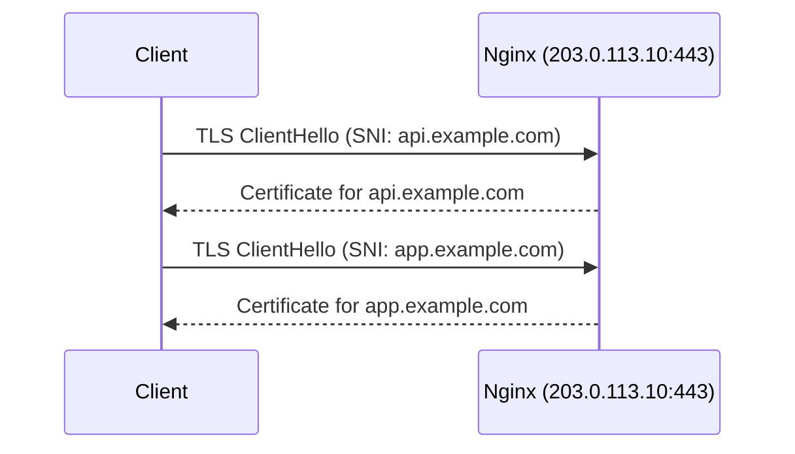

# How to Configure Multiple SSL Certificates on a Single IPv4 Address with SNI

Author: [nawazdhandala](https://www.github.com/nawazdhandala)

Tags: Nginx, SSL, SNI, IPv4, TLS, Virtual Hosting, Certificates

Description: Host multiple HTTPS sites on a single IPv4 address using Server Name Indication (SNI) in Nginx, with each domain using its own SSL certificate.

## Introduction

Server Name Indication (SNI) is a TLS extension that allows clients to specify which hostname they are connecting to during the TLS handshake. This enables Nginx to select the correct certificate for each domain even though they all share one IPv4 address.

## How SNI Works



## Prerequisites

- Nginx compiled with `--with-http_ssl_module` (default)
- Separate certificates for each domain
- Clients using TLS 1.0+ (all modern browsers support SNI)

## Configuration: Multiple Domains on One IPv4

Each `server` block listens on the same IP:port but serves a different certificate:

```nginx
# /etc/nginx/conf.d/site1.conf

server {
    # Both listen on same IPv4:port - SNI selects the right one
    listen 203.0.113.10:443 ssl;
    server_name api.example.com;

    ssl_certificate     /etc/letsencrypt/live/api.example.com/fullchain.pem;
    ssl_certificate_key /etc/letsencrypt/live/api.example.com/privkey.pem;

    ssl_protocols TLSv1.2 TLSv1.3;
    ssl_session_cache shared:SSL:10m;

    location / {
        proxy_pass http://api_backend;
        proxy_set_header Host $host;
        proxy_set_header X-Forwarded-Proto https;
    }
}
```

```nginx
# /etc/nginx/conf.d/site2.conf

server {
    # Same listen address - Nginx uses SNI to differentiate
    listen 203.0.113.10:443 ssl;
    server_name app.example.com;

    ssl_certificate     /etc/letsencrypt/live/app.example.com/fullchain.pem;
    ssl_certificate_key /etc/letsencrypt/live/app.example.com/privkey.pem;

    ssl_protocols TLSv1.2 TLSv1.3;
    ssl_session_cache shared:SSL:10m;

    location / {
        proxy_pass http://app_backend;
        proxy_set_header Host $host;
        proxy_set_header X-Forwarded-Proto https;
    }
}
```

## Shared SSL Configuration with Include

Avoid repeating SSL settings across server blocks using an include file:

```nginx
# /etc/nginx/ssl-common.conf

ssl_protocols TLSv1.2 TLSv1.3;
ssl_ciphers ECDHE-ECDSA-AES128-GCM-SHA256:ECDHE-RSA-AES128-GCM-SHA256;
ssl_prefer_server_ciphers off;
ssl_session_cache shared:SSL:10m;
ssl_session_timeout 1d;
ssl_session_tickets off;
ssl_stapling on;
ssl_stapling_verify on;
resolver 8.8.8.8 valid=300s;
add_header Strict-Transport-Security "max-age=63072000" always;
```

```nginx
server {
    listen 203.0.113.10:443 ssl;
    server_name api.example.com;

    ssl_certificate     /etc/letsencrypt/live/api.example.com/fullchain.pem;
    ssl_certificate_key /etc/letsencrypt/live/api.example.com/privkey.pem;

    # Include shared SSL settings
    include /etc/nginx/ssl-common.conf;

    location / { proxy_pass http://api_backend; }
}
```

## Wildcard Certificate for Subdomains

A single wildcard certificate covers all subdomains on one domain:

```nginx
server {
    listen 203.0.113.10:443 ssl;
    server_name ~^(?<subdomain>.+)\.example\.com$;

    # One wildcard cert for all *.example.com
    ssl_certificate     /etc/letsencrypt/live/example.com/fullchain.pem;
    ssl_certificate_key /etc/letsencrypt/live/example.com/privkey.pem;

    include /etc/nginx/ssl-common.conf;

    location / {
        proxy_pass http://${subdomain}_backend;
    }
}
```

## Verifying SNI Is Working

```bash
# Check which certificate is served for each domain
openssl s_client -connect 203.0.113.10:443 -servername api.example.com 2>/dev/null | \
  openssl x509 -noout -subject -issuer

openssl s_client -connect 203.0.113.10:443 -servername app.example.com 2>/dev/null | \
  openssl x509 -noout -subject -issuer
```

## Conclusion

SNI makes it practical to host dozens of HTTPS sites on a single IPv4 address. Each `server` block in Nginx specifies its own certificate while sharing the same `listen` directive. Use shared include files for common TLS settings to keep configuration DRY, and validate with `openssl s_client` to confirm the correct certificate is presented per domain.
