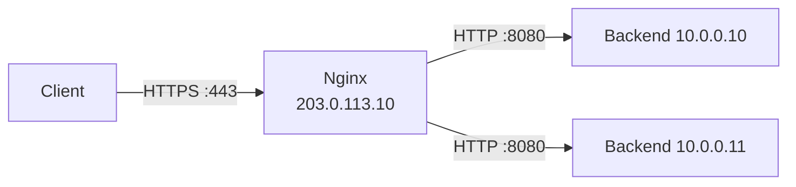

# How to Set Up Nginx SSL Termination on an IPv4 Address

Author: [nawazdhandala](https://www.github.com/nawazdhandala)

Tags: Nginx, SSL, TLS, IPv4, HTTPS, Certificate, Security

Description: Configure Nginx as an SSL termination proxy on a specific IPv4 address, handling HTTPS encryption while forwarding plain HTTP to backend servers.

## Introduction

SSL termination at Nginx offloads the CPU-intensive cryptographic work from application backends. Nginx decrypts incoming HTTPS requests and forwards them as plain HTTP to upstream servers over a trusted internal network.

## Architecture



## Prerequisites

- A valid SSL certificate and private key (or Let's Encrypt)
- Nginx with `ssl` module compiled in (default on most distributions)

## Obtaining a Certificate with Certbot

```bash
# Install Certbot

sudo apt install certbot python3-certbot-nginx

# Obtain certificate for your domain
sudo certbot --nginx -d example.com -d www.example.com

# Certificates are stored at:
# /etc/letsencrypt/live/example.com/fullchain.pem
# /etc/letsencrypt/live/example.com/privkey.pem
```

## SSL Termination Configuration

Bind SSL to a specific IPv4 address and forward traffic to backends:

```nginx
# /etc/nginx/conf.d/ssl-termination.conf

upstream app_backends {
    server 10.0.0.10:8080;
    server 10.0.0.11:8080;
    keepalive 32;
}

# Redirect HTTP to HTTPS
server {
    listen 203.0.113.10:80;
    server_name example.com www.example.com;
    return 301 https://$host$request_uri;
}

# SSL termination server
server {
    # Bind to specific IPv4 address
    listen 203.0.113.10:443 ssl;
    server_name example.com www.example.com;

    # Certificate files
    ssl_certificate     /etc/letsencrypt/live/example.com/fullchain.pem;
    ssl_certificate_key /etc/letsencrypt/live/example.com/privkey.pem;

    # Modern TLS settings
    ssl_protocols TLSv1.2 TLSv1.3;
    ssl_ciphers ECDHE-ECDSA-AES128-GCM-SHA256:ECDHE-RSA-AES128-GCM-SHA256:ECDHE-ECDSA-AES256-GCM-SHA384:ECDHE-RSA-AES256-GCM-SHA384;
    ssl_prefer_server_ciphers off;

    # Session resumption for performance
    ssl_session_cache    shared:SSL:10m;
    ssl_session_timeout  1d;
    ssl_session_tickets  off;

    # HSTS header
    add_header Strict-Transport-Security "max-age=63072000" always;

    location / {
        proxy_pass http://app_backends;
        proxy_http_version 1.1;
        proxy_set_header Connection "";

        # Pass TLS metadata to backends
        proxy_set_header X-Forwarded-Proto https;
        proxy_set_header X-Real-IP $remote_addr;
        proxy_set_header X-Forwarded-For $proxy_add_x_forwarded_for;
        proxy_set_header Host $host;
    }
}
```

## Enabling OCSP Stapling

OCSP stapling improves TLS handshake performance by caching the certificate revocation response:

```nginx
server {
    listen 203.0.113.10:443 ssl;

    ssl_certificate     /etc/letsencrypt/live/example.com/fullchain.pem;
    ssl_certificate_key /etc/letsencrypt/live/example.com/privkey.pem;
    ssl_trusted_certificate /etc/letsencrypt/live/example.com/chain.pem;

    # Enable OCSP stapling
    ssl_stapling on;
    ssl_stapling_verify on;
    resolver 8.8.8.8 1.1.1.1 valid=300s;
    resolver_timeout 5s;
}
```

## Testing SSL Configuration

```bash
# Test TLS handshake and certificate chain
openssl s_client -connect 203.0.113.10:443 -servername example.com

# Check TLS grade with testssl.sh
./testssl.sh example.com

# Verify HSTS header is present
curl -I https://example.com | grep Strict-Transport-Security
```

## Conclusion

Nginx SSL termination on a specific IPv4 address centralizes certificate management and reduces backend complexity. Use TLS 1.2/1.3 with modern cipher suites, enable OCSP stapling for performance, and always forward `X-Forwarded-Proto: https` so backends know the original connection was secure.
