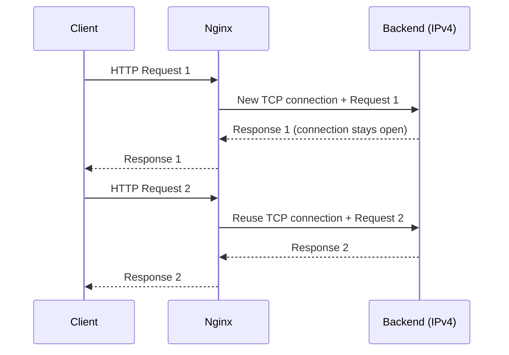

# How to Configure Nginx Upstream Keepalive Connections for IPv4 Backends

Author: [nawazdhandala](https://www.github.com/nawazdhandala)

Tags: Nginx, IPv4, Upstream, Keepalive, Performance, Load Balancing, Networking

Description: Configure Nginx upstream keepalive connections to reuse persistent TCP connections to IPv4 backend servers, reducing connection overhead and improving throughput.

## Introduction

By default, Nginx opens a new TCP connection to upstream backends for every proxied request. Enabling keepalive connections in the upstream block allows Nginx to maintain a pool of idle connections that can be reused, significantly reducing latency and CPU overhead-especially at high request rates.

## How Upstream Keepalive Works



## Prerequisites

- Nginx 1.1.4+ installed
- One or more IPv4 upstream servers running
- HTTP/1.1 capable backends (required for keepalive)

## Basic Keepalive Configuration

The `keepalive` directive sets the maximum number of idle connections per worker process. Add it to your `upstream` block:

```nginx
# /etc/nginx/conf.d/upstream.conf

upstream backend_pool {
    # Define IPv4 backend servers
    server 192.168.1.10:8080;
    server 192.168.1.11:8080;
    server 192.168.1.12:8080;

    # Keep up to 32 idle keepalive connections per worker
    keepalive 32;

    # Maximum number of requests per keepalive connection (Nginx 1.15.3+)
    keepalive_requests 1000;

    # Timeout for idle keepalive connections
    keepalive_timeout 60s;
}

server {
    listen 80;

    location / {
        proxy_pass http://backend_pool;

        # REQUIRED: upgrade to HTTP/1.1 for keepalive to work
        proxy_http_version 1.1;

        # Clear the Connection header to prevent close semantics
        proxy_set_header Connection "";

        proxy_set_header Host $host;
        proxy_set_header X-Real-IP $remote_addr;
    }
}
```

## Key Directives Explained

| Directive | Default | Purpose |
|---|---|---|
| `keepalive N` | none | Max idle connections per worker |
| `keepalive_requests N` | 1000 | Max requests per connection |
| `keepalive_timeout T` | 60s | Idle timeout before closing |

## Verifying Keepalive Is Active

Use `ss` to confirm connections remain in ESTABLISHED state after requests complete:

```bash
# Watch TCP connections to backend port 8080

watch -n 1 "ss -tn dst 192.168.1.10:8080"

# Expected output shows connections in ESTABLISHED state
# even between requests when keepalive is working
# State    Recv-Q Send-Q  Local Address:Port  Peer Address:Port
# ESTAB    0      0       10.0.0.1:54321      192.168.1.10:8080
```

Check Nginx connection reuse with stub_status:

```nginx
# Add to your server block for status endpoint
location /nginx_status {
    stub_status;
    allow 127.0.0.1;
    deny all;
}
```

```bash
curl http://localhost/nginx_status
# Active connections: 45
# server accepts handled requests
#  1000 1000 5000
# Reading: 0 Writing: 5 Waiting: 40
```

## Tuning Recommendations

For high-traffic environments, adjust the keepalive pool size relative to your worker count:

```nginx
# /etc/nginx/nginx.conf
worker_processes auto;
events {
    worker_connections 1024;
}

upstream backend_pool {
    server 192.168.1.10:8080;
    server 192.168.1.11:8080;

    # Rule of thumb: (worker_connections / upstream_servers) * 0.5
    keepalive 64;
    keepalive_requests 10000;
    keepalive_timeout 75s;
}
```

## Common Pitfall: Missing HTTP/1.1 Upgrade

If you forget `proxy_http_version 1.1` and `proxy_set_header Connection ""`, Nginx defaults to HTTP/1.0 which does not support keepalive. The backend will close each connection after responding, negating all benefits.

## Conclusion

Enabling upstream keepalive in Nginx is a low-effort, high-impact optimization for IPv4 backends. Set `keepalive` to a value matching your concurrency needs, always pair it with `proxy_http_version 1.1`, and clear the `Connection` header. Monitor with `stub_status` and `ss` to confirm connections are being reused.
