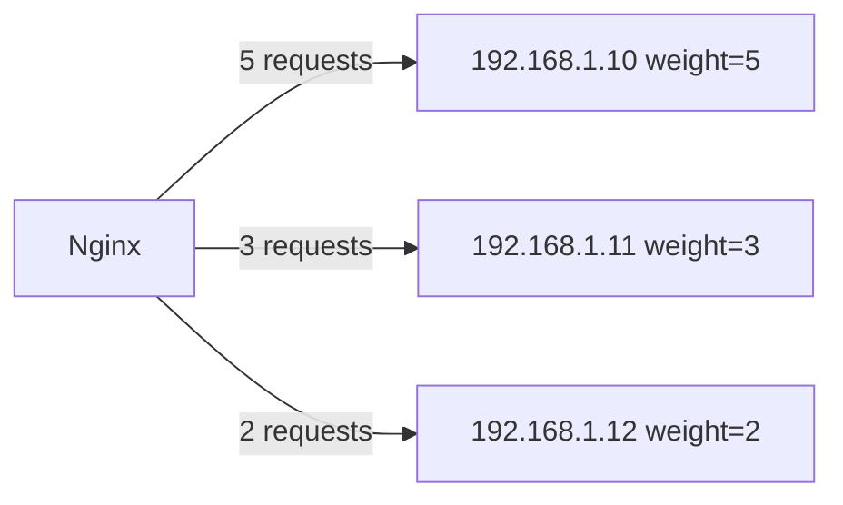

# How to Set Up Weighted Load Balancing in Nginx with IPv4 Upstreams

Author: [nawazdhandala](https://www.github.com/nawazdhandala)

Tags: Nginx, Load Balancing, IPv4, Weighted, Upstream, Performance, Networking

Description: Configure weighted load balancing in Nginx to distribute traffic proportionally across IPv4 upstream servers based on their capacity.

## Introduction

Weighted load balancing lets you send more traffic to higher-capacity servers. If one backend has twice the CPU and memory of another, you can assign it double the weight to utilize its resources fully.

## How Weights Work

With `weight=N`, Nginx treats each server as if it were `N` separate servers in the round-robin pool:



## Basic Weighted Configuration

Assign `weight` to each server based on its relative capacity:

```nginx
# /etc/nginx/conf.d/weighted-lb.conf

upstream weighted_backends {
    # High-capacity server: receives 50% of traffic
    server 192.168.1.10:8080 weight=5;

    # Medium-capacity server: receives 30% of traffic
    server 192.168.1.11:8080 weight=3;

    # Low-capacity server: receives 20% of traffic
    server 192.168.1.12:8080 weight=2;
}

server {
    listen 80;
    server_name example.com;

    location / {
        proxy_pass http://weighted_backends;
        proxy_set_header Host $host;
        proxy_set_header X-Real-IP $remote_addr;
        proxy_set_header X-Forwarded-For $proxy_add_x_forwarded_for;
        proxy_http_version 1.1;
        proxy_set_header Connection "";
    }
}
```

## Combining Weight with Failure Detection

Weights work together with `max_fails` and `fail_timeout`:

```nginx
upstream weighted_backends {
    # Primary: high-capacity, strict failure detection
    server 192.168.1.10:8080 weight=5 max_fails=3 fail_timeout=15s;

    # Secondary: medium-capacity
    server 192.168.1.11:8080 weight=3 max_fails=3 fail_timeout=15s;

    # Canary: low weight for gradual rollout testing
    server 192.168.1.20:8080 weight=1 max_fails=2 fail_timeout=30s;
}
```

## Canary Deployments with Weights

Use a very low weight to send a small percentage of traffic to a new version:

```nginx
upstream app_with_canary {
    # Stable version: 95% of traffic
    server 192.168.1.10:8080 weight=95;
    server 192.168.1.11:8080 weight=95;

    # Canary version: ~5% of traffic
    server 192.168.1.50:8080 weight=10;
}
```

## Verifying Weight Distribution

Send a batch of requests and count how many hit each backend:

```bash
# Each backend returns its hostname or IP in the response
for i in $(seq 1 100); do
    curl -s http://example.com/backend-id
done | sort | uniq -c | sort -rn

# Expected output proportional to weights:
# 50  backend-10
# 30  backend-11
# 20  backend-12
```

Monitor distribution via Nginx access logs:

```bash
# Requires $upstream_addr in log format
log_format upstream_log '$remote_addr - $upstream_addr [$time_local] '
                        '"$request" $status $body_bytes_sent';
```

## Dynamically Updating Weights (Nginx Plus)

Nginx Plus supports runtime updates via the API without reloading:

```bash
# Update weight of backend 192.168.1.12 to 5
curl -X PATCH http://localhost/api/9/http/upstreams/weighted_backends/servers/2 \
  -H "Content-Type: application/json" \
  -d '{"weight": 5}'
```

Open-source Nginx requires a reload (`nginx -s reload`) to apply weight changes.

## Conclusion

Weighted load balancing in Nginx is a simple directive—`weight=N`—that gives you precise control over traffic distribution. Use it to match load to server capacity, gradually roll out new versions with canary deployments, or shift traffic away from servers undergoing maintenance.
