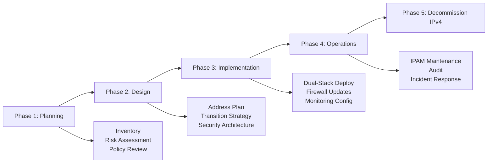

# How to Follow NIST SP 800-119 IPv6 Secure Deployment Guidelines

Author: [nawazdhandala](https://www.github.com/nawazdhandala)

Tags: IPv6, Security, NIST, Compliance, Guidelines

Description: Learn the key recommendations from NIST Special Publication 800-119 for securely deploying IPv6 in federal and enterprise networks.

## Overview

NIST Special Publication 800-119, "Guidelines for the Secure Deployment of IPv6," provides a comprehensive framework for planning and implementing IPv6 in federal agencies and enterprises. It was published to address the security implications of transitioning from IPv4 to IPv6 and identifies risks unique to each transition mechanism.

## Core Recommendations

### 1. Inventory and Planning

Before deploying IPv6, NIST recommends a thorough inventory:

```text
[ ] Identify all hosts, routers, and appliances
[ ] Determine which support IPv6 (check vendor documentation)
[ ] Identify applications that may behave differently under IPv6
[ ] Catalog all security controls and verify they cover IPv6
[ ] Create an IPv6 address management (IPAM) plan
```

### 2. Risk Assessment by Transition Mechanism

NIST SP 800-119 categorizes transition mechanisms by risk level:

| Mechanism | Risk Level | Recommendation |
|-----------|-----------|----------------|
| Dual-stack | Medium | Preferred - visible and manageable |
| 6in4 manual tunnel | Medium | Acceptable with proper ACLs |
| 6to4 automatic | High | Avoid - deprecated, uncontrolled relays |
| Teredo | High | Disable - bypasses NAT/firewalls |
| ISATAP | Medium-High | Use only in controlled environments |
| NAT64/DNS64 | Low-Medium | Preferred for IPv4-only backends |

### 3. Security Policy Coverage

NIST requires that all IPv4 security policies be explicitly extended to IPv6:

```bash
# Check: Do your firewall rules cover IPv6?

# IPv4 rule example:
iptables -A INPUT -p tcp --dport 22 -s 10.0.0.0/8 -j ACCEPT

# IPv6 equivalent MUST exist:
ip6tables -A INPUT -p tcp --dport 22 -s fd00::/8 -j ACCEPT
# Failure to add IPv6 rules = implicit permit for IPv6
```

### 4. Address Planning Requirements

NIST recommends a structured addressing plan:

```text
Infrastructure addresses:   2001:db8:0:ffxx::/64  (routers, switches)
Server subnets:             2001:db8:0:01xx::/64
User subnets:               2001:db8:0:10xx::/64
DMZ:                        2001:db8:0:20xx::/64
Management:                 fd00:mgmt::/48 (ULA)
```

### 5. Transition Technology Security

**Disable Unused Transition Technologies on Hosts:**

```powershell
# Windows: Disable all automatic tunnel mechanisms
netsh interface teredo set state disabled
netsh interface isatap set state disabled
netsh interface 6to4 set state disabled
```

```bash
# Linux: Disable automatic tunnel modules
echo "blacklist sit" >> /etc/modprobe.d/disable-ipv6-tunnels.conf
echo "blacklist ipv6" >> /etc/modprobe.d/disable-ipv6-tunnels.conf
modprobe -r sit
```

**Block at Network Perimeter:**

```bash
# Block protocol 41 and Teredo
iptables -A FORWARD -p 41 -j DROP
iptables -A FORWARD -p udp --dport 3544 -j DROP
```

### 6. Routing Infrastructure

NIST requires route origin authentication for IPv6:

```bash
# RPKI route origin validation (FRRouting)
router bgp 65000
  address-family ipv6 unicast
    bgp bestpath prefix-validate allow-invalid   ! Log but don't drop initially
    neighbor 2001:db8::1 route-map RPKI-CHECK in
!
route-map RPKI-CHECK permit 10
  match rpki valid
route-map RPKI-CHECK permit 20
  match rpki notfound
route-map RPKI-CHECK deny 30
  match rpki invalid    ! Drop RPKI-invalid routes
```

### 7. Monitoring Requirements

NIST requires that IPv6 traffic be monitored on equal footing with IPv4:

```bash
# Ensure syslog captures IPv6 firewall drops
ip6tables -A INPUT -j LOG --log-prefix "IPv6-INPUT-DROP: " --log-level 4
ip6tables -A FORWARD -j LOG --log-prefix "IPv6-FWD-DROP: " --log-level 4

# Ensure NetFlow/IPFIX captures IPv6
# Check with: tcpdump -i eth0 'udp port 9995 or udp port 9996'
```

### 8. DNS Security for IPv6

NIST recommends DNSSEC for AAAA record validation:

```bash
# Verify DNSSEC is validating AAAA records
dig +dnssec AAAA ipv6.google.com

# Check DNS64 deployment (if used)
# DNS64 synthesizes AAAA records - must be protected against spoofing
```

## NIST SP 800-119 Implementation Phases



## Summary

NIST SP 800-119 provides a phased approach to IPv6 deployment: inventory and plan, design with risk-aware transition mechanisms, implement dual-stack while extending all IPv4 security controls to IPv6, and monitor continuously. Key actions include disabling unauthorized tunneling on hosts, blocking protocol 41/Teredo at the perimeter, creating structured IPv6 address plans, and ensuring SIEM/NetFlow captures IPv6 traffic.
