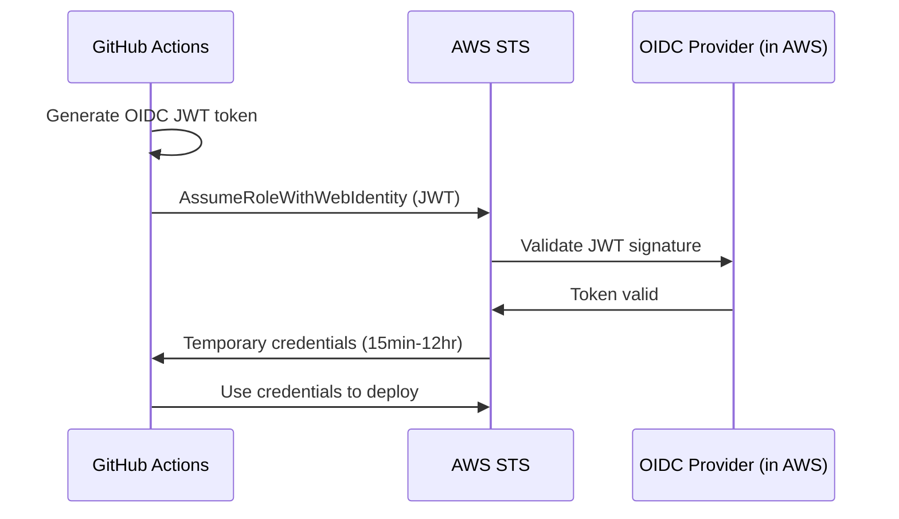

# How to Manage OIDC Providers with OpenTofu

Author: [nawazdhandala](https://www.github.com/nawazdhandala)

Tags: OpenTofu, OIDC, AWS, GitHub Actions, IAM, Keyless Authentication, Security

Description: Learn how to configure OIDC identity providers in AWS using OpenTofu to enable keyless authentication for GitHub Actions, GitLab CI, and other CI/CD systems.

---

OIDC (OpenID Connect) federation allows CI/CD systems to authenticate to cloud providers without storing long-lived credentials. Instead of storing an AWS access key in GitHub Secrets, GitHub Actions proves its identity using a short-lived JWT token. OpenTofu makes setting up this trust relationship repeatable and auditable.

## How OIDC Federation Works



## Setting Up GitHub Actions OIDC with AWS

```hcl
# main.tf

terraform {
  required_providers {
    aws = {
      source  = "hashicorp/aws"
      version = "~> 5.30"
    }
  }
}

provider "aws" {
  region = var.aws_region
}

# Create the OIDC provider for GitHub Actions
resource "aws_iam_openid_connect_provider" "github_actions" {
  url = "https://token.actions.githubusercontent.com"

  # The client ID list - for GitHub Actions, use the AWS STS audience
  client_id_list = ["sts.amazonaws.com"]

  # GitHub's OIDC thumbprint - verify this matches the current cert
  # Get current value: openssl s_client -servername token.actions.githubusercontent.com \
  #   -connect token.actions.githubusercontent.com:443 < /dev/null 2>/dev/null | \
  #   openssl x509 -fingerprint -sha1 -noout
  thumbprint_list = ["6938fd4d98bab03faadb97b34396831e3780aea1"]
}

# Create a role that GitHub Actions can assume
resource "aws_iam_role" "github_actions_deploy" {
  name = "GitHubActionsDeployRole"

  assume_role_policy = jsonencode({
    Version = "2012-10-17"
    Statement = [
      {
        Effect = "Allow"
        Principal = {
          Federated = aws_iam_openid_connect_provider.github_actions.arn
        }
        Action = "sts:AssumeRoleWithWebIdentity"
        Condition = {
          StringEquals = {
            # Only allow tokens from the AWS audience
            "token.actions.githubusercontent.com:aud" = "sts.amazonaws.com"
          }
          StringLike = {
            # Restrict to specific repo and branch pattern
            # sub format: repo:<owner>/<repo>:ref:refs/heads/<branch>
            "token.actions.githubusercontent.com:sub" = "repo:${var.github_org}/${var.github_repo}:ref:refs/heads/main"
          }
        }
      }
    ]
  })
}

# Attach deployment permissions to the role
resource "aws_iam_role_policy_attachment" "deploy_policy" {
  role       = aws_iam_role.github_actions_deploy.name
  policy_arn = aws_iam_policy.deploy.arn
}
```

## Supporting Multiple Environments

Use different role ARNs for different branches or environments.

```hcl
# multi_env.tf
# Allow main branch to deploy to production
resource "aws_iam_role" "github_production" {
  name = "GitHubActionsProductionRole"

  assume_role_policy = jsonencode({
    Version = "2012-10-17"
    Statement = [{
      Effect    = "Allow"
      Principal = { Federated = aws_iam_openid_connect_provider.github_actions.arn }
      Action    = "sts:AssumeRoleWithWebIdentity"
      Condition = {
        StringEquals = {
          "token.actions.githubusercontent.com:aud" = "sts.amazonaws.com"
          # Lock to main branch only for production role
          "token.actions.githubusercontent.com:sub" = "repo:${var.github_org}/${var.github_repo}:ref:refs/heads/main"
        }
      }
    }]
  })
}

# Allow any branch to deploy to staging
resource "aws_iam_role" "github_staging" {
  name = "GitHubActionsStagingRole"

  assume_role_policy = jsonencode({
    Version = "2012-10-17"
    Statement = [{
      Effect    = "Allow"
      Principal = { Federated = aws_iam_openid_connect_provider.github_actions.arn }
      Action    = "sts:AssumeRoleWithWebIdentity"
      Condition = {
        StringEquals = {
          "token.actions.githubusercontent.com:aud" = "sts.amazonaws.com"
        }
        StringLike = {
          # Any branch can deploy to staging
          "token.actions.githubusercontent.com:sub" = "repo:${var.github_org}/${var.github_repo}:*"
        }
      }
    }]
  })
}
```

## Example GitHub Actions Workflow

```yaml
# .github/workflows/deploy.yml
name: Deploy
on:
  push:
    branches: [main]

permissions:
  id-token: write   # Required for OIDC
  contents: read

jobs:
  deploy:
    runs-on: ubuntu-latest
    steps:
      - uses: actions/checkout@v4

      - name: Configure AWS credentials via OIDC
        uses: aws-actions/configure-aws-credentials@v4
        with:
          role-to-assume: arn:aws:iam::123456789012:role/GitHubActionsDeployRole
          aws-region: us-east-1

      - name: Deploy
        run: aws ecs update-service --cluster prod --service app --force-new-deployment
```

## Best Practices

- Always use sub-claim conditions to restrict which repos and branches can assume a role.
- Use separate roles for production and non-production environments.
- Set a short `max_session_duration` on the role (e.g., 3600 seconds) to limit token lifetime.
- Audit OIDC provider thumbprints regularly as certificate rotations can break federation.
- Consider using `StringEquals` for the sub claim instead of `StringLike` wherever the exact value is known.
