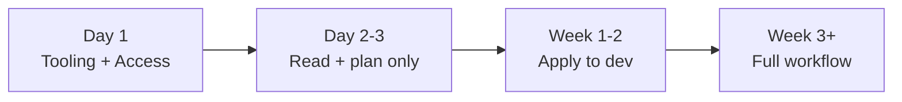

# How to Onboard New Team Members to an OpenTofu Project

Author: [nawazdhandala](https://www.github.com/nawazdhandala)

Tags: OpenTofu, Onboarding, Team Workflows, Documentation, Developer Experience, Infrastructure as Code

Description: Learn how to create a smooth onboarding experience for new team members joining an OpenTofu project, including environment setup, access provisioning, and learning resources.

---

A structured onboarding process gets new team members productive in days instead of weeks. For OpenTofu projects, this means automated tooling setup, scoped access that can be expanded as trust grows, and hands-on exercises against a safe environment.

## Onboarding Checklist



## Automated Tooling Setup

```bash
# .tool-versions - works with mise or asdf

opentofu 1.6.0
terraform-docs 0.17.0
tflint 0.50.3
pre-commit 3.6.0

# Setup script: scripts/onboard.sh
#!/bin/bash
set -euo pipefail

echo "Setting up OpenTofu development environment..."

# Install mise if not present
if ! command -v mise &>/dev/null; then
  curl https://mise.run | sh
fi

# Install all tools from .tool-versions
mise install

# Install pre-commit hooks
pre-commit install

# Configure AWS CLI profile for dev account
aws configure --profile dev

echo "Setup complete! Run 'make help' to see available commands."
```

## Scoped IAM Role for New Engineers

```hcl
# iam_onboarding.tf
resource "aws_iam_policy" "new_engineer_dev" {
  name        = "new-engineer-dev-readonly"
  description = "Read-only access to dev infrastructure for new engineers"

  policy = jsonencode({
    Version = "2012-10-17"
    Statement = [
      {
        # Can run tofu plan against dev
        Effect = "Allow"
        Action = [
          "ec2:Describe*",
          "rds:Describe*",
          "ecs:Describe*",
          "s3:GetObject",
          "s3:ListBucket",
          "cloudwatch:Get*",
          "cloudwatch:Describe*"
        ]
        Resource = "*"
        Condition = {
          StringEquals = {
            "aws:ResourceTag/Environment" = "dev"
          }
        }
      },
      {
        # Can read state from dev
        Effect   = "Allow"
        Action   = ["s3:GetObject", "dynamodb:GetItem"]
        Resource = [
          "${aws_s3_bucket.state.arn}/environments/dev/*",
          aws_dynamodb_table.state_lock.arn
        ]
      }
    ]
  })
}

resource "aws_iam_group_membership" "new_engineers" {
  name  = "new-engineers"
  users = var.new_engineer_usernames
  group = aws_iam_group.new_engineers.name
}
```

## Sandbox Environment

```hcl
# sandbox.tf - personal sandbox per engineer
resource "aws_iam_role" "sandbox" {
  for_each = toset(var.engineer_usernames)
  name     = "sandbox-${each.key}"

  assume_role_policy = jsonencode({
    Version = "2012-10-17"
    Statement = [{
      Effect = "Allow"
      Principal = {
        AWS = "arn:aws:iam::${var.account_id}:user/${each.key}"
      }
      Action = "sts:AssumeRole"
    }]
  })

  tags = {
    Purpose = "engineer-sandbox"
    Engineer = each.key
  }
}

# Sandbox has limited permissions scoped to sandbox resources
resource "aws_iam_role_policy" "sandbox" {
  for_each = toset(var.engineer_usernames)
  name     = "sandbox-permissions"
  role     = aws_iam_role.sandbox[each.key].id

  policy = jsonencode({
    Version = "2012-10-17"
    Statement = [{
      Effect   = "Allow"
      Action   = ["ec2:*", "rds:*", "s3:*"]
      Resource = "*"
      Condition = {
        StringEquals = {
          "aws:RequestedRegion" = "us-east-1"
          "aws:ResourceTag/Owner" = each.key
        }
      }
    }]
  })
}
```

## Onboarding Guide Checklist

```markdown
# New Engineer Onboarding Guide

## Day 1: Environment Setup
- [ ] Run `./scripts/onboard.sh`
- [ ] Verify `tofu version` shows correct version
- [ ] Configure AWS CLI: `aws configure --profile dev`
- [ ] Clone infra repo and run `make init ENVIRONMENT=dev`

## Day 2: Exploration
- [ ] Read `docs/architecture.md` for system overview
- [ ] Review existing modules in `modules/`
- [ ] Run `tofu plan` against dev and review output
- [ ] Read last 5 merged PRs to understand team workflow

## Week 1: First Change
- [ ] Pick up a "good first issue" labeled ticket
- [ ] Make change, run `make plan ENVIRONMENT=dev`
- [ ] Open PR and request review from buddy
- [ ] Observe how Atlantis comments the plan

## Resources
- [Team conventions](docs/conventions.md)
- [Module catalog](docs/modules.md)
- [AWS account IDs](docs/accounts.md)
```

## Best Practices

- Automate tooling setup with a single script - "run this one command" is more reliable than a multi-step guide.
- Grant read-only access first and expand incrementally - it's easier to add permissions than to explain a production incident.
- Assign a buddy for the first two weeks to answer questions and review first PRs.
- Create sandbox accounts or namespaces where new engineers can experiment without risk to shared environments.
- Keep the onboarding guide in the repository so it stays up to date when tools and processes change.
