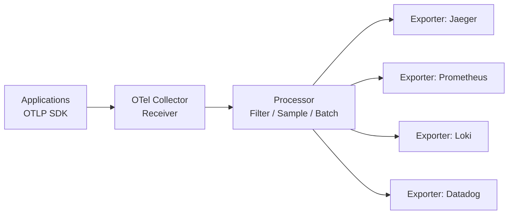

# How to Deploy OpenTelemetry Collector with OpenTofu

Author: [nawazdhandala](https://www.github.com/nawazdhandala)

Tags: OpenTofu, OpenTelemetry, Observability, Traces, Metrics, Logs, Kubernetes, Helm, Infrastructure as Code

Description: Learn how to deploy the OpenTelemetry Collector on Kubernetes using OpenTofu to collect, process, and export traces, metrics, and logs to multiple backends.

---

The OpenTelemetry Collector is a vendor-neutral telemetry pipeline that receives, processes, and exports traces, metrics, and logs. Deploying it with OpenTofu standardizes the observability pipeline across environments and makes it easy to switch backends without redeploying applications.

## OpenTelemetry Collector Pipeline



## Collector Deployment Modes

```hcl
# otel_collector.tf

# DaemonSet mode - one collector per node (for log and metric collection)

resource "helm_release" "otel_daemonset" {
  name             = "otel-collector-daemonset"
  repository       = "https://open-telemetry.github.io/opentelemetry-helm-charts"
  chart            = "opentelemetry-collector"
  version          = "0.73.1"
  namespace        = "observability"
  create_namespace = true

  values = [
    yamlencode({
      mode = "daemonset"

      config = {
        receivers = {
          # Receive OTLP from pods on the same node
          otlp = {
            protocols = {
              grpc = { endpoint = "0.0.0.0:4317" }
              http = { endpoint = "0.0.0.0:4318" }
            }
          }
          # Collect host metrics
          hostmetrics = {
            root_path   = "/hostfs"
            collection_interval = "30s"
            scrapers = {
              cpu        = {}
              disk       = {}
              filesystem = {}
              load       = {}
              memory     = {}
              network    = {}
            }
          }
          # Collect Kubernetes events
          k8s_events = {}
        }

        processors = {
          batch = {
            timeout    = "10s"
            send_batch_size = 1000
          }
          memory_limiter = {
            limit_mib       = 400
            spike_limit_mib = 100
          }
          # Add k8s metadata to all telemetry
          k8sattributes = {
            auth_type = "serviceAccount"
            extract = {
              metadata = ["k8s.pod.name", "k8s.namespace.name", "k8s.deployment.name"]
              labels = [{ from = "pod", key = "app" }]
            }
          }
          # Add resource attributes
          resource = {
            attributes = [
              { key = "deployment.environment", value = var.environment, action = "insert" }
              { key = "k8s.cluster.name", value = var.cluster_name, action = "insert" }
            ]
          }
        }

        exporters = {
          # Export traces to Jaeger
          otlp = {
            endpoint = "jaeger-collector.observability:14250"
            tls = { insecure = true }
          }

          # Export metrics to Prometheus
          prometheusremotewrite = {
            endpoint = "http://kube-prometheus-stack-prometheus.monitoring:9090/api/v1/write"
          }

          # Debug logging in dev
          logging = {
            verbosity = var.environment == "dev" ? "detailed" : "basic"
          }
        }

        service = {
          pipelines = {
            traces = {
              receivers  = ["otlp"]
              processors = ["memory_limiter", "k8sattributes", "resource", "batch"]
              exporters  = ["otlp"]
            }
            metrics = {
              receivers  = ["otlp", "hostmetrics"]
              processors = ["memory_limiter", "k8sattributes", "resource", "batch"]
              exporters  = ["prometheusremotewrite"]
            }
          }
        }
      }

      resources = {
        requests = { cpu = "50m", memory = "128Mi" }
        limits   = { cpu = "250m", memory = "512Mi" }
      }

      # Access to host filesystem for hostmetrics
      extraVolumeMounts = [{
        name      = "hostfs"
        mountPath = "/hostfs"
        readOnly  = true
      }]

      extraVolumes = [{
        name = "hostfs"
        hostPath = { path = "/" }
      }]
    })
  ]
}
```

## Gateway Deployment Mode

```hcl
# Centralized gateway - receives from all DaemonSets and routes to backends
resource "helm_release" "otel_gateway" {
  name       = "otel-collector-gateway"
  repository = "https://open-telemetry.github.io/opentelemetry-helm-charts"
  chart      = "opentelemetry-collector"
  version    = "0.73.1"
  namespace  = "observability"

  values = [
    yamlencode({
      mode     = "deployment"
      replicas = var.environment == "production" ? 2 : 1

      config = {
        receivers = {
          otlp = {
            protocols = {
              grpc = { endpoint = "0.0.0.0:4317" }
              http = { endpoint = "0.0.0.0:4318" }
            }
          }
        }
        processors = {
          batch = { timeout = "5s" }
          # Tail sampling - keep only interesting traces
          tail_sampling = {
            decision_wait = "10s"
            policies = [
              { name = "errors-policy", type = "status_code", status_code = { status_codes = ["ERROR"] } }
              { name = "slow-policy", type = "latency", latency = { threshold_ms = 1000 } }
            ]
          }
        }
        exporters = {
          otlp = { endpoint = "jaeger-collector.observability:14250", tls = { insecure = true } }
        }
        service = {
          pipelines = {
            traces = {
              receivers  = ["otlp"]
              processors = ["batch", "tail_sampling"]
              exporters  = ["otlp"]
            }
          }
        }
      }
    })
  ]
}
```

## Best Practices

- Always configure `memory_limiter` processor - without it, a burst of telemetry can OOM the collector.
- Use tail sampling in the gateway collector for traces - it lets you keep 100% of error and slow traces without storing all traces.
- Use DaemonSet mode for host metrics and log collection; use Deployment mode for the centralized gateway.
- Add `k8sattributes` processor to all pipelines - Kubernetes metadata (pod name, namespace, deployment) is essential for correlating telemetry.
- Keep the collector configuration in a separate ConfigMap so it can be updated without redeploying the Helm release.
