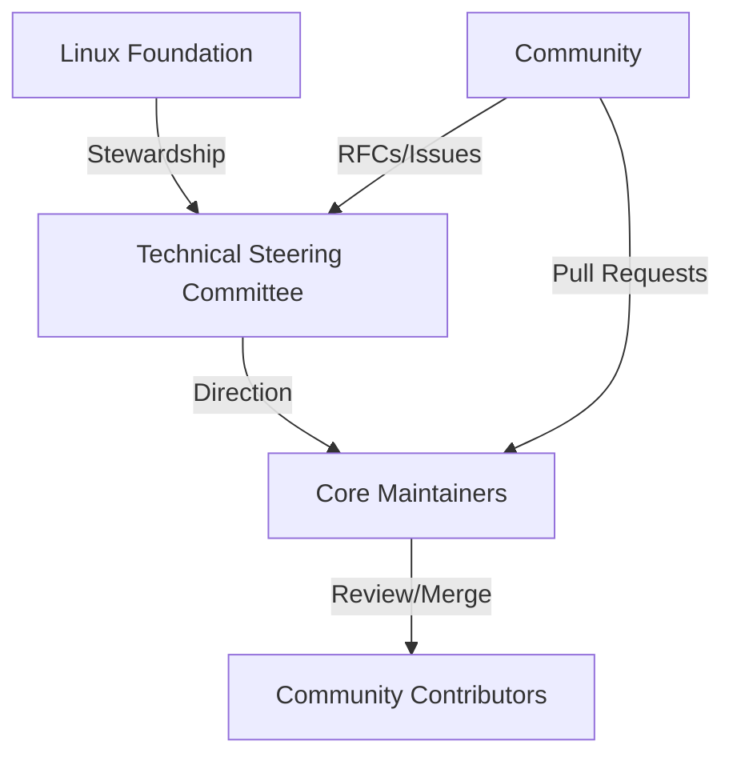

# How to Understand OpenTofu Governance Model

Author: [nawazdhandala](https://www.github.com/nawazdhandala)

Tags: OpenTofu, Governance, Open Source, Linux Foundation, Community, Contributing

Description: Learn about OpenTofu's governance model, how decisions are made, who maintains the project, and how the community participates in its direction.

## Introduction

OpenTofu is an open source project under the Linux Foundation. Its governance model ensures the project remains open, vendor-neutral, and community-driven. Understanding the governance structure helps you know who makes decisions, how to influence them, and what protections are in place.

## Governance Overview



## The Technical Steering Committee (TSC)

The TSC is responsible for:
- Setting the technical direction of the project
- Approving or rejecting RFCs
- Resolving disputes between contributors
- Managing the project charter and licensing
- Deciding on major architectural changes

TSC members are elected by the OpenTofu community and include representatives from companies and individuals that have contributed significantly to the project.

## Core Maintainers

Core maintainers have write access to the repository and are responsible for:
- Reviewing and merging pull requests
- Triaging issues and assigning them
- Cutting releases
- Enforcing the code of conduct

## Community Contribution Tiers

```text
Casual Contributor    →  One-time or occasional PRs
Regular Contributor   →  Consistent PRs over time
Maintainer            →  Merge access, issue triage
TSC Member            →  Project direction decisions
```

## Decision-Making Process

| Decision Type | Process |
|---------------|---------|
| Bug fix PR    | 1 core maintainer approval |
| Enhancement PR | 2 core maintainer approvals |
| New feature   | RFC discussion + TSC approval |
| Major change  | RFC + TSC vote |
| Release       | Core maintainer team consensus |
| Governance change | TSC vote |

## Vendor Neutrality

A key principle of OpenTofu governance is vendor neutrality. The Linux Foundation stewardship ensures:

- No single company can control the project's direction
- All contributors have equal voice regardless of employer
- Decisions are made based on technical merit
- No single vendor's commercial interests override community needs

This is enforced through:
- Diverse TSC membership from multiple organizations
- Public RFC and decision-making processes
- The project charter prohibiting vendor lock-in

## Project Charter and License

- **License**: Mozilla Public License 2.0 (MPL-2.0)
- **Trademark**: Managed by Linux Foundation
- **Pledge**: OpenTofu will always remain open source
- **Charter**: Published at opentofu.org/charter

## Getting Involved in Governance

```bash
# 1. Join the community Slack

# https://opentofu.org/slack

# 2. Attend TSC meetings (public, recorded)
# https://github.com/opentofu/opentofu/tree/main/tsc-meetings

# 3. Participate in RFC discussions
# https://github.com/opentofu/opentofu/pulls?q=label%3Arfc

# 4. Nominate yourself for TSC when elections open
# https://github.com/opentofu/opentofu/blob/main/GOVERNANCE.md
```

## Summary

OpenTofu's governance model under the Linux Foundation ensures the project remains truly open and community-driven. The TSC provides strategic direction, core maintainers handle day-to-day code review, and the community drives features through RFCs and contributions. The vendor-neutral structure protects the project from any single company's influence.
