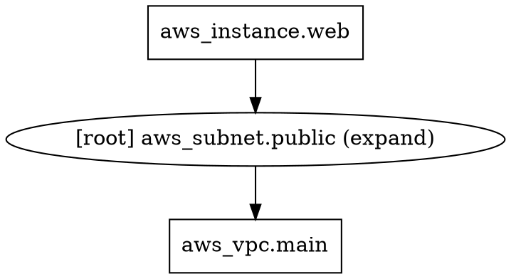

# How to Visualize and Understand the OpenTofu Resource Dependency Graph

Author: [nawazdhandala](https://www.github.com/nawazdhandala)

Tags: OpenTofu, Dependency Graph, Visualization, Graphviz, Infrastructure as Code

Description: Learn how to generate, visualize, and interpret OpenTofu's resource dependency graph using the tofu graph command and Graphviz to understand resource ordering and relationships.

## Introduction

OpenTofu builds a directed acyclic graph (DAG) of all resources before executing any changes. Understanding this graph helps you debug ordering issues, optimize parallel execution, and reason about complex module relationships. The `tofu graph` command generates this graph in DOT format, which can be visualized with Graphviz.

## Generating the Graph

### Basic Graph Generation

```bash
tofu graph
```

Output is in DOT (Graphviz) format:



### Generating Different Graph Types

```bash
# Plan graph (default)
tofu graph -type=plan

# Apply graph
tofu graph -type=apply

# Destroy graph
tofu graph -type=destroy-plan

# Refresh graph
tofu graph -type=refresh-only-plan
```

## Visualizing with Graphviz

Install Graphviz:

```bash
# Ubuntu/Debian
apt-get install graphviz

# macOS
brew install graphviz

# RHEL/CentOS
dnf install graphviz
```

Generate an SVG visualization:

```bash
tofu graph | dot -Tsvg > graph.svg
open graph.svg  # macOS
xdg-open graph.svg  # Linux
```

Generate a PNG:

```bash
tofu graph | dot -Tpng > graph.png
```

## Interpreting the Graph

### Node Types

Different node shapes indicate resource types:
- **Boxes**: Resources and data sources
- **Subgraphs**: Module boundaries
- **Provider nodes**: Cloud provider configurations

### Edge Direction

Arrows point from dependent to dependency:
```
aws_instance.web → aws_subnet.public → aws_vpc.main
```

This means: `aws_vpc.main` is created first, then `aws_subnet.public`, then `aws_instance.web`.

### Parallel Nodes

Nodes without an edge between them are created in parallel:

```hcl
resource "aws_s3_bucket" "logs" { ... }
resource "aws_s3_bucket" "assets" { ... }
resource "aws_s3_bucket" "backups" { ... }
# All three have no dependency on each other — created in parallel
```

## Filtering the Graph

For large configurations, filter the DOT output with grep or use the `-draw-cycles` flag:

```bash
# Show only nodes involving EC2 instances
tofu graph | grep "aws_instance"

# Highlight cycles if they exist
tofu graph -draw-cycles | dot -Tsvg > graph.svg
```

## Using the Graph for Debugging

### Finding Unexpected Dependencies

If a resource is being destroyed or modified unexpectedly:

```bash
tofu graph -type=plan | dot -Tsvg > plan_graph.svg
```

Check the edges leading to the affected resource node to identify what is triggering the change.

### Detecting Missing Dependencies

If resources are being created in the wrong order, check the plan graph for missing edges. Add `depends_on` or explicit references if needed:

```hcl
resource "aws_instance" "app" {
  # Explicit reference creates a graph edge
  subnet_id = aws_subnet.private.id

  # Implicit dependency not captured by reference
  depends_on = [aws_iam_role_policy_attachment.app_policy]
}
```

### Module Dependencies

```bash
# Graph that includes module internals
tofu graph -module-depth=2
```

## Practical Example: VPC Graph

```hcl
resource "aws_vpc" "main" { cidr_block = "10.0.0.0/16" }

resource "aws_internet_gateway" "main" {
  vpc_id = aws_vpc.main.id  # Edge: igw → vpc
}

resource "aws_subnet" "public" {
  vpc_id = aws_vpc.main.id  # Edge: subnet → vpc
}

resource "aws_route_table" "public" {
  vpc_id = aws_vpc.main.id  # Edge: rt → vpc
}

resource "aws_route" "internet" {
  route_table_id         = aws_route_table.public.id  # Edge: route → rt
  gateway_id             = aws_internet_gateway.main.id  # Edge: route → igw
  destination_cidr_block = "0.0.0.0/0"
}
```

The graph for this configuration shows:
- `aws_vpc.main` as the root node
- `aws_internet_gateway.main`, `aws_subnet.public`, and `aws_route_table.public` all depending on `aws_vpc.main` (created in parallel)
- `aws_route.internet` depending on both `aws_route_table.public` and `aws_internet_gateway.main`

## Best Practices

- Generate graph visualizations before applying large changes to verify ordering.
- Check the destroy graph when planning infrastructure teardown.
- Use the graph to identify unnecessary `depends_on` that serialize work that could be parallel.
- Store graph snapshots as part of your infrastructure documentation.
- Run `tofu graph` in CI and diff against the previous graph to understand the impact of changes.

## Conclusion

The OpenTofu resource dependency graph is a powerful tool for understanding infrastructure relationships. By visualizing it with Graphviz, you can debug ordering issues, optimize parallelism, and build confidence in your configuration before running `tofu apply`.
