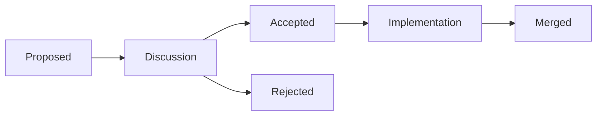

# How to Participate in OpenTofu RFC Process

Author: [nawazdhandala](https://www.github.com/nawazdhandala)

Tags: OpenTofu, RFC, Open Source, Community, Governance, Contributing

Description: Learn how to participate in and submit Request for Comments (RFCs) for significant OpenTofu design decisions and feature proposals.

## Introduction

OpenTofu uses an RFC (Request for Comments) process for significant changes that affect the core language, state format, or provider APIs. RFCs allow the community to discuss design decisions transparently before implementation begins. Understanding this process helps you influence OpenTofu's direction.

## What Requires an RFC

The RFC process is for changes that:
- Modify the OpenTofu configuration language (HCL)
- Change the state file format
- Modify provider SDK APIs
- Introduce new meta-arguments or built-in functions
- Change existing semantics in a breaking way

Small bug fixes, documentation improvements, and minor enhancements do not need RFCs.

## RFC Repository Structure

```text
opentofu/opentofu/
└── rfc/
    ├── README.md          – RFC process documentation
    ├── TEMPLATE.md        – Template for new RFCs
    ├── 0001-example.md    – Accepted RFC example
    └── 0042-my-feature.md – Your RFC
```

## Writing an RFC

```markdown
# RFC-XXXX: Feature Name

| Field       | Value                  |
|-------------|------------------------|
| Status      | Proposed               |
| Author      | Your Name              |
| Date        | 2026-03-20             |
| Discussion  | Link to GitHub issue   |

## Summary
One paragraph describing the proposed change.

## Motivation
Why is this change needed? What problem does it solve?

Include concrete examples of the pain point:
```hcl
# Current: requires repetitive code

provider "aws" { alias = "us_east_1" region = "us-east-1" }
provider "aws" { alias = "eu_west_1" region = "eu-west-1" }
provider "aws" { alias = "ap_south" region = "ap-southeast-1" }
# Problem: 20 accounts = 20 provider blocks
```

## Guide-Level Explanation
Explain the feature as if writing documentation. Show examples of the
new behavior with `before` and `after` code blocks.

## Reference-Level Explanation
Technical specification:
- Exact syntax changes to the HCL grammar
- Semantic behavior including edge cases
- Impact on the plan/apply graph
- Error messages for invalid configurations

## Drawbacks
- Implementation complexity
- Potential confusion for users
- Performance implications

## Rationale and Alternatives
Why is this design the best approach? What alternatives were considered?

## Unresolved Questions
- Edge case A: how should X behave?
- Edge case B: should Y be allowed?
- Implementation question: which internal package should own this?
```hcl

## Submitting an RFC

```bash
# 1. Fork the OpenTofu repository
git clone https://github.com/YOUR_USERNAME/opentofu.git
cd opentofu

# 2. Create a branch for your RFC
git checkout -b rfc/my-feature-name

# 3. Copy the template and fill it in
cp rfc/TEMPLATE.md rfc/0000-my-feature.md
# Edit the file

# 4. Commit and push
git add rfc/0000-my-feature.md
git commit -m "rfc: add proposal for my feature"
git push origin rfc/my-feature-name

# 5. Open a pull request
# Title: RFC: My Feature Name
# Request review from core maintainers
```

## RFC Lifecycle



## Participating in Existing RFCs

```bash
# Find open RFC PRs
# https://github.com/opentofu/opentofu/pulls?q=label%3Arfc

# Leave constructive comments:
# - Share your use case and whether the RFC addresses it
# - Point out edge cases not covered
# - Suggest alternative approaches
# - Indicate if you'd use this feature (+1 with context)
```

## Summary

The OpenTofu RFC process ensures significant changes are thoughtfully designed and community-reviewed before implementation. Participating by writing well-structured RFCs, commenting with use cases, and reviewing others' proposals is one of the most impactful ways to shape OpenTofu's future direction.
