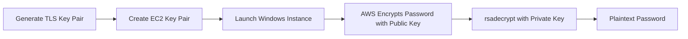

# How to Use the rsadecrypt Function in OpenTofu

Author: [nawazdhandala](https://www.github.com/nawazdhandala)

Tags: OpenTofu, Infrastructure as Code, Terraform, IaC, DevOps

Description: Learn how to use the rsadecrypt function in OpenTofu to decrypt RSA-encrypted values, commonly used for retrieving Windows EC2 instance passwords.

## Introduction

The `rsadecrypt` function in OpenTofu decrypts a Base64-encoded, RSA-encrypted ciphertext using a PEM-encoded private key. Its primary use case in AWS is decrypting the initial Windows EC2 instance administrator password, which AWS encrypts using the EC2 key pair's public key.

## Syntax

```hcl
rsadecrypt(ciphertext, privatekey)
```

- **ciphertext** — Base64-encoded RSA-encrypted data
- **privatekey** — PEM-encoded RSA private key string
- Returns the decrypted plaintext string

## Basic Examples

```hcl
# The ciphertext would be a Base64-encoded RSA-encrypted string
# The private key is PEM format

locals {
  private_key = file("~/.ssh/my-key.pem")
  decrypted   = rsadecrypt(var.encrypted_password, local.private_key)
}
```

## Practical Use Cases

### Retrieving Windows EC2 Password

This is the primary real-world use case for `rsadecrypt` in OpenTofu:

```hcl
# Generate an RSA key pair
resource "tls_private_key" "windows" {
  algorithm = "RSA"
  rsa_bits  = 4096
}

# Create the EC2 key pair using the generated public key
resource "aws_key_pair" "windows" {
  key_name   = "windows-server-key"
  public_key = tls_private_key.windows.public_key_openssh
}

# Launch a Windows EC2 instance
resource "aws_instance" "windows" {
  ami           = data.aws_ami.windows.id
  instance_type = "t3.medium"
  key_name      = aws_key_pair.windows.key_name

  tags = {
    Name = "windows-server"
  }
}

# Wait for password to be available and decrypt it
data "aws_instance" "windows_data" {
  instance_id = aws_instance.windows.id
}

# Note: AWS provides encrypted_password after instance initialization
output "windows_password" {
  sensitive = true
  value     = rsadecrypt(
    aws_instance.windows.password_data,
    tls_private_key.windows.private_key_pem
  )
}
```

### Decrypting Sensitive Configuration

```hcl
variable "encrypted_db_password" {
  type        = string
  description = "RSA-encrypted database password (Base64)"
  sensitive   = true
}

locals {
  private_key  = file("${path.module}/keys/decrypt-key.pem")
  db_password  = rsadecrypt(var.encrypted_db_password, local.private_key)
}

resource "aws_db_instance" "main" {
  identifier        = "app-db"
  engine            = "postgres"
  engine_version    = "14.7"
  instance_class    = "db.t3.medium"
  allocated_storage = 20
  db_name           = "appdb"
  username          = "appuser"
  password          = local.db_password

  skip_final_snapshot = false
}
```

### Secrets Bootstrapping

```hcl
variable "encrypted_bootstrap_token" {
  type      = string
  sensitive = true
}

locals {
  private_key_pem = file("${path.module}/bootstrap-key.pem")
  bootstrap_token = rsadecrypt(var.encrypted_bootstrap_token, local.private_key_pem)
}

resource "aws_ssm_parameter" "token" {
  name      = "/app/bootstrap-token"
  type      = "SecureString"
  value     = local.bootstrap_token
  sensitive = true
}
```

## Step-by-Step Usage

1. Obtain the RSA-encrypted ciphertext (Base64-encoded).
2. Have the corresponding PEM-encoded private key.
3. Call `rsadecrypt(ciphertext, private_key)`.
4. Mark all outputs containing the result as `sensitive = true`.

## Windows Password Retrieval Flow



## Security Considerations

- Never hardcode private key content in your `.tf` files
- Read private keys from files or vault systems
- Mark all decrypted values as `sensitive = true`
- Store private keys outside of version control

## Conclusion

The `rsadecrypt` function in OpenTofu serves the specific but important use case of decrypting RSA-encrypted values, most commonly Windows EC2 instance passwords. By combining `tls_private_key`, `aws_key_pair`, and `rsadecrypt`, you can fully automate Windows EC2 provisioning with password retrieval in your infrastructure code.
