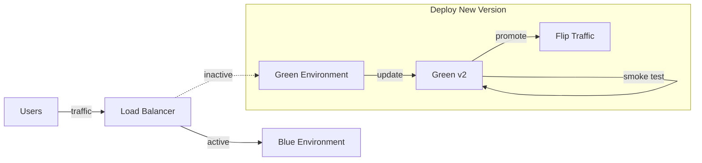

# How to Use Workspaces for Blue-Green Deployments in OpenTofu

Author: [nawazdhandala](https://www.github.com/nawazdhandala)

Tags: OpenTofu, Workspaces, Blue-Green Deployment, Zero Downtime, Infrastructure as Code

Description: Use OpenTofu workspaces to implement blue-green deployments that enable zero-downtime infrastructure updates by maintaining two parallel environments.

Blue-green deployments eliminate downtime by keeping two identical environments - blue and green - and switching traffic between them. OpenTofu workspaces make it straightforward to manage both environments from a single configuration.

## How Blue-Green Works



At any point, one environment serves live traffic while the other is updated and tested. Traffic switches are instant.

## Setting Up Blue and Green Workspaces

```bash
# Create both workspaces

tofu workspace new blue
tofu workspace new green

# Check available workspaces
tofu workspace list
```

## Parameterizing Configuration by Workspace

Reference `terraform.workspace` to name resources after their color slot:

```hcl
# main.tf
locals {
  color = terraform.workspace  # "blue" or "green"
}

resource "aws_launch_template" "app" {
  name_prefix   = "app-${local.color}-"
  image_id      = var.ami_id
  instance_type = "m5.large"

  tag_specifications {
    resource_type = "instance"
    tags = {
      Name  = "app-${local.color}"
      Slot  = local.color
    }
  }
}

resource "aws_autoscaling_group" "app" {
  name                = "app-${local.color}"
  desired_capacity    = 3
  min_size            = 2
  max_size            = 6
  vpc_zone_identifier = var.subnet_ids

  launch_template {
    id      = aws_launch_template.app.id
    version = "$Latest"
  }

  tag {
    key                 = "Slot"
    value               = local.color
    propagate_at_launch = true
  }
}
```

## Managing the Load Balancer Separately

The load balancer lives outside workspace-specific state so it can point to either environment:

```hcl
# lb.tf  (applied in the default workspace or via a separate state)
resource "aws_lb_target_group_attachment" "active" {
  # This value is set via a variable, updated when you flip traffic
  target_group_arn = var.active_target_group_arn
  target_id        = var.active_asg_name
}

variable "active_slot" {
  description = "Which slot is currently active: blue or green"
  default     = "blue"
}
```

## Deployment Workflow

```bash
# 1. Identify the inactive slot (assume blue is live, green is idle)
INACTIVE=green

# 2. Deploy new version to the inactive slot
tofu workspace select $INACTIVE
tofu apply -var="ami_id=$NEW_AMI" -auto-approve

# 3. Run smoke tests against the inactive slot's endpoint
curl -f https://green.internal.example.com/health

# 4. Flip traffic to the newly updated slot
tofu workspace select default
tofu apply -var="active_slot=green" -auto-approve

# 5. Monitor production for a few minutes, then decommission old slot
tofu workspace select blue
tofu destroy -auto-approve
```

## Using a Wrapper Script

Automate the flip with a shell script to reduce human error:

```bash
#!/usr/bin/env bash
# flip-traffic.sh
set -euo pipefail

NEW_SLOT="${1:-green}"
NEW_AMI="${2}"

echo "Deploying to $NEW_SLOT..."
tofu workspace select "$NEW_SLOT"
tofu apply -var="ami_id=$NEW_AMI" -auto-approve

echo "Running health checks..."
ENDPOINT=$(tofu output -raw endpoint)
for i in {1..10}; do
  curl -sf "$ENDPOINT/health" && break || sleep 5
done

echo "Switching traffic to $NEW_SLOT..."
tofu workspace select default
tofu apply -var="active_slot=$NEW_SLOT" -auto-approve

echo "Traffic is now on $NEW_SLOT. Old slot can be cleaned up."
```

## Best Practices

- **Keep workspaces symmetric**: Always ensure blue and green share identical infrastructure shapes - only the AMI or container image version differs.
- **Test before flipping**: Run automated smoke tests against the idle environment before switching traffic.
- **Use workspace outputs**: Export key endpoints as `tofu output` values so scripts can discover them dynamically.
- **Rollback is instant**: If the new slot has problems, re-run the flip script with the old slot name.

## Conclusion

OpenTofu workspaces map naturally onto blue-green deployment patterns. Two workspaces, one configuration, and a simple traffic-flip script give you zero-downtime deployments with instant rollback capability.
