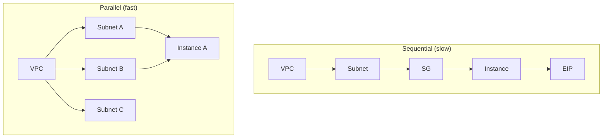

# How to Optimize Resource Dependencies for Parallel Execution in OpenTofu

Author: [nawazdhandala](https://www.github.com/nawazdhandala)

Tags: OpenTofu, Parallel Execution, Performance, Dependencies, Infrastructure as Code

Description: Learn how to restructure OpenTofu resource dependencies to maximize parallel execution and reduce total apply time.

OpenTofu processes resources in parallel whenever their dependencies are satisfied. Poorly structured dependencies force sequential execution and increase apply times. By analyzing your dependency graph and removing unnecessary dependencies, you can significantly cut the time needed to provision large infrastructure.

## How OpenTofu Parallelism Works

OpenTofu uses a worker pool with a configurable concurrency limit (default: 10). It processes all resources whose dependencies are already met simultaneously. If your dependency graph is a straight chain, only one resource creates at a time regardless of the pool size.

```bash
# Increase parallelism for large configurations
tofu apply -parallelism=20
```

## Identifying Sequential Bottlenecks

Generate the graph and look for long chains:

```bash
tofu graph | dot -Tsvg -o graph.svg
```

A straight vertical line in the graph means sequential execution. Wide, flat graphs indicate high parallelism.



## Pattern 1: Remove Unnecessary Intermediate Dependencies

```hcl
# BAD: subnet-b unnecessarily depends on subnet-a
resource "aws_subnet" "a" { vpc_id = aws_vpc.main.id; cidr_block = "10.0.1.0/24" }
resource "aws_subnet" "b" {
  vpc_id     = aws_subnet.a.vpc_id  # References subnet A's attribute instead of VPC directly
  cidr_block = "10.0.2.0/24"
}

# GOOD: both subnets depend directly on the VPC and can be created in parallel
resource "aws_subnet" "a" { vpc_id = aws_vpc.main.id; cidr_block = "10.0.1.0/24" }
resource "aws_subnet" "b" { vpc_id = aws_vpc.main.id; cidr_block = "10.0.2.0/24" }
```

## Pattern 2: Use for_each for Parallel Resource Creation

`for_each` creates multiple instances of a resource in parallel, while sequential `resource` blocks with `depends_on` chains create them one by one:

```hcl
# GOOD: all subnets created in parallel with for_each
resource "aws_subnet" "app" {
  for_each = {
    "us-east-1a" = "10.0.1.0/24"
    "us-east-1b" = "10.0.2.0/24"
    "us-east-1c" = "10.0.3.0/24"
  }

  vpc_id            = aws_vpc.main.id
  cidr_block        = each.value
  availability_zone = each.key
}
```

All three subnets are provisioned simultaneously.

## Pattern 3: Avoid depends_on on Large Modules

A `depends_on` on a module forces all resources in that module to complete before any resource in the dependent module starts — even resources with no real dependency:

```hcl
# BAD: forces all of module.networking to finish before module.compute starts
module "compute" {
  source     = "./modules/compute"
  depends_on = [module.networking]
}

# BETTER: pass specific outputs as inputs to create only the necessary edges
module "compute" {
  source    = "./modules/compute"
  subnet_id = module.networking.subnet_id   # Only waits for the subnet, not entire module
  sg_id     = module.networking.sg_id
}
```

## Pattern 4: Move Shared Resources to the Root Module

If multiple modules depend on the same resource, declare it in the root module and pass it as an input rather than creating it inside one module and referencing it from another:

```hcl
# root main.tf
resource "aws_kms_key" "shared" { ... }

module "app" {
  source      = "./modules/app"
  kms_key_arn = aws_kms_key.shared.arn
}

module "db" {
  source      = "./modules/db"
  kms_key_arn = aws_kms_key.shared.arn
}
# app and db modules can now be provisioned in parallel
```

## Measuring Improvement

Compare apply times before and after optimization:

```bash
# Time the apply
time tofu apply -auto-approve

# Count independent resource groups in the graph
tofu graph | grep -c '^    "\[root\]'
```

## Conclusion

OpenTofu's parallel execution capability is only as good as your dependency graph allows. Remove unnecessary intermediate dependencies, use `for_each` for sibling resources, minimize broad `depends_on` usage, and share resources through inputs rather than cross-module references to unlock maximum parallelism and faster infrastructure provisioning.
