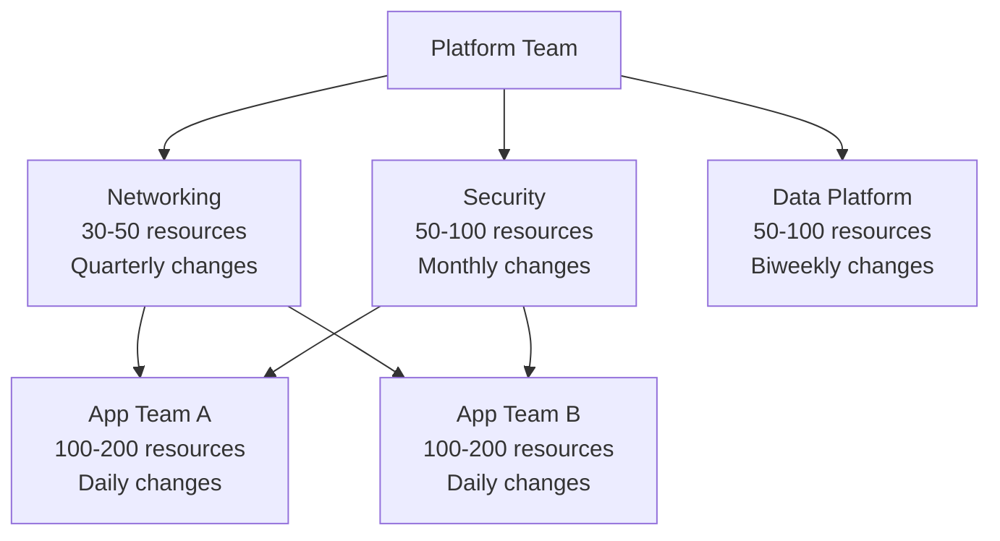

# How to Optimize OpenTofu for Large Enterprise Deployments

Author: [nawazdhandala](https://www.github.com/nawazdhandala)

Tags: OpenTofu, Enterprise, Performance, Scale, Infrastructure as Code, Best Practices

Description: Learn the architectural and operational patterns that make OpenTofu scale to enterprise environments with hundreds of engineers and thousands of managed resources.

## Introduction

Scaling OpenTofu from a single-team tool to an enterprise platform requires addressing performance, security, governance, and team autonomy simultaneously. This guide covers the layered approach successful large-scale deployments use.

## Architecture: State Segmentation by Domain

At enterprise scale, state files should align with team boundaries and deployment frequency:



## Performance: Global Settings

```hcl
# ~/.terraformrc — enterprise-wide settings
plugin_cache_dir   = "/shared/tofu-plugin-cache"

# CI runners should mount this as a shared volume
```

```bash
# Enterprise-wide environment variables set on all CI runners
export TF_CLI_ARGS_plan="-parallelism=20 -compact-warnings"
export TF_CLI_ARGS_apply="-parallelism=15"
export TF_PLUGIN_CACHE_DIR="/shared/tofu-plugin-cache"
```

## Governance: Centralized Policy as Code

```hcl
# OPA policy distributed to all stacks via a shared module
module "compliance" {
  source  = "registry.example.com/platform/compliance/opa"
  version = "~> 2.0"

  required_tags     = ["Environment", "Owner", "CostCenter", "Application"]
  allowed_regions   = ["us-east-1", "us-west-2", "eu-west-1"]
  max_instance_size = "m5.4xlarge"
}
```

## Security: OIDC-Based Authentication for All CI/CD

Eliminate long-lived credentials across all pipelines:

```hcl
# Create OIDC providers for GitHub Actions across all accounts
resource "aws_iam_openid_connect_provider" "github_actions" {
  url = "https://token.actions.githubusercontent.com"
  client_id_list  = ["sts.amazonaws.com"]
  thumbprint_list = ["6938fd4d98bab03faadb97b34396831e3780aea1"]
}

# Per-team CI role with least privilege
resource "aws_iam_role" "team_alpha_ci" {
  name = "team-alpha-ci"
  assume_role_policy = jsonencode({
    Version = "2012-10-17"
    Statement = [{
      Effect    = "Allow"
      Principal = { Federated = aws_iam_openid_connect_provider.github_actions.arn }
      Action    = "sts:AssumeRoleWithWebIdentity"
      Condition = {
        StringLike = {
          "token.actions.githubusercontent.com:sub" = "repo:my-org/team-alpha-*:*"
        }
      }
    }]
  })
}
```

## CI/CD: Enterprise Pipeline Template

```yaml
# Reusable workflow template shared across all teams
# .github/workflows/opentofu-template.yml

on:
  workflow_call:
    inputs:
      working_directory:
        required: true
        type: string
      environment:
        required: true
        type: string

jobs:
  plan:
    runs-on: ubuntu-latest
    defaults:
      run:
        working-directory: ${{ inputs.working_directory }}
    steps:
      - uses: actions/checkout@v4
      - uses: actions/cache@v4
        with:
          path: ~/.terraform.d/plugin-cache
          key: tofu-providers-${{ hashFiles('**/.terraform.lock.hcl') }}
      - run: tofu init -lockfile=readonly
      - run: tofu plan -parallelism=20 -no-color -out=tfplan
```

## Cost Management: Mandatory Tagging at Provider Level

```hcl
# Force tags on all resources via provider default_tags
provider "aws" {
  region = var.region
  default_tags {
    tags = {
      ManagedBy   = "opentofu"
      Environment = var.environment
      Team        = var.team_name
      CostCenter  = var.cost_center
      Repository  = var.github_repo
    }
  }
}
```

## State Backend: Centralized with Per-Team Prefixes

```hcl
# Each team's state is isolated but in a central bucket
terraform {
  backend "s3" {
    bucket         = "enterprise-opentofu-state"
    key            = "teams/${var.team_name}/${var.environment}/${var.component}/tofu.tfstate"
    region         = "us-east-1"
    dynamodb_table = "enterprise-opentofu-locks"
    encrypt        = true
    kms_key_id     = "arn:aws:kms:us-east-1:account:key/state-key"
  }
}
```

## Conclusion

Enterprise OpenTofu deployments succeed through disciplined state segmentation (one state per team/domain), centralized but permissive governance (OPA policies as shared modules), OIDC-based authentication eliminating static credentials, plugin caching at the CI runner level, and reusable CI/CD workflow templates. Each of these independently provides value; together they create a platform that scales to hundreds of engineers.
