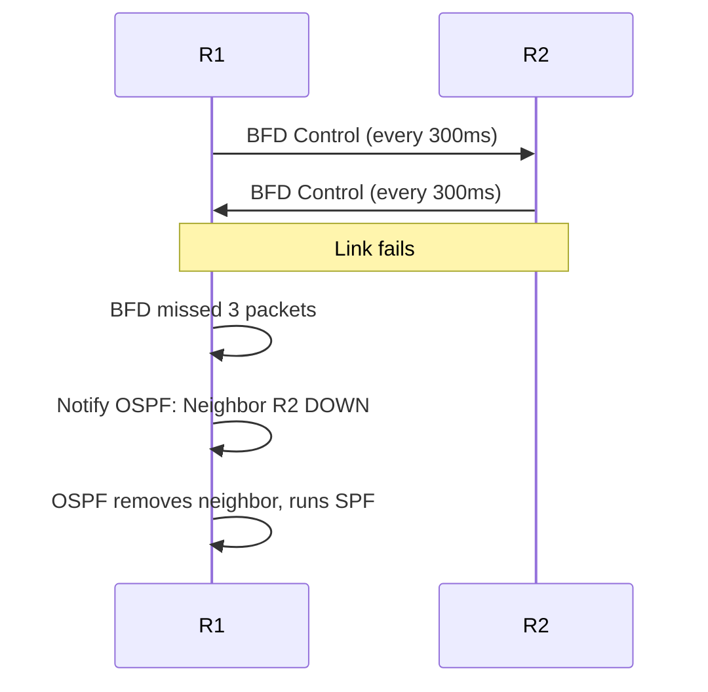

# How to Set Up OSPF BFD for Fast Failover

Author: [nawazdhandala](https://www.github.com/nawazdhandala)

Tags: OSPF, BFD, Fast Failover, Cisco IOS, High Availability, Convergence

Description: Learn how to configure BFD (Bidirectional Forwarding Detection) with OSPF to achieve sub-second failure detection and faster network convergence.

## Why BFD with OSPF?

OSPF's default Dead interval is 40 seconds—meaning if a link fails silently (no interface down event), it takes up to 40 seconds to detect the failure and reconverge. BFD provides sub-second failure detection (typically 300ms–1 second) by sending rapid probe packets independently of OSPF. When BFD detects a failure, it immediately notifies OSPF to remove the neighbor.

## How BFD Works with OSPF



BFD timer: 300ms interval × 3 multiplier = 900ms detection time.

## Step 1: Verify BFD Is Supported

BFD is supported on most Cisco IOS/IOS XE platforms but requires the platform to have hardware or software BFD support:

```
! Check BFD configuration
Router# show bfd neighbors
! If the command doesn't exist, BFD is not supported on this platform
```

## Step 2: Configure BFD on OSPF Interfaces

Enable BFD for OSPF directly on the interface:

```
Router(config)# interface GigabitEthernet0/0
! Enable BFD for OSPF on this interface with default timers
Router(config-if)# ip ospf bfd

! OR configure BFD with custom timers:
! Minimum interval=300ms, multiplier=3 (900ms detection)
Router(config-if)# bfd interval 300 min_rx 300 multiplier 3
Router(config-if)# ip ospf bfd
```

Configure the same settings on both sides of the link.

## Step 3: Enable BFD for All OSPF Neighbors Globally

Instead of per-interface, enable BFD for all OSPF interfaces at once:

```
router ospf 1
 ! Enable BFD for all OSPF interfaces
 bfd all-interfaces
```

## Step 4: Verify BFD Sessions Are Established

```
Router# show bfd neighbors

IPv4 Sessions
NeighAddr                              LD/RD         RH/RS  State  Int
10.0.0.2                               1/1           Up     Up     Gi0/0

! LD = Local Discriminator, RD = Remote Discriminator
! State: Up = BFD session established
```

## Step 5: Check BFD and OSPF Integration

```
! Verify OSPF sees the BFD association
Router# show ip ospf neighbor detail | include BFD

! Output:
! Neighbor 2.2.2.2, interface address 10.0.0.2
!   Neighbor is part of BFD session
!   BFD state is Up
```

## Step 6: Configure BFD on FRRouting

```bash
# In FRR vtysh or frr.conf
# First enable bfdd daemon:
sudo sed -i 's/bfdd=no/bfdd=yes/' /etc/frr/daemons
sudo systemctl restart frr
```

```
! In vtysh
router ospf
 bfd
!
interface eth0
 ip ospf bfd
!
bfd
 peer 10.0.0.2
  receive-interval 300
  transmit-interval 300
  detect-multiplier 3
!
```

## Step 7: Test BFD Failover

Simulate a link failure and measure convergence time:

```
! On R2 - simulate failure
R2(config)# interface GigabitEthernet0/0
R2(config-if)# shutdown

! On R1 - observe fast detection (should be under 1 second)
R1# debug bfd event
! BFD shows session Down quickly, OSPF removes the neighbor

! Check convergence in routing table
R1# show ip route ospf
! Routes via R2 should be gone within ~1 second
```

## BFD Timer Guidelines

| Environment | Interval | Multiplier | Detection Time |
|---|---|---|---|
| Data Center (fast links) | 50ms | 3 | 150ms |
| LAN (Ethernet) | 300ms | 3 | 900ms |
| WAN (low-bandwidth) | 1000ms | 3 | 3 seconds |
| Unstable links | 1000ms | 5 | 5 seconds |

Don't set BFD intervals too aggressive on CPU-constrained hardware—it can overload the control plane.

## Conclusion

BFD with OSPF reduces failure detection from 40 seconds (Dead interval) to under 1 second. Enable it with `ip ospf bfd` on interfaces or `bfd all-interfaces` globally, configure matching timers on both sides, and verify with `show bfd neighbors` that sessions are Up. Use conservative timers on WAN links to avoid false positives from temporary congestion.
