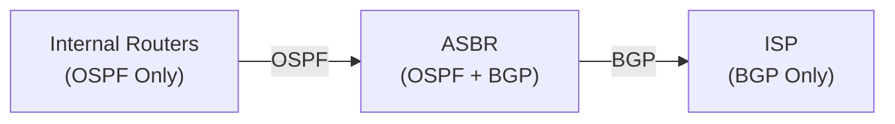

# How to Configure Mutual Redistribution Between OSPF and BGP

Author: [nawazdhandala](https://www.github.com/nawazdhandala)

Tags: OSPF, BGP, Redistribution, Cisco IOS, Routing, ASBR

Description: Learn how to configure bidirectional route redistribution between OSPF and BGP on an ASBR, including loop prevention strategies using route tags.

## When Is Mutual Redistribution Needed?

In enterprise networks, the edge router often runs both OSPF (for the internal LAN) and BGP (for ISP connectivity). To allow internal routers to reach Internet destinations, BGP routes must be redistributed into OSPF-or a default route can be used. And to allow external peers to reach internal prefixes, OSPF routes may need to be redistributed into BGP.

## The Redistribution Loop Problem

Mutual redistribution creates a risk: OSPF routes redistributed into BGP can be redistributed back into OSPF, potentially replacing the original routes with inferior external paths. Route tags are the standard solution.

## Architecture



## Step 1: Tag OSPF Routes Before Redistributing into BGP

Apply a tag to OSPF routes when redistributing them into BGP. Later, use this tag to prevent them from being re-imported:

```text
! Route map tags all OSPF routes before sending to BGP
route-map OSPF_TO_BGP permit 10
 ! Set a tag to identify OSPF-originated routes in BGP
 set tag 100

router bgp 65001
 address-family ipv4 unicast
  ! Redistribute OSPF into BGP with the tag
  redistribute ospf 1 route-map OSPF_TO_BGP
 exit-address-family
```

## Step 2: Filter Tagged Routes When Redistributing BGP into OSPF

When importing BGP routes back into OSPF, deny any route with tag 100 (which came from OSPF originally):

```text
! Deny routes that came from OSPF (tag=100) to prevent loops
route-map BGP_TO_OSPF deny 10
 match tag 100

! Permit everything else (genuine BGP/Internet routes)
route-map BGP_TO_OSPF permit 20
 ! Set a high metric for external routes
 set metric 200

router ospf 1
 ! Redistribute BGP routes into OSPF, excluding OSPF-originated ones
 redistribute bgp 65001 subnets route-map BGP_TO_OSPF
```

## Step 3: Prefer Default Route Over Full BGP Table

For most enterprise environments, redistribute a default route into OSPF instead of the full BGP table:

```text
router ospf 1
 ! Inject a default route into OSPF from BGP
 default-information originate always metric 10
```

This keeps the OSPF database small while still providing Internet access to internal hosts.

## Step 4: Verify Redistribution

```text
! On the ASBR - check redistributed routes
Router# show ip ospf database external

! Should see BGP-learned routes as Type-5 LSAs
! LS Type: AS External Link
! Link State ID: 198.51.100.0

! Check BGP table for OSPF routes
Router# show ip bgp | include /24

! Internal OSPF routes should appear in BGP with correct tag
Router# show ip bgp 172.16.0.0/24
! Tag: 100 in the output confirms tagging worked
```

## Step 5: Check Routing Tables on Internal Routers

```text
! On an internal OSPF-only router
InternalR# show ip route ospf

! Should see:
! O E2  198.51.100.0/24 [110/200] via 10.0.0.1   <- From BGP via redistribution
! O     172.16.0.0/24  [110/2]   via 10.0.0.2    <- Pure OSPF route
! O E2  0.0.0.0/0      [110/10]  via 10.0.0.1    <- Default route from BGP
```

## Step 6: Limit Which BGP Routes Enter OSPF

Use a prefix list to allow only specific BGP prefixes into OSPF:

```text
ip prefix-list ALLOW_SPECIFIC_BGP seq 10 permit 0.0.0.0/0   ! Default only

route-map BGP_TO_OSPF_FILTERED deny 10
 match tag 100   ! Block OSPF-originated

route-map BGP_TO_OSPF_FILTERED permit 20
 match ip address prefix-list ALLOW_SPECIFIC_BGP
 set metric 50

router ospf 1
 redistribute bgp 65001 subnets route-map BGP_TO_OSPF_FILTERED
```

## Conclusion

Mutual redistribution between OSPF and BGP requires loop prevention using route tags: tag OSPF routes before sending to BGP, and deny those tagged routes when importing back into OSPF. For most enterprise use cases, redistribute only a default route (not the full BGP table) into OSPF to minimize LSA flooding and SPF overhead.
