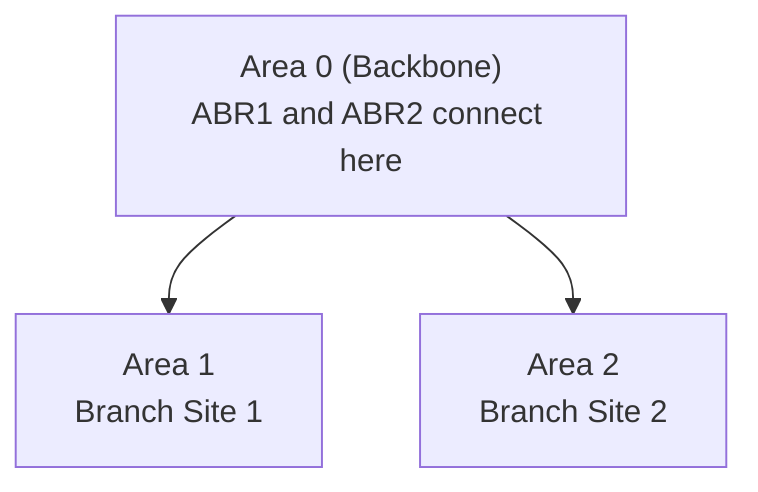

# How to Configure OSPF Multi-Area Networks

Author: [nawazdhandala](https://www.github.com/nawazdhandala)

Tags: OSPF, Multi-Area, Cisco IOS, ABR, Routing, Scalability

Description: Learn how to design and configure OSPF multi-area networks with Area Border Routers (ABRs) to improve scalability and reduce SPF calculation overhead.

## Why Use Multiple OSPF Areas?

In a single-area OSPF network, every router runs SPF on the complete topology database. As the network grows, SPF calculations become expensive and LSA flooding consumes bandwidth. Multi-area OSPF solves this by dividing the network into areas-each area runs SPF independently, and Area Border Routers (ABRs) summarize routes between areas.

## OSPF Area Design Rules



- **Area 0** is the backbone-all other areas must connect to it
- **ABR (Area Border Router):** Connected to two or more areas, including Area 0
- **Internal Router:** All interfaces in a single area
- **ASBR (AS Boundary Router):** Redistributes external routes into OSPF

## Step 1: Configure the Backbone (Area 0) Routers

On routers that will be entirely within Area 0:

```text
! Core router R0 - entirely in Area 0
R0(config)# router ospf 1
R0(config-router)# router-id 10.0.0.1
! Advertise all interfaces in Area 0
R0(config-router)# network 10.0.0.0 0.0.0.255 area 0
R0(config-router)# network 10.0.12.0 0.0.0.3 area 0
```

## Step 2: Configure the ABR (Connects Area 0 and Area 1)

An ABR has interfaces in multiple areas. It runs separate SPF for each area:

```text
! ABR1 - connects Area 0 (Gig0/0) and Area 1 (Gig0/1)
ABR1(config)# router ospf 1
ABR1(config-router)# router-id 10.0.0.2

! Interface connecting to Area 0 backbone
ABR1(config-router)# network 10.0.12.0 0.0.0.3 area 0

! Interface connecting to Area 1
ABR1(config-router)# network 172.16.1.0 0.0.0.255 area 1
```

## Step 3: Configure Internal Routers in Area 1

Routers entirely within Area 1 only need to know about their own area:

```text
! R1 - internal router in Area 1
R1(config)# router ospf 1
R1(config-router)# router-id 172.16.1.1
R1(config-router)# network 172.16.1.0 0.0.0.255 area 1
R1(config-router)# network 172.16.2.0 0.0.0.255 area 1
```

## Step 4: Add Route Summarization at the ABR

ABRs can summarize multiple Area 1 prefixes into a single summary advertised into Area 0. This reduces LSA flooding and routing table size:

```text
! On ABR1 - summarize Area 1 routes before advertising to Area 0
ABR1(config-router)# area 1 range 172.16.0.0 255.255.0.0

! Suppress the component routes (optional - only advertise summary)
ABR1(config-router)# area 1 range 172.16.0.0 255.255.0.0 not-advertise
```

## Step 5: Verify Inter-Area Routes

On a router in Area 1, check that Area 0 routes appear as inter-area (O IA):

```text
R1# show ip route ospf

! O     10.0.0.0/24 [110/2] via 172.16.1.254     <- Area 0 route (intra-area)
! O IA  10.1.0.0/24 [110/3] via 172.16.1.254     <- Inter-area route from other area
```

`O` = intra-area, `O IA` = inter-area (learned from another area via an ABR)

## Step 6: Verify the OSPF Area in the Database

```text
! Show OSPF database filtered by area
R1# show ip ospf database summary

! Type-3 LSA (Summary LSA) - generated by ABRs
! Shows prefixes from other areas
```

## Step 7: Check OSPF Process for Multiple Areas

```text
! Confirm the router's area membership
Router# show ip ospf

! Output will show:
! Area 0 active, Number of interfaces in this area is 2
! Area 1 active, Number of interfaces in this area is 1
```

## Conclusion

Multi-area OSPF requires Area 0 as the backbone and ABRs to connect other areas. Configure the ABR with `network` statements in both Area 0 and the branch area, and add `area range` summarization to reduce the number of Type-3 LSAs advertised between areas. Verify with `show ip route ospf` that inter-area routes appear with the `O IA` tag.
