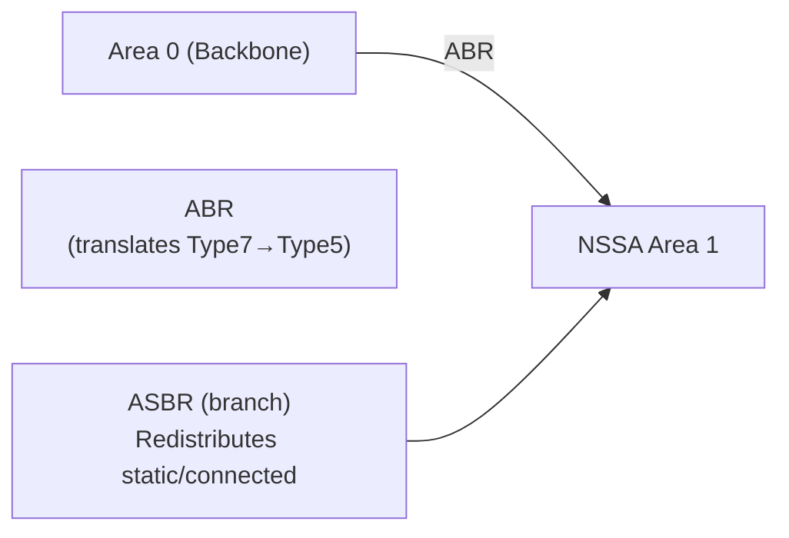

# How to Configure OSPF Not-So-Stubby Areas (NSSA)

Author: [nawazdhandala](https://www.github.com/nawazdhandala)

Tags: OSPF, NSSA, Cisco IOS, Routing, External Routes, LSA Type 7

Description: Learn how to configure OSPF Not-So-Stubby Areas (NSSA) to allow limited external route redistribution into a stub-like area while still blocking external LSAs from the backbone.

## What Is an NSSA?

A regular stub area blocks all external routes (Type-5 LSAs). But what if you need to redistribute external routes (from a branch's BGP or static routes) into OSPF from within the stub area? That's impossible with a regular stub. NSSA solves this by using Type-7 LSAs for external routes within the area-then the ABR translates them to Type-5 LSAs before forwarding to Area 0.

## LSA Types in NSSA

| LSA Type | Description | In NSSA |
|---|---|---|
| Type 1 | Router LSA | Yes |
| Type 2 | Network LSA | Yes |
| Type 3 | Summary (Inter-area) | Yes (from ABR) |
| Type 4 | ASBR Summary | No |
| Type 5 | External Routes | No (blocked) |
| Type 7 | NSSA External Routes | Yes (used instead of Type 5) |

## Typical NSSA Use Case



The branch ASBR redistributes local routes (ISP connection, static routes) into NSSA using Type-7 LSAs. The ABR translates them to Type-5 and floods them into the backbone.

## Step 1: Configure the ABR for NSSA

```text
! On the ABR - configure Area 1 as NSSA
ABR(config)# router ospf 1
ABR(config-router)# area 1 nssa
```

## Step 2: Configure Internal Routers in the NSSA

All routers in the NSSA area must be configured as NSSA:

```text
! On internal router R1 in Area 1
R1(config)# router ospf 1
R1(config-router)# area 1 nssa
```

## Step 3: Configure Redistribution on the ASBR (Inside the NSSA)

The ASBR inside the NSSA redistributes external routes as Type-7 LSAs:

```text
! On the branch ASBR inside Area 1
ASBR(config)# router ospf 1
ASBR(config-router)# area 1 nssa

! Redistribute connected routes into OSPF (generates Type-7 LSAs)
ASBR(config-router)# redistribute connected subnets

! Redistribute static routes into OSPF
ASBR(config-router)# redistribute static subnets
```

## Step 4: Control Default Route Injection

By default, the ABR does not automatically inject a default route into an NSSA (unlike stub areas). Force it:

```text
! On the ABR - inject default route into the NSSA
ABR(config-router)# area 1 nssa default-information-originate
```

## Step 5: Configure Totally NSSA

Like totally stubby areas, a Totally NSSA blocks Type-3 inter-area LSAs as well:

```text
! On the ABR only - totally NSSA (blocks Type 3, 4, 5 - uses only default)
ABR(config-router)# area 1 nssa no-summary

! Internal routers still use:
R1(config-router)# area 1 nssa
```

## Step 6: Verify NSSA Operation

```text
! Check area type on any NSSA router
Router# show ip ospf | include NSSA

! Output:
!   Area 1
!     It is a NSSA area

! Check for Type-7 LSAs in the database
Router# show ip ospf database nssa-external

! Verify Type-7 to Type-5 translation at the ABR
ABR# show ip ospf database external
! Translated Type-5 LSAs should appear here after ABR translation
```

## Step 7: NSSA ABR Election

When multiple ABRs serve the same NSSA, only one translates Type-7 to Type-5. The ABR with the highest Router ID becomes the translator by default:

```text
! Force a specific ABR to be the translator
ABR1(config-router)# area 1 nssa translate type7 always
```

## Conclusion

OSPF NSSA allows external route redistribution from within a stub-like area using Type-7 LSAs, which the ABR translates to Type-5 LSAs for the backbone. Configure all area routers with `area X nssa`, add `no-summary` on the ABR for a totally NSSA, and use `default-information-originate` if branch routers need a default route to reach non-local destinations.
