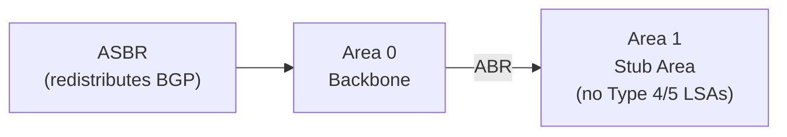

# How to Set Up OSPF Stub Areas to Reduce Routing Table Size

Author: [nawazdhandala](https://www.github.com/nawazdhandala)

Tags: OSPF, Stub Area, Cisco IOS, Routing, Scalability

Description: Learn how to configure OSPF stub areas to block Type-5 external LSAs from remote areas, replacing them with a default route to reduce routing table size on branch routers.

## What Is an OSPF Stub Area?

In OSPF, Type-5 LSAs carry external routes (redistributed from BGP, static routes, or other protocols). These can number in the thousands. A stub area blocks Type-5 LSAs from being flooded into the area, replacing them with a single default route (0.0.0.0/0) from the ABR. This drastically reduces the OSPF database and routing table size on routers in the stub area.

## What Stub Areas Block

| LSA Type | Description | Allowed in Stub? |
|---|---|---|
| Type 1 | Router LSA | Yes |
| Type 2 | Network LSA | Yes |
| Type 3 | Summary (Inter-area) | Yes |
| Type 4 | ASBR Summary | No |
| Type 5 | External (AS External) | No |

## Topology



The stub area routers only know about Area 0 and Area 1 prefixes-all external destinations are reached via the default route from the ABR.

## Step 1: Configure the ABR for Stub Area

The ABR must be configured as a stub area boundary. Configure this on the ABR:

```text
! On the ABR connecting Area 0 and Area 1
ABR(config)# router ospf 1
ABR(config-router)# router-id 10.0.0.2
ABR(config-router)# network 10.0.12.0 0.0.0.3 area 0
ABR(config-router)# network 172.16.1.0 0.0.0.255 area 1

! Configure Area 1 as a stub area
ABR(config-router)# area 1 stub
```

The ABR automatically injects a default route (Type-3 LSA) into the stub area.

## Step 2: Configure All Routers in the Stub Area

**Every router in Area 1 must be configured as stub.** If any router is not configured as stub, neighbor adjacency with the ABR will fail (Area type mismatch):

```text
! On internal router R1 in Area 1
R1(config)# router ospf 1
R1(config-router)# router-id 172.16.1.1
R1(config-router)# network 172.16.1.0 0.0.0.255 area 1

! Must also configure stub
R1(config-router)# area 1 stub
```

## Step 3: Verify Stub Configuration

```text
! On any router in Area 1
R1# show ip ospf

Area 1
  Number of interfaces in this area is 2
  It is a stub area
  Area has no authentication
  SPF algorithm last executed 00:01:00.000 ago

R1# show ip route ospf

! Should see inter-area routes (O IA) and a default route
! O IA  0.0.0.0/0 [110/11] via 172.16.1.254      <- Default from ABR
! O IA  10.0.0.0/24 [110/2] via 172.16.1.254      <- Area 0 networks

! External routes (O E1/E2) should NOT appear
```

## Step 4: Tune the Default Route Cost

The ABR injects the default route with cost 1 by default. Adjust it:

```text
! Set the cost of the default route injected into the stub area
ABR(config-router)# area 1 default-cost 10
```

Use this when multiple ABRs serve the same stub area-set a higher cost on the backup ABR to prefer the primary.

## Step 5: Compare Routing Table Size

On a stub area router, the routing table is significantly smaller:

```text
! Before stub configuration: might have thousands of O E2 routes
R1# show ip route summary

! After stub configuration: only local area + inter-area + one default
! Route Source    Networks  Subnets    Overhead   Memory (bytes)
! connected           0          2          192        288
! ospf 1              0         10          960       1440
! Total               0         12         1152       1728
```

## Conclusion

OSPF stub areas reduce routing table size on branch routers by blocking Type-4 and Type-5 external LSAs and replacing them with a default route from the ABR. All routers in the area must be configured as stub-missing this on even one router prevents adjacency formation. Use `area X default-cost` to influence which ABR is used for the default route when multiple ABRs serve the stub area.
