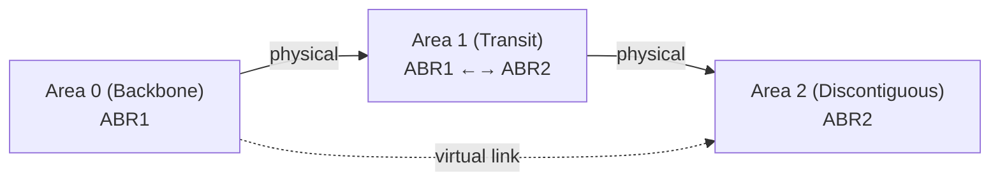

# How to Configure OSPF Virtual Links to Connect Discontiguous Areas

Author: [nawazdhandala](https://www.github.com/nawazdhandala)

Tags: OSPF, Virtual Links, Cisco IOS, Area Design, Routing

Description: Learn how to configure OSPF virtual links to connect an area to the backbone through a transit area when a direct connection to Area 0 is not possible.

## Why Virtual Links?

OSPF requires all areas to connect directly to Area 0 (the backbone). In some network designs-often after a merger, acquisition, or improper area design-an area may only have connectivity through another non-backbone area. OSPF virtual links create a logical tunnel through a transit area to restore the Area 0 connection.

## Virtual Link Topology



Area 2 has no direct physical connection to Area 0-it connects only through Area 1. The virtual link makes it logically adjacent to Area 0 through Area 1.

## Limitations of Virtual Links

- Cannot traverse stub areas (stub, totally stubby, NSSA)
- Should be a temporary fix-redesign the physical topology when possible
- Adds complexity and can mask underlying design issues

## Step 1: Identify the ABRs at Each End

For a virtual link through Area 1:
- **ABR1:** Has interfaces in both Area 0 and Area 1 - Router ID 10.0.0.1
- **ABR2:** Has interfaces in both Area 1 and Area 2 - Router ID 10.0.0.2

## Step 2: Configure the Virtual Link on ABR1

The virtual link is configured with the Router ID of the far-end ABR:

```text
! On ABR1 - create virtual link to ABR2 through Area 1
ABR1(config)# router ospf 1
ABR1(config-router)# router-id 10.0.0.1
! Area 1 is the transit area; 10.0.0.2 is ABR2's Router ID
ABR1(config-router)# area 1 virtual-link 10.0.0.2
```

## Step 3: Configure the Virtual Link on ABR2

```text
! On ABR2 - create virtual link to ABR1 through Area 1
ABR2(config)# router ospf 1
ABR2(config-router)# router-id 10.0.0.2
! Area 1 is the transit area; 10.0.0.1 is ABR1's Router ID
ABR2(config-router)# area 1 virtual-link 10.0.0.1

! ABR2 interfaces
ABR2(config-router)# network 10.0.12.4 0.0.0.3 area 1   ! toward ABR1
ABR2(config-router)# network 172.16.2.0 0.0.0.255 area 2 ! Area 2 interfaces
```

## Step 4: Verify the Virtual Link Is Up

```text
! Check virtual link status on ABR1
ABR1# show ip ospf virtual-links

Virtual Link OSPF_VL0 to router 10.0.0.2 is up
  Run as demand circuit
  DoNotAge LSA allowed.
  Transit area 1, via interface GigabitEthernet0/1
  Transmit Delay is 1 sec, State POINT_TO_POINT
  Hello due in 00:00:05
  Adjacency State FULL (Hello suppressed)
```

`State FULL` confirms the virtual link adjacency is established.

## Step 5: Verify Area 2 Routes in the Routing Table

On a router in Area 0 or Area 2, verify routes are now exchanged:

```text
! On a router in Area 0
Router# show ip route ospf | include IA

! Should see Area 2 routes as inter-area:
! O IA  172.16.2.0/24 [110/3] via 10.0.0.1
```

## Step 6: Add Authentication to the Virtual Link

Virtual links should use OSPF authentication:

```text
! Configure authentication on the virtual link (MD5)
ABR1(config-router)# area 1 virtual-link 10.0.0.2 message-digest-key 1 md5 VLinkSecret
ABR2(config-router)# area 1 virtual-link 10.0.0.1 message-digest-key 1 md5 VLinkSecret
```

## Conclusion

OSPF virtual links provide a temporary solution for areas that cannot directly connect to Area 0. Configure `area [transit-area] virtual-link [remote-router-id]` on both ABRs at each end, verify with `show ip ospf virtual-links` that the link is FULL, and plan a physical network redesign to eliminate the dependency on virtual links for long-term stability.
