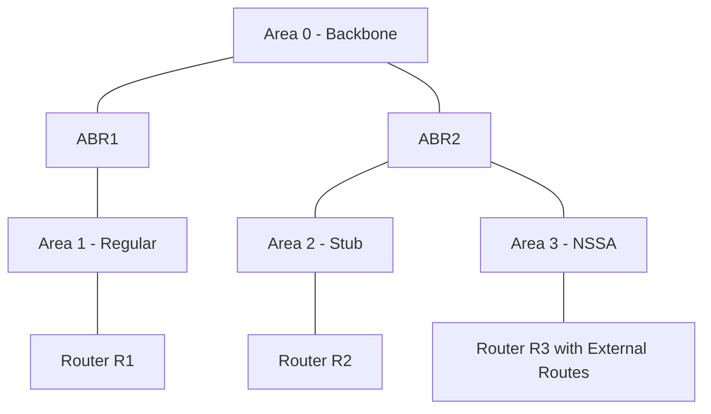

# How to Understand OSPFv3 Area Configuration for IPv6

Author: [nawazdhandala](https://www.github.com/nawazdhandala)

Tags: OSPFv3, IPv6, OSPF Areas, Routing, Networking

Description: Understand how OSPFv3 areas work for IPv6 networks, including backbone area design, stub areas, NSSA, and area border router roles.

## Overview

OSPFv3 uses the same area concept as OSPFv2 — areas divide the network into smaller flooding domains to reduce LSA overhead and improve scalability. The backbone area (Area 0) connects all other areas.

## OSPFv3 Area Hierarchy



## Area Types

| Area Type | External Routes | Type 3 LSAs | Use Case |
|-----------|----------------|-------------|----------|
| Backbone (Area 0) | Yes | Yes | Core — all areas connect here |
| Regular | Yes | Yes | Standard area with full LSDB |
| Stub | No | Yes | Branch sites with single exit |
| Totally Stub | No | No (only default) | Maximum filtering |
| NSSA | Only Type 7 | Yes | Branch with local AS external routes |

## Configuring Areas on Cisco IOS

```
! Regular area (Area 1)
Router(config)# router ospfv3 1
Router(config-router)# address-family ipv6 unicast

! Interface in Area 0
Router(config)# interface GigabitEthernet0/0
Router(config-if)# ospfv3 1 ipv6 area 0

! Interface in Area 1
Router(config)# interface GigabitEthernet0/1
Router(config-if)# ospfv3 1 ipv6 area 1

! Configure Area 2 as Stub (on the ABR)
Router(config)# router ospfv3 1
Router(config-router)# address-family ipv6 unicast
Router(config-router-af)# area 2 stub

! Configure Area 3 as Totally Stub (on the ABR)
Router(config-router-af)# area 3 stub no-summary
```

## Configuring Areas on FRRouting

```bash
vtysh
configure terminal

router ospf6
 ospf6 router-id 1.1.1.1

! Assign interfaces to areas
interface eth0
 ipv6 ospf6 area 0.0.0.0

interface eth1
 ipv6 ospf6 area 0.0.0.1

! Configure Area 2 as stub
router ospf6
 area 0.0.0.2 stub

! Configure Area 3 as totally stub (no-summary)
 area 0.0.0.3 stub no-summary

end
write memory
```

## Area Border Router (ABR)

An ABR has interfaces in two or more areas. It generates Type 3 (Inter-Area Prefix) LSAs to advertise prefixes between areas:

```bash
# Verify ABR role on FRRouting
vtysh -c "show ipv6 ospf"
# Should show: This router is an ABR

# Show inter-area routes generated by ABR
vtysh -c "show ipv6 ospf database inter-prefix"
```

## Virtual Links

Virtual links extend Area 0 connectivity through a transit area when a non-backbone area has no direct connection to the backbone:

```
! Cisco: Configure virtual link through Area 1 to reach router 2.2.2.2
Router(config)# router ospfv3 1
Router(config-router)# address-family ipv6 unicast
Router(config-router-af)# area 1 virtual-link 2.2.2.2
```

## Verifying Area Configuration

```bash
# FRRouting: show area details
vtysh -c "show ipv6 ospf database"

# Cisco: show area summary
show ospfv3 database summary

# Verify which area each interface belongs to
show ospfv3 interface brief
```

## Summary

OSPFv3 areas follow the same hierarchy as OSPFv2. All areas must connect to Area 0. Use stub areas to reduce LSA overhead in branch sites, NSSA for branches with external routes, and ABRs to connect multiple areas. On FRRouting, use `area <id> stub` and on Cisco use `area <id> stub` in the address-family configuration.
