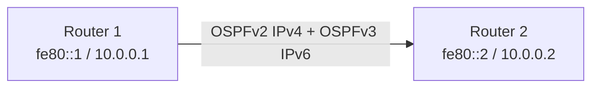

# How to Configure OSPFv3 for IPv6 Alongside OSPFv2 for IPv4

Author: [nawazdhandala](https://www.github.com/nawazdhandala)

Tags: OSPFv3, OSPFv2, IPv6, IPv4, Dual Stack, FRR, Routing, Configuration

Description: Learn how to run OSPFv3 for IPv6 and OSPFv2 for IPv4 simultaneously on the same router interfaces for dual-stack network operation.

---

OSPFv3 is the IPv6 version of OSPF (RFC 5340). Unlike OSPFv2 which embeds IP addresses in LSAs, OSPFv3 uses link-local IPv6 addresses for neighbor discovery and can run over AF (Address Family) extensions to also carry IPv4 routes. In a dual-stack network, you typically run both OSPFv2 (for IPv4) and OSPFv3 (for IPv6) simultaneously.

## Architecture



## FRR: Running OSPFv2 and OSPFv3 Together

### OSPFv2 for IPv4 (Standard)

```bash
vtysh << 'EOF'
conf t

router ospf
  ospf router-id 10.0.0.1
  network 10.0.0.0/30 area 0
  network 10.1.0.0/24 area 0
EOF
```

### OSPFv3 for IPv6

```bash
vtysh << 'EOF'
conf t

! Enable IPv6 on the interfaces
interface eth0
  ipv6 address 2001:db8:1::1/64
  ipv6 ospf6 area 0.0.0.0     ! Assign to OSPFv3 area 0

interface eth1
  ipv6 address 2001:db8:2::1/64
  ipv6 ospf6 area 0.0.0.0

! Configure the OSPFv3 process
router ospf6
  ospf6 router-id 10.0.0.1    ! Router ID is still IPv4 format even in OSPFv3
  area 0.0.0.0 range 2001:db8::/32  ! Aggregate IPv6 prefixes for this area
EOF
```

### Verifying OSPFv3

```bash
# Show OSPFv3 neighbors (uses link-local addresses)
vtysh -c "show ipv6 ospf6 neighbor"

# Show OSPFv3 routes
vtysh -c "show ipv6 route ospf6"

# Show the OSPFv3 LSDB
vtysh -c "show ipv6 ospf6 database"

# Compare with IPv4 OSPF routes
vtysh -c "show ip route ospf"
```

## Cisco IOS Dual-Stack OSPF

```
! OSPFv2 for IPv4
router ospf 1
  router-id 10.0.0.1
  network 10.0.0.0 0.0.0.3 area 0

! OSPFv3 for IPv6 — enable on interfaces
interface GigabitEthernet0/0
  ipv6 address 2001:db8:1::1/64
  ipv6 ospf 1 area 0          ! Interface-level activation for OSPFv3

! OSPFv3 process
ipv6 router ospf 1
  router-id 10.0.0.1
```

## OSPFv3 Address Families (AF — IPv4 over OSPFv3)

OSPFv3 can also carry IPv4 routes via the Address Family feature (RFC 5838), eliminating the need for a separate OSPFv2 process:

```bash
# FRR: Enable OSPFv3 AF for IPv4
vtysh << 'EOF'
conf t
router ospf6
  ospf6 router-id 10.0.0.1
  address-family ipv4 unicast
    area 0.0.0.0 range 10.0.0.0/8
EOF
```

## Key Differences: OSPFv2 vs OSPFv3

| Feature | OSPFv2 | OSPFv3 |
|---------|--------|--------|
| Configured on | Router (network stmt) | Interface |
| Uses | IPv4 addresses in LSAs | Link-local for adjacency |
| Authentication | MD5/plaintext | IPsec (no native auth) |
| Multiple instances | No | Yes |

## Key Takeaways

- OSPFv2 and OSPFv3 are separate processes that run independently and in parallel.
- OSPFv3 is configured per-interface (`ipv6 ospf6 area X`), unlike OSPFv2's `network` statement.
- OSPFv3 uses IPv4-formatted Router IDs even when routing IPv6; set `ospf6 router-id` explicitly.
- Use OSPFv3 AF extensions if you want a single OSPF process for both IPv4 and IPv6 (requires full OSPFv3 support on all routers).
