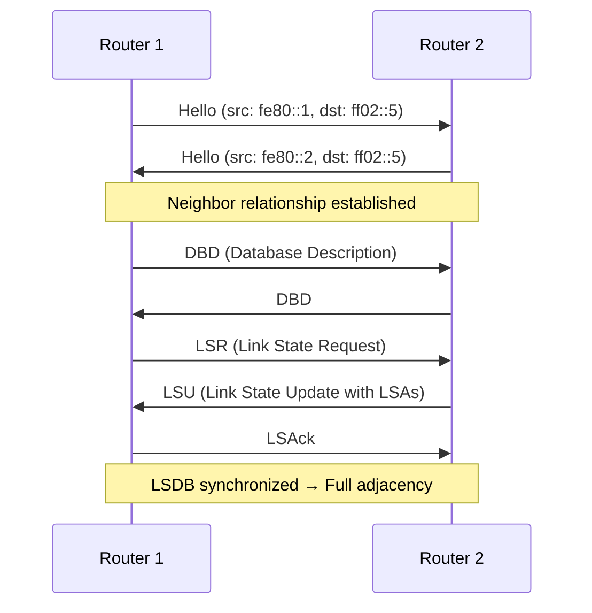

# How to Understand OSPFv3 for IPv6 Routing

Author: [nawazdhandala](https://www.github.com/nawazdhandala)

Tags: OSPFv3, IPv6, Routing Protocols, OSPF, Networking

Description: Understand the fundamentals of OSPFv3 — the OSPF variant designed natively for IPv6 — including its key differences from OSPFv2 and how it operates.

## Overview

OSPFv3 is the version of OSPF designed specifically for IPv6, defined in RFC 5340. While OSPFv2 carries IPv4 routes, OSPFv3 is a separate protocol that operates independently over IPv6 link-local addresses.

## OSPFv3 Key Characteristics

| Feature | OSPFv3 | OSPFv2 |
|---------|--------|--------|
| Protocol number | 89 | 89 |
| Transport | IPv6 | IPv4 |
| Adjacency addresses | Link-local (fe80::) | IPv4 addresses |
| Authentication | Uses IPsec (RFC 4552) | Built-in MD5/SHA |
| Address family | IPv6 only (base) / IPv4+IPv6 (RFC 5838) | IPv4 only |
| Router ID | 32-bit (must be set manually if no IPv4) | 32-bit |

## How OSPFv3 Operates



## OSPFv3 Multicast Addresses

| Address | Purpose |
|---------|---------|
| `ff02::5` | All OSPF routers (ALLSPFRouters) |
| `ff02::6` | All DR/BDR routers (ALLDRouters) |

## OSPFv3 vs OSPFv2 Protocol Changes

OSPFv3 removes network-layer addressing from OSPF packets and LSAs. Key changes:
- **Link-local addresses** are used for all neighbor communication
- **Router IDs** must be explicitly configured if no IPv4 address exists
- **Authentication** is delegated to IPsec rather than built into the protocol
- **Instance ID** field added to Hello packets to allow multiple OSPFv3 instances per link

## Verifying OSPFv3 on FRRouting

```bash
# Access the FRRouting CLI
vtysh

# Show OSPFv3 neighbors
show ipv6 ospf neighbor

# Show the OSPFv3 link-state database
show ipv6 ospf database

# Show OSPFv3 routes
show ipv6 route ospf
```

## Router ID Requirement

OSPFv3 requires a 32-bit Router ID, just like OSPFv2. If no IPv4 address is configured on the router, you must set the Router ID manually:

```
! Cisco IOS
router ospfv3 1
 router-id 1.1.1.1

# FRRouting
router ospf6
 ospf6 router-id 1.1.1.1
```

## Summary

OSPFv3 is the native IPv6 link-state routing protocol. It uses IPv6 link-local addresses for adjacency formation, multicast addresses ff02::5 and ff02::6 for protocol messages, and IPsec for authentication. Router IDs remain 32-bit values and must be manually configured in IPv6-only environments.
