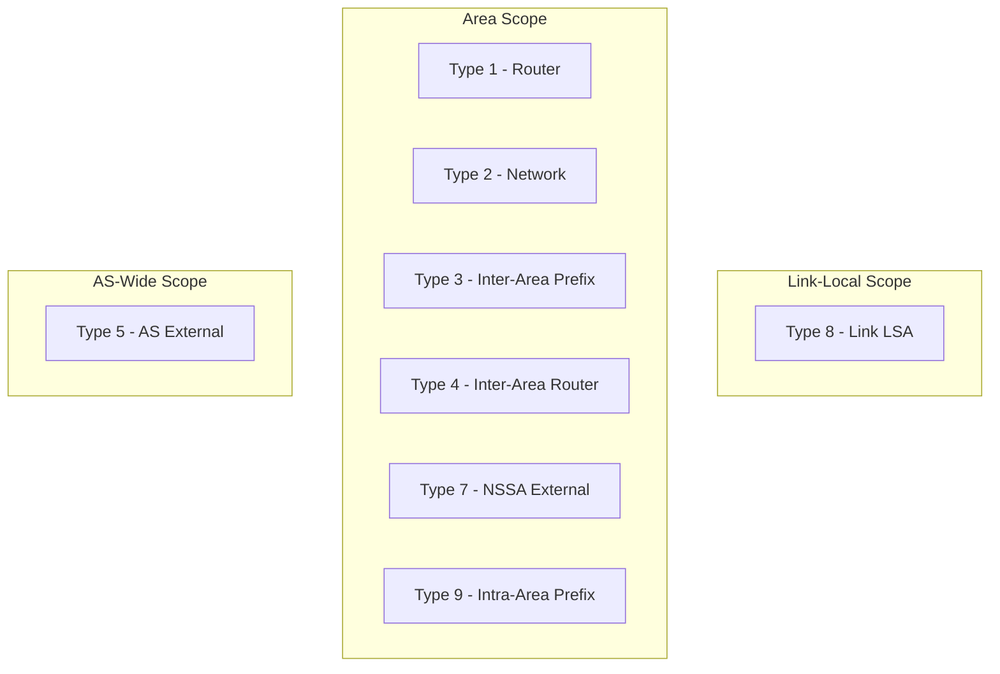

# How to Understand OSPFv3 LSA Types for IPv6

Author: [nawazdhandala](https://www.github.com/nawazdhandala)

Tags: OSPFv3, IPv6, LSA, OSPF, Networking

Description: Understand the OSPFv3 Link State Advertisement types, their scope, and how they differ from OSPFv2 LSAs in carrying IPv6 routing information.

## Overview

OSPFv3 uses Link State Advertisements (LSAs) to build the topology database. OSPFv3 introduced new LSA types (8 and 9) and modified existing ones to separate topology from addressing - a key design change from OSPFv2.

## OSPFv3 LSA Types

| Type | Name | Scope | Content |
|------|------|-------|---------|
| 1 | Router LSA | Area | Router's links and their interface IDs (no addresses) |
| 2 | Network LSA | Area | DR-generated, lists all routers on a broadcast segment |
| 3 | Inter-Area Prefix LSA | Area | IPv6 prefixes from other areas (replaces Type 3/4 of OSPFv2) |
| 4 | Inter-Area Router LSA | Area | Path to an ASBR in another area |
| 5 | AS External LSA | AS-wide | External IPv6 prefixes redistributed into OSPF |
| 7 | NSSA External LSA | Area | External routes in NSSA areas (converted to Type 5 by ABR) |
| 8 | Link LSA | Link-local | Router's link-local address + on-link prefixes for that link |
| 9 | Intra-Area Prefix LSA | Area | IPv6 prefixes associated with a router or transit network |

## Key Difference: Addressing Separation

In OSPFv2, Router LSAs (Type 1) contain IP addresses. In OSPFv3, Router LSAs contain **only topology information** (interface IDs). IPv6 addresses are carried in Type 8 (Link LSA) and Type 9 (Intra-Area Prefix LSA) - this separation is fundamental to OSPFv3's cleaner design.

## Viewing LSAs in FRRouting

```bash
# Show all LSAs in the OSPF database

vtysh -c "show ipv6 ospf database"

# Show specific LSA types
vtysh -c "show ipv6 ospf database router"    # Type 1
vtysh -c "show ipv6 ospf database network"   # Type 2
vtysh -c "show ipv6 ospf database inter-prefix"  # Type 3
vtysh -c "show ipv6 ospf database as-external"   # Type 5
vtysh -c "show ipv6 ospf database link"      # Type 8
vtysh -c "show ipv6 ospf database intra-prefix"  # Type 9
```

## Viewing LSAs on Cisco

```text
! Show complete OSPFv3 database
Router# show ospfv3 database

! Show specific LSA types
Router# show ospfv3 database router         ! Type 1
Router# show ospfv3 database network        ! Type 2
Router# show ospfv3 database inter-area prefix  ! Type 3
Router# show ospfv3 database external       ! Type 5
Router# show ospfv3 database link           ! Type 8
Router# show ospfv3 database intra-area-prefix  ! Type 9
```

## Type 8: Link LSA (New in OSPFv3)

The Link LSA is unique to OSPFv3 and has **link-local scope** - it is only flooded on the local link, not into the area. It contains:
- The router's link-local address for that specific link
- List of on-link IPv6 prefixes
- Router priority and options flags

```text
! Sample Link LSA output on Cisco
Router# show ospfv3 database link

LS age: 423
Link State ID: 3 (Interface ID of advertising router)
Originating Router: 1.1.1.1
Number of Prefixes: 1
  Prefix: 2001:DB8:1::/64
  Prefix Options: 0 (-|-|-|-)
```

## Type 9: Intra-Area Prefix LSA (New in OSPFv3)

The Intra-Area Prefix LSA carries IPv6 prefixes for routers and transit networks within an area. It replaces the address-carrying functionality removed from Type 1 and Type 2 LSAs:

```text
Router# show ospfv3 database intra-area-prefix

LS age: 234
Link State ID: 1 (router originated)
Number of Prefixes: 2
  Prefix: 2001:DB8:1::/64, Metric: 10
  Prefix: 2001:DB8:2::/64, Metric: 0
```

## LSA Flooding Scope



## Summary

OSPFv3 introduces Type 8 (Link LSA) and Type 9 (Intra-Area Prefix LSA) to carry IPv6 addresses separately from topology. Type 1 and Type 2 LSAs contain only link topology. This separation allows OSPFv3 to support multiple address families and renumber globally without disrupting topology information.
