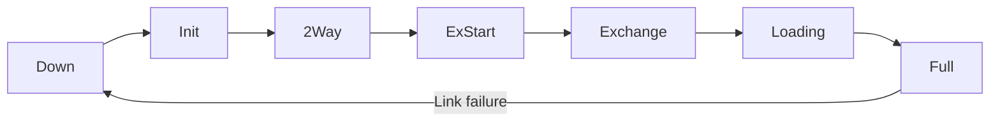

# How to Troubleshoot OSPFv3 Neighbor Adjacency Issues

Author: [nawazdhandala](https://www.github.com/nawazdhandala)

Tags: OSPFv3, IPv6, Troubleshooting, Adjacency, Networking

Description: A systematic guide to diagnosing and resolving OSPFv3 neighbor adjacency failures, from missing Hello packets to state machine stuck issues.

## Overview

OSPFv3 adjacency issues prevent routes from being exchanged. The neighbor state machine progresses through: Down → Init → 2-Way → ExStart → Exchange → Loading → Full. Understanding what prevents each transition is key to fast diagnosis.

## OSPFv3 Adjacency State Machine



## Step 1: Check Neighbor State

```bash
# FRRouting

vtysh -c "show ipv6 ospf neighbor"

# Cisco
show ospfv3 neighbor

# Expected output for healthy adjacency:
# Neighbor ID  State  DeadTime  Interface  Address
# 2.2.2.2      Full   35s       eth0       fe80::2
```

## Step 2: Diagnose Common State Problems

### Stuck in Init

Both routers see each other's Hellos but not in each other's neighbor list:

```bash
# Check Hello parameters - all must match:
vtysh -c "show ipv6 ospf interface eth0"
# Verify: Hello interval, Dead interval, Area ID

# Common mismatch: Hello interval differs
# Router A: hello 10s
# Router B: hello 30s  ← MISMATCH - will not form adjacency
```

### Stuck in 2-Way (Non-DR/BDR)

On a broadcast network with more than two routers, only DR and BDR form Full adjacency with each other. Others stay at 2-Way - this is **normal and expected**.

### Stuck in ExStart/Exchange

Usually caused by MTU mismatch:

```bash
# Check interface MTU
ip link show eth0
# Check if MTU matches on both sides (default is 1500)

# FRRouting: disable MTU check as a test
vtysh
configure terminal
interface eth0
 ipv6 ospf6 mtu-ignore
end
```

## Step 3: Verify Link-Local Addresses

OSPFv3 requires link-local addresses to form adjacency:

```bash
# Confirm link-local address exists
ip -6 addr show dev eth0 | grep "scope link"
# Must show a fe80:: address

# If missing, add one
sudo ip -6 addr add fe80::1/64 dev eth0 scope link
```

## Step 4: Check Multicast Group Membership

OSPFv3 uses multicast for Hello packets:

```bash
# Verify OSPFv3 multicast group membership
ip -6 maddr show dev eth0 | grep "ff02::5\|ff02::6"
# ff02::5 = All OSPF Routers
# ff02::6 = All DR/BDR Routers

# If not joined, ospf6d may not be running or the interface is not enabled
```

## Step 5: Check Firewall Rules

```bash
# Verify OSPFv3 traffic (IP protocol 89) is not blocked
sudo ip6tables -L INPUT -n -v | grep "89\|ospf\|ACCEPT"

# Quick fix: allow OSPF protocol
sudo ip6tables -A INPUT -p 89 -j ACCEPT
sudo ip6tables -A OUTPUT -p 89 -j ACCEPT
```

## Step 6: Capture OSPFv3 Hello Packets

```bash
# Capture OSPFv3 traffic (IP protocol 89)
sudo tcpdump -i eth0 -n "ip6 proto 89"

# With verbose decode
sudo tcpdump -i eth0 -n -v "ip6 proto 89"

# If you see Hellos from the neighbor but no adjacency:
# Check area ID, hello interval, and authentication settings
```

## Step 7: Check Area ID and Network Type

```bash
# FRRouting: verify area assignment
vtysh -c "show ipv6 ospf interface eth0" | grep "Area\|Network Type"

# Common issues:
# - One side in Area 0, other in Area 1
# - Network type mismatch (broadcast vs point-to-point)
```

## OSPFv3 Adjacency Troubleshooting Matrix

| Symptom | Likely Cause | Fix |
|---------|-------------|-----|
| Stuck in Init | Hello/Dead interval mismatch | Match timers on both sides |
| No Hello received | Firewall, no link-local address | Allow proto 89, add fe80:: |
| Stuck in ExStart | MTU mismatch | Match MTU or use `mtu-ignore` |
| State flapping | Unstable link or CPU overload | Check link quality and CPU |
| DROTHER in 2-Way | Normal behavior (not DR/BDR) | Expected - not an issue |

## Summary

OSPFv3 adjacency failures are almost always caused by: missing link-local addresses, firewall blocking protocol 89, Hello/Dead interval mismatch, area ID mismatch, or MTU mismatch. Work through these checks in order and use `tcpdump` to confirm whether Hello packets are flowing in both directions.
