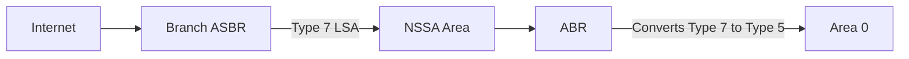

# How to Configure OSPFv3 NSSA Areas for IPv6

Author: [nawazdhandala](https://www.github.com/nawazdhandala)

Tags: OSPFv3, IPv6, NSSA, OSPF, Routing

Description: Learn how to configure OSPFv3 Not-So-Stubby Areas (NSSA) for IPv6, which allow branch sites to import external routes while still reducing LSA overhead.

## Overview

A Not-So-Stubby Area (NSSA) is a hybrid between a stub area and a regular area. It blocks external LSAs (Type 5) from the backbone, but allows local external routes to be injected as Type 7 LSAs, which the ABR then converts to Type 5 LSAs for redistribution into the backbone.

## When to Use NSSA

Use NSSA when:
- You want stub area benefits (no external LSA flooding from backbone)
- But the branch also has its own external routes to advertise (e.g., a branch connected to a separate ISP or static routes to be redistributed)



## Configuring NSSA on Cisco IOS

```text
! Configure Area 1 as NSSA on ALL routers in the area

! On the ABR
Router-ABR(config)# router ospfv3 1
Router-ABR(config-router)# address-family ipv6 unicast
Router-ABR(config-router-af)# area 1 nssa

! On the internal router/ASBR in Area 1
Router-Branch(config)# router ospfv3 1
Router-Branch(config-router)# address-family ipv6 unicast
Router-Branch(config-router-af)# area 1 nssa

! Configure NSSA with no-summary (totally NSSA - block Type 3 LSAs)
Router-ABR(config-router-af)# area 1 nssa no-summary
```

## Redistributing External Routes in NSSA

The ASBR in the NSSA redistributes external routes as Type 7 LSAs:

```text
! On the ASBR in the NSSA area - redistribute static routes
Router-ASBR(config)# router ospfv3 1
Router-ASBR(config-router)# address-family ipv6 unicast
Router-ASBR(config-router-af)# redistribute static
Router-ASBR(config-router-af)# area 1 nssa
```

## Configuring NSSA on FRRouting

```bash
vtysh
configure terminal

! Configure Area 1 as NSSA
router ospf6
 area 0.0.0.1 nssa

! NSSA with no-summary (ABR only)
router ospf6
 area 0.0.0.1 nssa no-summary

! Redistribute on the branch ASBR
router ospf6
 redistribute static

end
write memory
```

## Verifying NSSA Configuration

```text
! Cisco: Verify NSSA flag in area database
Router# show ospfv3 database
! Should show area is NSSA

! Check for Type 7 LSAs in the area
Router# show ospfv3 database nssa

! Check converted Type 5 LSAs on the ABR
Router# show ospfv3 database external
```

```bash
# FRRouting: Verify NSSA configuration

vtysh -c "show ipv6 ospf"
# Area 0.0.0.1 is [NSSA]

# Check Type 7 LSAs
vtysh -c "show ipv6 ospf database as-nssa"
```

## NSSA Default Route

The ABR can inject a default route into the NSSA area:

```text
! Cisco: Inject default route into NSSA
Router-ABR(config)# router ospfv3 1
Router-ABR(config-router)# address-family ipv6 unicast
Router-ABR(config-router-af)# area 1 nssa default-information-originate
```

## Differences: Stub vs NSSA

| Feature | Stub | NSSA |
|---------|------|------|
| External routes from backbone | Blocked | Blocked |
| External routes from local ASBR | Not allowed | Allowed (Type 7) |
| Type 5 LSAs | Blocked | Blocked |
| Type 7 LSAs | N/A | Allowed locally |
| Default route | Injected by ABR | Injected by ABR (optional) |

## Summary

OSPFv3 NSSA combines the LSA reduction benefits of stub areas with the ability to advertise local external routes. Configure NSSA on all routers in the area, redistribute external routes on the branch ASBR, and the ABR automatically translates Type 7 LSAs to Type 5 for the backbone. Use `nssa no-summary` to block inter-area LSAs as well (totally NSSA).
