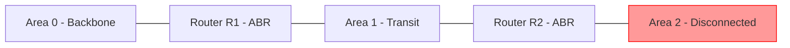

# How to Configure OSPFv3 Virtual Links for IPv6

Author: [nawazdhandala](https://www.github.com/nawazdhandala)

Tags: OSPFv3, IPv6, Virtual Links, OSPF Areas, Networking

Description: Learn how to configure OSPFv3 virtual links to extend backbone Area 0 connectivity through a transit area when a non-backbone area has no direct backbone connection.

## Overview

All OSPFv3 areas must be directly connected to the backbone (Area 0). A **virtual link** is a logical extension of Area 0 through a transit area, used when a physical connection to Area 0 is not possible due to geographic or administrative constraints.

## When Virtual Links Are Needed



Area 2 is not directly connected to Area 0. A virtual link through Area 1 (the transit area) creates a logical connection.

## Configuring Virtual Links on Cisco IOS

```
! Virtual links are configured on both ABRs at each end

! On R1 (ABR between Area 0 and Area 1)
! The transit area is Area 1; the remote ABR's router ID is 2.2.2.2
Router-R1(config)# router ospfv3 1
Router-R1(config-router)# address-family ipv6 unicast
Router-R1(config-router-af)# area 1 virtual-link 2.2.2.2

! On R2 (ABR between Area 1 and Area 2)
! The transit area is Area 1; the remote ABR's router ID is 1.1.1.1
Router-R2(config)# router ospfv3 1
Router-R2(config-router)# address-family ipv6 unicast
Router-R2(config-router-af)# area 1 virtual-link 1.1.1.1
```

## Configuring Virtual Links on FRRouting

```bash
vtysh
configure terminal

! On R1 — virtual link through Area 1 to R2 (router-id 2.2.2.2)
router ospf6
 area 0.0.0.1 virtual-link 2.2.2.2

! On R2 — virtual link through Area 1 to R1 (router-id 1.1.1.1)
router ospf6
 area 0.0.0.1 virtual-link 1.1.1.1

end
write memory
```

## Virtual Link Requirements

1. The **transit area** (Area 1 in this example) must be a regular area — NOT a stub or NSSA
2. Both ABRs must configure the virtual link using each other's **Router IDs** (not IP addresses)
3. The virtual link is treated as a point-to-point link in Area 0

## Verifying Virtual Links

```
! Cisco: Verify virtual link state
Router# show ospfv3 virtual-links

OSPFv3 1 address-family ipv6 (router-id 1.1.1.1)
Virtual Links for Process "1"

Virtual Link OSPF_VL0 to router 2.2.2.2 is up
  Run as demand circuit
  DoNotAge LSA not allowed (Number of Runs: 17).
  Transit area 0.0.0.1, via interface GigabitEthernet0/0
  Hello interval 10, Dead interval 40, Wait interval 40, Retransmit 5
  State POINT_TO_POINT, Hello due in 00:00:06
```

```bash
# FRRouting: Check virtual link status
vtysh -c "show ipv6 ospf virtual-link"
```

## Troubleshooting Virtual Links

```bash
# Common issues:
# 1. Wrong Router ID in virtual-link config
#    Verify: show ospfv3 (check this router's Router ID)
#    Verify neighbor Router ID: show ospfv3 neighbor

# 2. Transit area is stub/NSSA (not allowed)
#    Fix: Remove stub/nssa config from the transit area

# 3. ABRs cannot reach each other through the transit area
#    Verify: show ipv6 route — both ABRs must have routes to each other
```

## Virtual Links with Authentication

```
! Cisco: Add IPsec authentication to a virtual link
Router(config)# router ospfv3 1
Router(config-router)# address-family ipv6 unicast
Router(config-router-af)# area 1 virtual-link 2.2.2.2 authentication ipsec spi 256 sha1 <key>
```

## Summary

OSPFv3 virtual links solve the problem of areas with no direct backbone connection by creating a logical Area 0 extension through a transit area. Configure them on both ABRs using each other's Router IDs and the common transit area ID. The transit area must not be a stub or NSSA. Verify with `show ospfv3 virtual-links` and confirm the state is `UP`.
