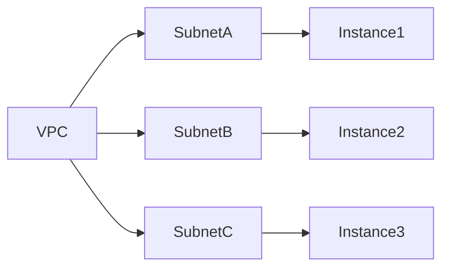

# How to Use the -parallelism Flag to Control Concurrent Operations

Author: [nawazdhandala](https://www.github.com/nawazdhandala)

Tags: OpenTofu, Performance, Parallelism, Concurrency, Infrastructure as Code, DevOps

Description: Learn how to use OpenTofu's -parallelism flag to tune the number of concurrent resource operations, balancing speed against API rate limits.

## Introduction

OpenTofu creates, updates, and refreshes up to 10 resources concurrently by default. The `-parallelism` flag controls this limit. Increasing it speeds up large applies; decreasing it prevents API rate limit errors.

## Default Behavior

```bash
# Default: 10 concurrent operations
tofu apply

# Equivalent explicit command
tofu apply -parallelism=10
```

OpenTofu builds a dependency graph and only applies operations concurrently when there is no dependency between the resources:



With `-parallelism=3`, SubnetA, SubnetB, and SubnetC can be created simultaneously (they are independent). Instance1, Instance2, and Instance3 also run in parallel once their respective subnets are ready.

## Increasing Parallelism for Faster Applies

```bash
# Speed up a large apply by increasing concurrent operations
tofu apply -parallelism=50

# Combine with targeted apply for focused speed
tofu apply -target=module.eks -parallelism=30
```

Useful benchmarks:

```bash
# Test different levels on your configuration
time tofu plan -parallelism=5
time tofu plan -parallelism=10  # default
time tofu plan -parallelism=25
time tofu plan -parallelism=50
```

## Decreasing Parallelism to Prevent Rate Limiting

```bash
# Reduce when hitting ThrottlingException or 429 errors
tofu apply -parallelism=3

# For very restrictive accounts or during peak hours
tofu apply -parallelism=2
```

## Setting a Default via TF_CLI_ARGS

Avoid remembering to pass the flag on every command:

```bash
# In your shell profile or CI environment
export TF_CLI_ARGS_plan="-parallelism=20"
export TF_CLI_ARGS_apply="-parallelism=20"

# Now tofu plan automatically uses -parallelism=20
tofu plan
```

## Parallelism Does Not Override Dependencies

```hcl
# Even with -parallelism=100, this resource waits for aws_vpc.main
resource "aws_subnet" "private" {
  vpc_id     = aws_vpc.main.id   # Implicit dependency — subnet waits for VPC
  cidr_block = "10.0.1.0/24"
}
```

Parallelism controls how many *independent* operations run at once — dependency ordering is always respected.

## Destroy Operations and Parallelism

During destroy, parallelism controls concurrent resource deletion. Lower values are safer:

```bash
# Slower but safer destroy — avoids race conditions in dependency teardown
tofu destroy -parallelism=5
```

## Finding the Optimal Value

```bash
#!/bin/bash
# benchmark.sh — find the best parallelism for your config
for p in 5 10 15 20 30 50; do
  echo -n "Parallelism $p: "
  time tofu plan -refresh=false -parallelism=$p 2>&1 | tail -1
done
```

## Conclusion

The `-parallelism` flag is a simple lever with a significant impact. Start at the default of 10, increase toward 20-50 for large configurations if API rate limits allow, and decrease to 2-5 if you are seeing throttling errors. Set it permanently via `TF_CLI_ARGS_apply` to avoid manual repetition.
