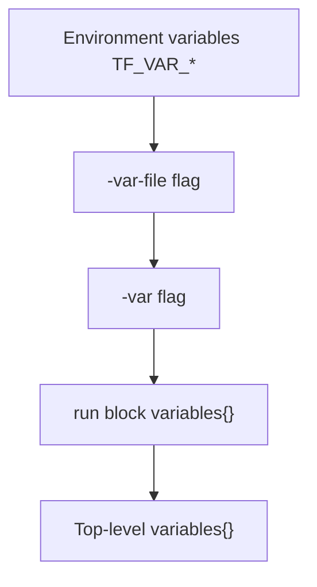

# How to Pass Variables to Tests in OpenTofu

Author: [nawazdhandala](https://www.github.com/nawazdhandala)

Tags: OpenTofu, Testing, Variable, Infrastructure as Code, HCL

Description: Explore the multiple ways to pass input variables to OpenTofu tests, including inline variables blocks, var files, and environment variables.

## Introduction

Passing variables to tests in OpenTofu is flexible: you can define them inline in the test file, load them from `.tfvars` files, or inject them via environment variables. Understanding all three mechanisms lets you write tests that work cleanly in both local development and CI environments.

## Method 1: Inline `variables` Blocks

The simplest approach is declaring variables directly in the test file. Top-level `variables` blocks set defaults for all `run` blocks; `run`-level blocks override them for that specific run.

```hcl
# module.tftest.hcl

# Top-level: applies to all run blocks

variables {
  region      = "us-east-1"
  environment = "test"
  instance_type = "t3.micro"
}

run "small_instance" {
  # Inherits region and environment from the top-level block
  # Overrides only instance_type
  variables {
    instance_type = "t3.nano"
  }

  assert {
    condition     = aws_instance.this.instance_type == "t3.nano"
    error_message = "Instance type override not applied"
  }
}

run "default_instance_type" {
  # Uses t3.micro from the top-level block
  assert {
    condition     = aws_instance.this.instance_type == "t3.micro"
    error_message = "Default instance type not used"
  }
}
```

## Method 2: `-var` Flag on the Command Line

Pass individual variables at runtime without editing the test file:

```bash
# Override a single variable
tofu test -var="region=eu-west-1"

# Pass multiple variables
tofu test \
  -var="region=eu-west-1" \
  -var="environment=staging" \
  -var="instance_type=t3.small"
```

Command-line `-var` values take precedence over inline `variables` blocks.

## Method 3: Variable Files (`-var-file`)

For larger sets of variables, load a `.tfvars` file:

```hcl
# tests/fixtures/dev.tfvars
region        = "us-east-1"
environment   = "dev"
instance_type = "t3.micro"
db_size       = "db.t3.small"
```

```bash
# Load variables from a file
tofu test -var-file=tests/fixtures/dev.tfvars

# Combine with inline overrides
tofu test \
  -var-file=tests/fixtures/dev.tfvars \
  -var="region=us-west-2"
```

## Method 4: Environment Variables

Set `TF_VAR_<name>` environment variables to supply values without modifying any files-ideal for secrets in CI:

```bash
# Set via environment variables
export TF_VAR_db_password="supersecret"
export TF_VAR_region="us-east-1"

tofu test
```

```hcl
# The test file simply references the variable normally
run "database_created" {
  # db_password is injected via TF_VAR_db_password
  assert {
    condition     = aws_db_instance.this.identifier == "test-db"
    error_message = "Database identifier mismatch"
  }
}
```

## Variable Precedence Order

When the same variable is set in multiple places, OpenTofu uses this precedence (highest wins):



## Practical Example: Multi-Environment Tests

```hcl
# tests/bucket.tftest.hcl

# Defaults suitable for local testing
variables {
  bucket_prefix = "test"
  region        = "us-east-1"
}

run "bucket_name_includes_prefix" {
  assert {
    condition     = startswith(aws_s3_bucket.this.bucket, var.bucket_prefix)
    error_message = "Bucket name should start with the prefix"
  }
}
```

```bash
# Local run with defaults
tofu test

# CI run pointing at staging
tofu test -var="bucket_prefix=staging" -var="region=eu-west-1"
```

## Conclusion

OpenTofu's layered variable system gives tests the same flexibility as regular modules. Use inline `variables` blocks for fixed test data, `.tfvars` files for environment presets, and environment variables for secrets-keeping your tests both readable and secure.
