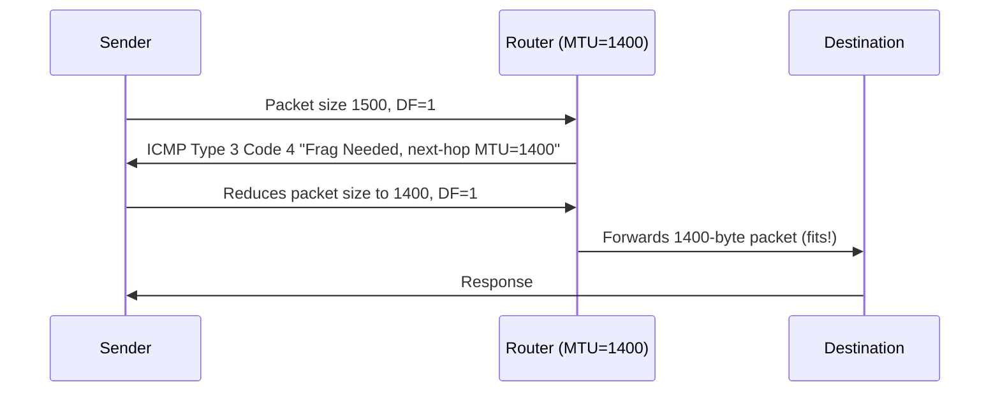

# How to Understand Path MTU Discovery Using ICMP

Author: [nawazdhandala](https://www.github.com/nawazdhandala)

Tags: ICMP, MTU, PMTUD, Networking, IPv4, Troubleshooting

Description: Understand how Path MTU Discovery uses ICMP to automatically determine the maximum packet size that can traverse a network path without fragmentation.

## Introduction

Path MTU Discovery (PMTUD) is the mechanism by which a sender automatically discovers the largest packet size that can pass through a network path without fragmentation. It relies on the IP Don't Fragment (DF) bit and ICMP Type 3 Code 4 (Fragmentation Needed) messages to progressively find the optimal MTU.

## How PMTUD Works



## Observing PMTUD in Action

```bash
# Set DF bit and send large packet - triggers PMTUD if path MTU < 1500

ping -s 1472 -M do -c 3 8.8.8.8
# -s 1472: payload size (1472 + 28 byte IP+ICMP header = 1500 bytes)
# -M do: set Don't Fragment bit

# If MTU is OK: you get replies
# If MTU issue: "ping: local error: Message too long, mtu=1400"
# Or: the ICMP Frag Needed is blocked and pings just time out (black hole)
```

## Capturing the PMTUD Exchange

```bash
# Watch for Fragmentation Needed ICMP messages
tcpdump -i eth0 -n -v 'icmp[0]=3 and icmp[1]=4'

# Example output:
# 10.0.0.1 > 192.168.1.10: ICMP 10.20.0.5 unreachable -
#   need to frag (mtu 1400), length 56
# -> Router at 10.0.0.1 has only 1400 MTU, telling us to reduce packet size
```

## Checking Linux's PMTUD Cache

```bash
# View the kernel's PMTUD route cache
ip route show cache

# Look for entries with mtu value less than 1500
ip route show cache | grep "mtu"
# 8.8.8.8 via 192.168.1.1 dev eth0 cache expires 9min mtu 1400

# Clear the PMTUD cache (forces rediscovery)
ip route flush cache
```

## Disabling/Enabling PMTUD per Socket

```bash
# Check PMTUD setting on a socket (Python example)
python3 -c "
import socket
IP_MTU_DISCOVER = 10
IP_PMTUDISC_WANT = 1
IP_PMTUDISC_DO = 2
IP_PMTUDISC_DONT = 0

s = socket.socket(socket.AF_INET, socket.SOCK_STREAM)
s.setsockopt(socket.IPPROTO_IP, IP_MTU_DISCOVER, IP_PMTUDISC_DO)
print('PMTUD: Do (DF bit set)')
"
```

## When PMTUD Fails (Black Hole)

PMTUD fails when routers on the path block ICMP Type 3 Code 4:

```bash
# Symptoms of PMTUD black hole:
# - TCP connections establish but hang after the initial handshake
# - Small requests (HEAD, GET with small response) work fine
# - Large transfers (file downloads, TLS handshake with big cert) fail
# - ping works, but curl/wget to the same host hangs

# Workaround: clamp TCP MSS so packets never exceed the path MTU
iptables -t mangle -A FORWARD -p tcp --tcp-flags SYN,RST SYN \
  -j TCPMSS --clamp-mss-to-pmtu
```

## Conclusion

PMTUD is an essential mechanism for efficient network operation. It requires ICMP Type 3 Code 4 messages to flow freely through your network. Blocking these messages creates MTU black holes that cause mysterious TCP hangs. Always allow Fragmentation Needed messages through firewalls, and use TCP MSS clamping as a belt-and-suspenders protection for VPN tunnels and overlay networks.
