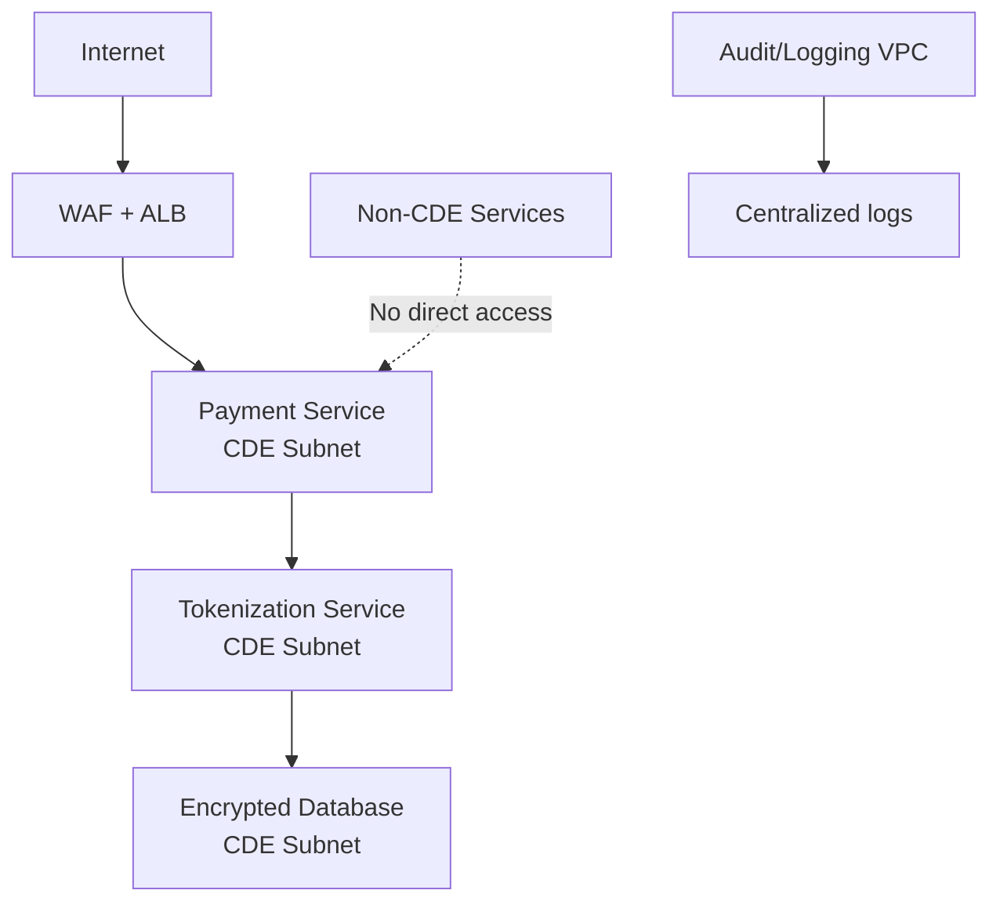

# How to Implement PCI DSS-Compliant Infrastructure with OpenTofu

Author: [nawazdhandala](https://www.github.com/nawazdhandala)

Tags: OpenTofu, PCI DSS, Compliance, Cardholder Data, Security, Network Segmentation, Infrastructure as Code

Description: Learn how to provision PCI DSS-compliant AWS infrastructure using OpenTofu, covering network segmentation, encryption, access controls, and logging requirements for cardholder data environments.

---

PCI DSS protects cardholder data (CHD) through 12 requirements spanning network security, encryption, access control, monitoring, and vulnerability management. OpenTofu codifies the technical controls required to isolate and protect the cardholder data environment (CDE).

## CDE Network Architecture



## CDE Network Segmentation

```hcl
# cde_network.tf
# PCI DSS Requirement 1: Install and maintain network security controls

# Isolated VPC for cardholder data
resource "aws_vpc" "cde" {
  cidr_block           = "10.10.0.0/16"
  enable_dns_hostnames = true

  tags = {
    Name       = "cde-vpc"
    Compliance = "PCI-DSS"
    Scope      = "CDE"
  }
}

# No VPC peering to non-CDE environments
# CDE communicates via API Gateway only

resource "aws_security_group" "cde_db" {
  name        = "cde-database"
  description = "Database tier — only accepts connections from app tier"
  vpc_id      = aws_vpc.cde.id

  ingress {
    from_port       = 5432
    to_port         = 5432
    protocol        = "tcp"
    security_groups = [aws_security_group.cde_app.id]
    description     = "Allow PostgreSQL from application tier only"
  }

  # No inbound from anywhere else
  egress {
    from_port   = 0
    to_port     = 0
    protocol    = "-1"
    cidr_blocks = ["0.0.0.0/0"]
  }
}
```

## Encryption Requirements

```hcl
# pci_encryption.tf
# PCI DSS Requirement 3: Protect stored account data
# Requirement 4: Protect cardholder data with strong cryptography during transmission

resource "aws_kms_key" "chd" {
  description             = "KMS key for cardholder data"
  deletion_window_in_days = 30
  enable_key_rotation     = true  # Required annually

  tags = {
    Compliance   = "PCI-DSS"
    DataCategory = "CHD"
  }
}

resource "aws_db_instance" "cde" {
  identifier              = "cde-database"
  engine                  = "postgres"
  storage_encrypted       = true
  kms_key_id              = aws_kms_key.chd.arn
  backup_retention_period = 35
  deletion_protection     = true
  multi_az                = true
  publicly_accessible     = false

  parameter_group_name = aws_db_parameter_group.ssl_required.name

  lifecycle {
    prevent_destroy = true
  }
}
```

## WAF for Payment Endpoints

```hcl
# pci_waf.tf
# PCI DSS Requirement 6: Develop and maintain secure systems
resource "aws_wafv2_web_acl" "payment" {
  name  = "payment-waf"
  scope = "REGIONAL"

  default_action { allow {} }

  rule {
    name     = "AWSManagedRulesCommonRuleSet"
    priority = 1
    override_action { none {} }
    statement {
      managed_rule_group_statement {
        name        = "AWSManagedRulesCommonRuleSet"
        vendor_name = "AWS"
      }
    }
    visibility_config {
      cloudwatch_metrics_enabled = true
      metric_name                = "CommonRuleSet"
      sampled_requests_enabled   = true
    }
  }

  rule {
    name     = "SQLInjectionProtection"
    priority = 2
    override_action { none {} }
    statement {
      managed_rule_group_statement {
        name        = "AWSManagedRulesSQLiRuleSet"
        vendor_name = "AWS"
      }
    }
    visibility_config {
      cloudwatch_metrics_enabled = true
      metric_name                = "SQLiProtection"
      sampled_requests_enabled   = true
    }
  }
}
```

## Access Controls and Audit Logging

```hcl
# pci_access.tf
# PCI DSS Requirement 7: Restrict access to system components
# Requirement 8: Identify users and authenticate access
# Requirement 10: Log and monitor all access

resource "aws_cloudtrail" "cde_audit" {
  name                       = "cde-audit-trail"
  s3_bucket_name             = aws_s3_bucket.cde_audit_logs.id
  enable_log_file_validation = true  # Detect log tampering
  is_multi_region_trail      = true

  event_selector {
    read_write_type           = "All"
    include_management_events = true

    data_resource {
      type   = "AWS::S3::Object"
      values = ["${aws_s3_bucket.chd_storage.arn}/"]
    }
  }
}

# PCI requires audit logs retained for 12 months (3 months online)
resource "aws_s3_bucket_lifecycle_configuration" "cde_audit" {
  bucket = aws_s3_bucket.cde_audit_logs.id

  rule {
    id     = "pci-retention"
    status = "Enabled"

    transition {
      days          = 90   # Move to cheaper storage after 3 months
      storage_class = "GLACIER"
    }

    expiration {
      days = 365  # 12-month retention requirement
    }
  }
}
```

## Best Practices

- Engage a Qualified Security Assessor (QSA) before your first PCI DSS audit — OpenTofu implements technical controls but scope determination requires expertise.
- Tokenize cardholder data at the point of entry — minimize CDE scope by never storing raw PANs.
- Segment the CDE with dedicated VPCs and no peering to non-CDE environments — network segmentation is the most important scope-reduction control.
- Enable CloudTrail with log file validation for all CDE accounts — PCI Requirement 10 requires audit logs and evidence they haven't been tampered with.
- Run quarterly vulnerability scans and annual penetration tests on CDE infrastructure as required by PCI DSS Requirements 11.3 and 11.4.
